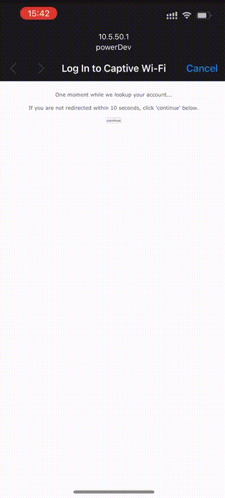

# Frequently asked questions

### Cloud or on-premises?
Powerlynx is fully cloud-based software. We do not offer the option to install it on your own server separately.

### Do you provide a trial to test your software?
Yes, we offer a 21-day trial so you can evaluate the Powerlynx software and determine if it suits your needs. During your license period, you can connect a maximum of 10 online customers.

### Pricing
[Link to pricing](https://powerlynx.app/pricing/)

Our entry-level license is $50 for 200 online customers. This means you can keep a maximum of 210 online customers in Powerlynx with this license. You can upgrade your license if needed. For example, if you plan to host 800 online customers, the cost will be $200, and your system can accommodate up to 810 online customers. Any additional customers beyond that limit will not be able to connect.

### What payment gateways do you support?
We are continually adding new integrations with payment gateways worldwide. Currently, we support PayPal, Stripe, Payfast(South Africa), Netcash(South Africa) and Safaricom MPESA (Kenya). More about supported payment gateways you can find [here](https://docs.powerlynx.app/finance/main.html).

### What network devices do you support?
By default, we support Mikrotik, Teltonika and Cambium network devices that can connect to Powerlynx using the RADIUS protocol. While it is possible to connect other devices through the RADIUS protocol, it may require some configuration adjustments.

### What is the user experience like when the customer connects to the WiFi?

In this video, the customer demonstrates connecting to the WiFi and purchasing internet access using a credit card through the Stripe payment gateway:

{data-zoomable}

### Do I need to connect SMS gateways to Powerlynx in order to send SMS?

Powerlynx does not come with an in-built SMS gateway. You'll need to connect third-party SMS gateways to Powerlynx. For more information on supported SMS gateways, please refer to the [forum](https://forum.powerlynx.app/t/sms-gateways-in-powerlynx/40) and [documentation](https://docs.powerlynx.app/system/sms.html).

### Can I connect my access point to Powerlynx?

Yes, you can connect your access point (AP) to Powerlynx. However, you need to have a hotspot controller, such as a Mikrotik router or Cambium router.

The general requirement for a hotspot controller is support for RADIUS and hotspot functionalities.

Mikrotik routers are relatively inexpensive and make excellent hotspot controllers. Here’s how you can set it up:

1. Connect the Hotspot Controller to Powerlynx: Follow the detailed guide available at [How to connect your Mikrotik with Powerlynx](https://docs.powerlynx.app/networking/mikrotik.html).

2. Connect APs to the Controller: After connecting your Mikrotik to Powerlynx, you can connect your APs (e.g., TP-Link, Ubiquiti) to the Mikrotik router using VLANs (for example).

3. Set Up Hotspot Server on Each VLAN Interface: Configure a hotspot server on each VLAN interface to efficiently manage and monetize your WiFi network through Powerlynx.

### What happens when the customer reaches the data package limit

When a customer connects to WiFi, selects a 1GB plan, and reaches that 1GB limit, they will need to reconnect to the WiFi in order to select a new plan. The customer will not be automatically redirected to the plan selection page. To address this, we have developed [a feature that notifies your customer via SMS when they reach their traffic limit](https://docs.powerlynx.app/system/notifications.html#voucher-limit-notifications). You can configure it so that when 90% of the data is used, Powerlynx will send a notification to the customer, informing them that they will be disconnected soon and need to reconnect to purchase a new data package.

### Can I Assign a Voucher to a Customer Manually?

In certain situations, you may need to provide a customer with a special-offer voucher that isn’t displayed on the splash page to prevent unauthorized use. For instance, employees might receive special vouchers for unlimited internet access. To assign a voucher manually:

1. Create a data plan.
2. Generate a series of vouchers from that plan.
3. Open the voucher series.
4. Select an individual voucher.
5. Assign it to the customer.

{data-zoomable}

### How does the referral system work in Powerlynx?

#### Earn Rewards by Inviting Others to Powerlynx

Powerlynx now offers a referral program that allows you to invite other companies to join and earn a bonus! By referring new clients, you can receive a credit towards your Powerlynx account, making it even easier to manage your subscription.

{data-zoomable}

#### How It Works

1. Invite a New Client

	•	Log in to your Powerlynx billing portal.

	•	Click the “Copy Invite Link” button on your dashboard.

	•	Share the referral link with someone who could benefit from Powerlynx.

2. The Referred Client Must Stay Active

	•	Your referral must sign up and remain active for 60 days.

	•	“Active” means paying for two consecutive monthly Powerlynx licenses.

	•	If the referral’s account is disabled within 60 days, no bonus will be awarded.

3. Receive Your Bonus

	•	Once your referral completes two consecutive monthly payments and stays active for 60 days, both of you receive a $100 account credit.

	•	The bonus is automatically added to your Powerlynx account balance.

**Important Terms**

•	The bonus credit can be used for Powerlynx licenses and services or withdrawn by contacting our support team.

Start Referring Today!

Grow the Powerlynx community and earn rewards. Log in to your billing portal and start sharing your invite link now!

### Can I create a read-only administrator in Powerlynx?

Yes, you can assign a read-only role to an administrator either when adding a new one or by updating an existing administrator and changing their role.

{data-zoomable}

### How do simultaneous devices work?

{data-zoomable}

This setting defines how many devices can connect to the network simultaneously using the same voucher or user account.

For example, if it is set to 2, a user can connect two devices (e.g., phone and laptop) with their phone number. These devices will share the voucher’s limits concurrently (e.g., data and time).

If a third device tries to connect, Powerlynx will automatically disconnect one of the existing devices:

If one device is offline, it will be removed.

If both are offline, the device with the oldest session will be disconnected.

This functions as a form of smart device replacement within Powerlynx.
