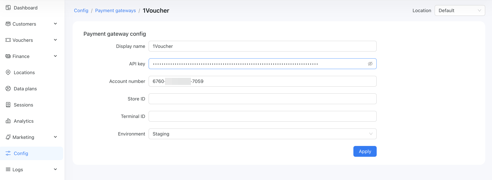
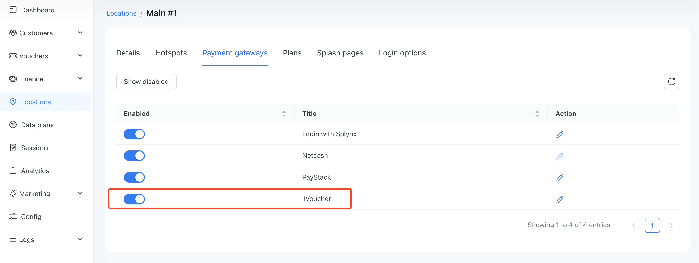
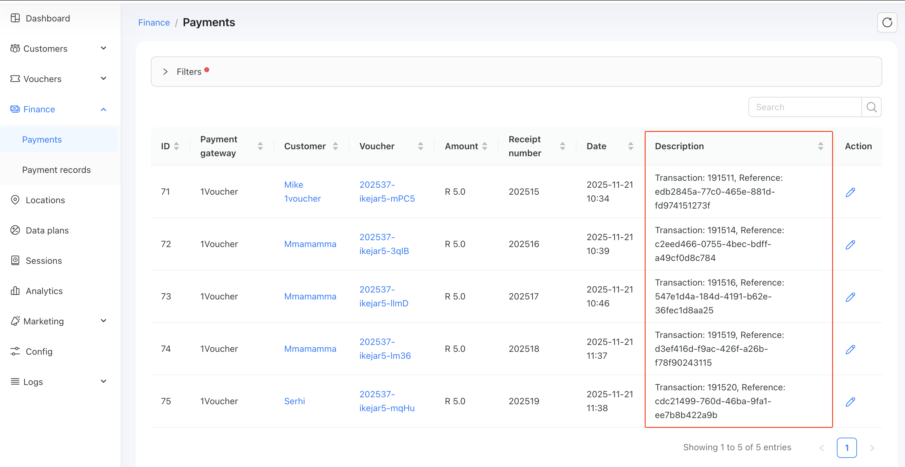

# 1Voucher

[1Voucher](https://www.1voucher.co.za/) 1Voucher is a prepaid digital payment voucher that lets you turn your cash into a 16-digit PIN you can use to pay online. Your customers can use 1Voucher to pay for internet access through Powerlynx.

To set up 1Voucher integration in Powerlynx, ensure you've selected country `South Africa` under `Config/System/Localization`.

## Configuration

Before integrating 1Voucher with Powerlynx, you need to have a 1Voucher merchant account. If you don’t have one, please contact 1Voucher to request it.

To integrate 1Voucher with Powerlynx, you need three crucial credentials:

| **Attribute**        |      **Required**      |  **Data Type**  | **Description** |
| ------------- | :-----------: | :-----------:| :-----------: |
| **API Key**     | YES | String | API key generated in your 1Voucher account |
| **Account number**     | YES | String | The account number of the Merchant |
| **Store ID**     | NO | String | The store where the 1Voucher was purchased. If you are not sure how to use it - keep it empty |
| **Terminal ID**     | NO | String | The till in the store where the 1Voucher was purchased. If you are not sure how to use it - keep it empty |
| **Environment**     | YES | Select | For live accounts, use the "Production" value; for staging accounts, use "Staging" |

In your Powerlynx account, navigate to the `Config/Finance/Payment Gateways/1Voucher` and insert them into the correspondingly named fields:

{data-zoomable}

Pay attention to the "Location" filter — you can configure your 1Voucher account as the default for the system (all locations will use this account which means all payments collected on all locations will go to this account), or you can select a specific location and link your account only with that location. Using this method, you can connect different 1Voucher accounts to different locations in Powerlynx. 

## Enable Payment Gateway for a Location

The next crucial step is to enable 1Voucher for a specific location. Navigate to Locations, select the desired location, and open the "Payment Gateways" tab. From there, enable 1Voucher for this location:

{data-zoomable}

If it's disabled, your clients will not have the option to pay with 1Voucher.

## Buying a voucher with 1Voucher

Customers can now buy a voucher on the splash page using 1Voucher. After selecting a data plan, they will be redirected to this page:

{data-zoomable}

After entering a 1Voucher PIN and clicking Apply, the system will connect to 1Voucher and validate the provided PIN.

If the customer pays with a 1Voucher amount higher than the price of the data plan in Powerlynx, a new voucher code will be sent to the provided phone number:

{data-zoomable}

In this example, the data plan price was R5, and the 1Voucher amount was R100. A new voucher with an amount of R95 was generated and sent to the customer.

You can track 1Voucher payments under `Finance/Payments`:

{data-zoomable}