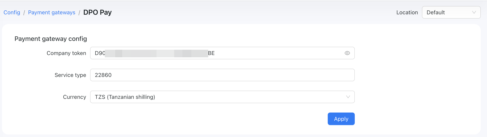
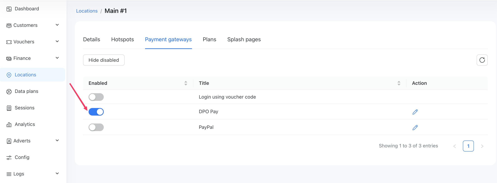
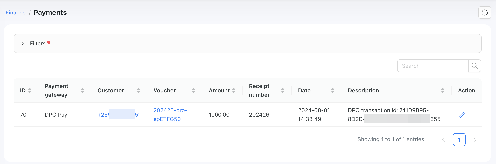

# DPO pay

[DPO Pay](https://dpogroup.com/) is a payment gateway available in the following countries: Botswana, Malawi, Rwanda, Uganda, Mauritius, Côte d'Ivoire, South Africa, Zambia, Ghana, Namibia, Tanzania, Zanzibar, Kenya, Nigeria, UAE, and Zimbabwe.

To set up DPO integration in Powerlynx, ensure you've selected one of the following countries under `Config/System/Localization`: Botswana, Malawi, Rwanda, Uganda, Mauritius, Côte d'Ivoire, South Africa, Zambia, Ghana, Namibia, Tanzania, Zanzibar, Kenya, Nigeria, UAE, or Zimbabwe.

## Configuration

Open your DPO account, and obtain your company token, service type. Copy these values and in Powerlynx, under `Config/Payment gateways/DPO Pay` fill in the "Company token" and "Service type" fields with previously copied vaues from DPO Pay account and select your currency in the "Currency" field.

Your config of this integration should be as following:



## Enable Payment Gateway for a Location

The next crucial step is to enable DPO Pay for a specific location. Navigate to Locations, select the desired location, and open the "Payment Gateways" tab. From there, enable DPO Pay for this location:

{data-zoomable}

If it's disabled, your clients will not have the option to pay with DPO Pay.

## Networking: Walled Garden

Another crucial step is to configure the allow list of hosts on your hotspot. For instance, if you've connected a Mikrotik hotspot using this [manual](https://docs.powerlynx.app/networking/mikrotik.html), you now need to add a list of allowed hosts related to DPO Pay. This allows your customers to be redirected to the 3D authentication page during the payment process. You can find more about Mikrotik Walled Garden [here](https://wiki.mikrotik.com/wiki/Manual:IP/Hotspot/Walled_Garden).

To do this, you should access your router (in my case, Mikrotik), open the Terminal, and run this command with the list of hosts you wish to allow:

```
/ip hotspot walled-garden
add dst-host=*.digitaloceanspaces.com
add dst-host=*.powerlynx.app
add dst-host=*pusher*
add dst-host=*.pusherapp.com
add dst-host=secure.3gdirectpay.com
add dst-host=assets.directpay.online
add dst-host=www.gstatic.com
add dst-host=www.google.com
add dst-host=*elb.amazonaws.com
add dst-host=*ipify*
```
It might be useful to visit our forum, especially [this topic](https://forum.powerlynx.app/t/mikrotik-walled-garden/19), to discuss all questions related to the walled garden.

## Buying a voucher with DPO Pay

Customers can now buy a voucher on a splash page using DPO Pay.

{data-zoomable}

After selecting "DPO Pay," the customer will be redirected to the DPO page to complete the payment:

{data-zoomable}

Here you can select payment methods you want: credit card, mobile money:

{data-zoomable}

{data-zoomable}

In includes Tigo Pesa, Vodacom MPESA, Zantel, Airtel money, etc.

Select one of the available payment methods and complete the payment.

Payment captured by Powerlynx are stored under `Finance/Payments`:

{data-zoomable}