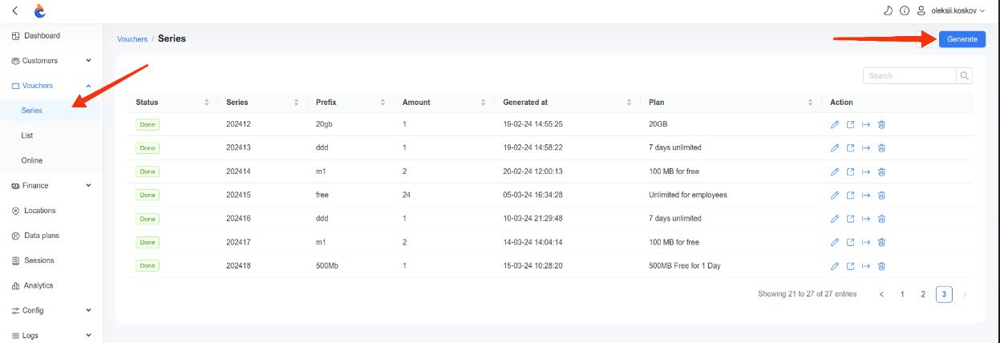
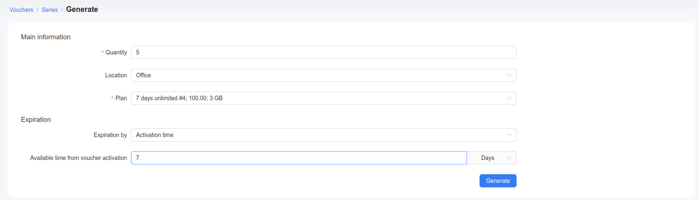
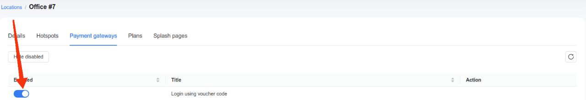
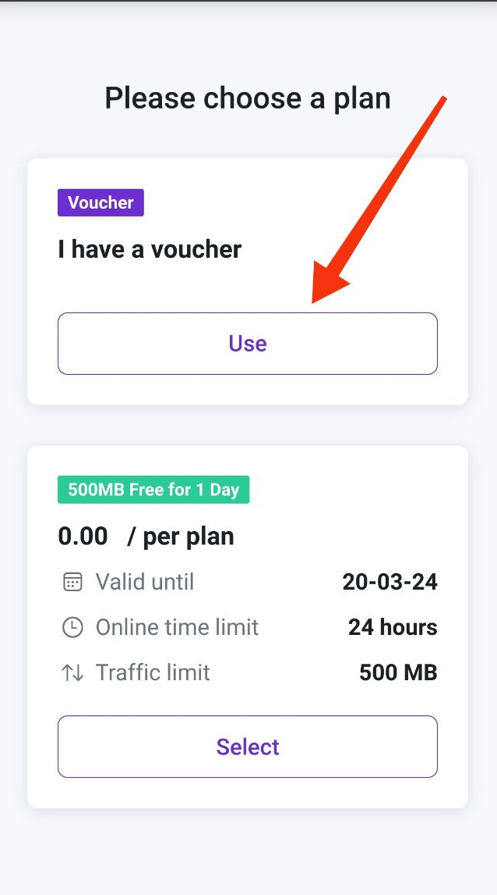
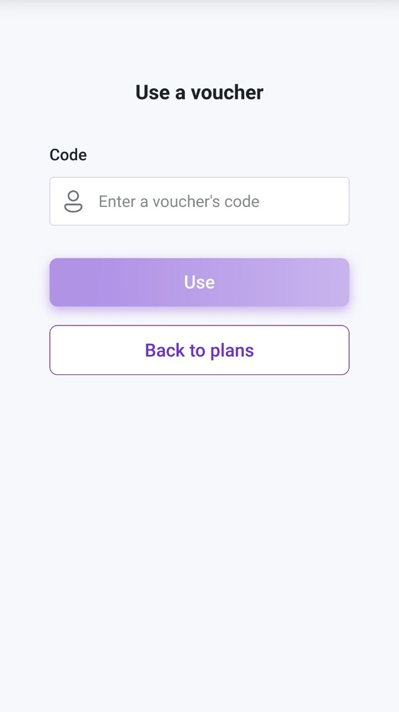

# Login using voucher code

In Powerlynx, a voucher functions like an access card, generated by the system to grant users network access under specific conditions. Each voucher contains detailed information about its validity, traffic limits, online time limits, and the maximum number of devices that can connect using it. It inherits the data plan settings (validity, speed limits, traffic limits, time online limits, etc). Please follow this [link](https://docs.powerlynx.app/system/vouchers.html) to learn more about vouchers in Powerlynx. 

Generally, for the end user to log in, they need to choose a data plan and pay for access using [Payment Gateways](https://docs.powerlynx.app/finance/main.html) such as [Stripe](https://docs.powerlynx.app/finance/stripe.html), [PayPal](https://docs.powerlynx.app/finance/paypal.html), [PayFast](https://docs.powerlynx.app/finance/payfast.html) and [Pay@](https://docs.powerlynx.app/finance/payat.html). However, it's also possible to sell printed vouchers generated in Powerlynx and enable your customers to log in using the voucher code provided.

To allow customers to log in using a voucher code, you need to follow these steps:

  1. Manually generate vouchers for specific location (required).
  2. Export and print vouchers (optional).
  3. Enable "Login using voucher code" for specific location (required).

## Generating Vouchers

For creating vouchers, go to `Vouchers/Series/Generate`. 

{data-zoomable}

Then you have to set several parameters for your vouchers:

{data-zoomable}

* **Quantity**        - total number of vouchers to generate (required);
* **Location**        - choose the specific location, where these vouchers will be valid. 
* **Plan**            - select Data plan (required); 
* **Expiration by**   - two options are available: `Valid until` and `Activation time`.

Note that you can select only one location for a series of vouchers, where they will be accessible for your customers. It means that your customers can use voucher regardless of the location it belongs to. 

In our case, we generate a series of 5 vouchers from the "7 days unlimited" plan, which are designated for use at the "Office" location. These vouchers will be active for 7 days from the voucher activation. After generation, we will have 5 vouchers that can be utilized in the "Login with voucher code".

::: tip
Pay attention to the **Expiration** section when generating a series. There are two options for setting the expiration method of a voucher:
- **Expiration by 'Valid Until':** This means the generated vouchers are valid until the specified date. They will expire on that date, regardless of whether they have been activated.

- **Expiration by 'Activation Time':** This means the generated vouchers are valid for X days following their activation. For example, if a voucher was generated two months ago but only activated today, the countdown for the "Available time from voucher activation" will begin from the date of activation.
:::

## Export and print

You can export generated series and then print. More detailed information about exporting series follow this [link](https://docs.powerlynx.app/system/vouchers.html#vouchers-export).

In this example, we export series in `PDF` using `Dark theme`, where we can check the result before printing vouchers.

{data-zoomable}

Also in Powerlynx there are several voucher settings that can be modified. More detailed information about these configs follow this [link](https://docs.powerlynx.app/system/vouchers.html#voucher-settings). You can find these under `Config/Finance/Main`:

{data-zoomable}

In this case we want to create payment after entering manual voucher, define the length of voucher's code as "8" and chose the default set of characters to be used in generating a voucher's code. Of course you can modified these values as like as you want. 

To check payments after activating voucher you can go to `Finance/Payment records` or `Finance/Payments`.

## Enable "Login using voucher code" for specific Location

As we generated vouchers for specific location we must to enable **Login using vouchers code** in this location.

To achieve this you must go to `Locations/"Locations-name"/Payment gateways` and enable **Login using voucher code**.

{data-zoomable}

## Configure Walled Garden

Another crucial step is to configure the allow list of hosts on your hotspot. For instance, if you've connected a Mikrotik hotspot using this [manual](https://docs.powerlynx.app/networking/mikrotik.html), now you need to add a list of allowed hosts related to Powerlynx. This allows your customers to be redirected to your Powerlynx page without accessing the rest of the internet. You can find more about Mikrotik Walled Garden [here](https://wiki.mikrotik.com/wiki/Manual:IP/Hotspot/Walled_Garden).

To do this, you should access your router (in my case, Mikrotik), open the Terminal, and run this command with the list of hosts you wish to allow:

```
add dst-host=*.digitaloceanspaces.com
add dst-host=*.powerlynx.app
```

You can use either `*.powerlynx.app` or your specific Powerlynx domain (`yourpowerlynxdomain.powerlynx.app`).

It might be useful to visit our forum, especially [this topic](https://forum.powerlynx.app/t/mikrotik-walled-garden/19), to discuss all questions related to the walled garden.

## Login using voucher code

Now, after all this steps your customers can login to the hotspot using voucher code. To achieve this customers must use full voucher's code. Your customers can find it on exported voucher. 

{data-zoomable}

Click on button "Use".

{data-zoomable}

And then enter the full code from the voucher into the `Code` section.

{data-zoomable}