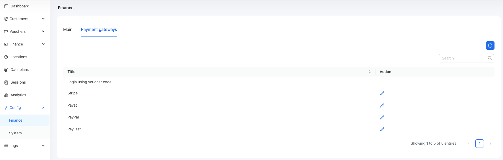

# Finance overview

Here, we describe how to manage finances in Powerlynx, including collecting and tracking payments, the available payment methods, and more. The finance section is designed to facilitate customer payments. You can integrate various payment gateways to provide multiple payment options for internet services. We will provide a list of available payment gateways and guide you through the setup process, simplifying payment collection and transaction management for your business.

If you want to monetize your Wi-Fi, you need to configure a payment gateway in Powerlynx that will allow you to collect payments. The list of available payment gateways can be found under `Config/Finance/Payment gateways`. This list depends on the country you've selected under `Config/System/Localization`. We display payment gateways available for your region, so make sure you've selected the correct country. For example, if you choose South Africa, you will have access to the following set of payment gateways: Stripe, PayFast, PayPal, Pay@.

There is one payment option that is always available - "Login using voucher code". Imagine the situation where you want to sell "internet access codes" to your customers. You can [generate vouchers](https://docs.powerlynx.app/system/vouchers.html), print them, and sell these printed cards to your customers. By selecting this option on the login page, the customer simply needs to enter the voucher code to access the internet.

{data-zoomable}

To configure the desired payment gateway, click on the button under the "Actions" section. You need to "connect" Powerlynx with your payment gateway to accept payments in Powerlynx using your payment gateway's services. Generally, each payment gateway offers integration options with third-party software. For this purpose, they provide you with the credentials required for connecting with third-party software. You'll find the list of available payment gateway integrations in Powerlynx below, along with instructions on how to connect them.

## [Stripe](stripe.md)
## [Paypal](paypal.md)
## [Payfast](payfast.md)