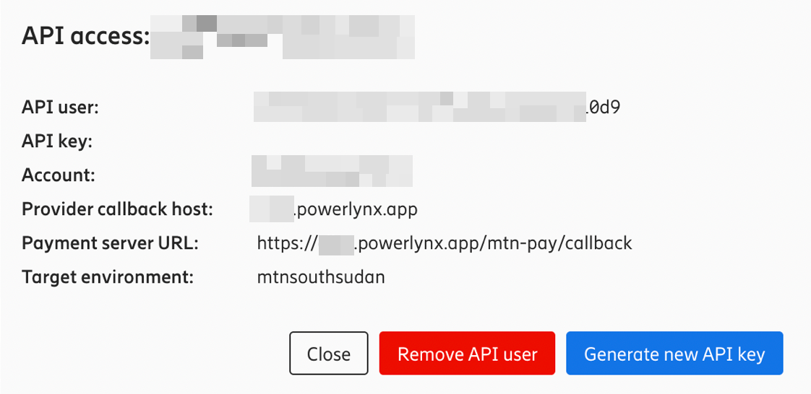
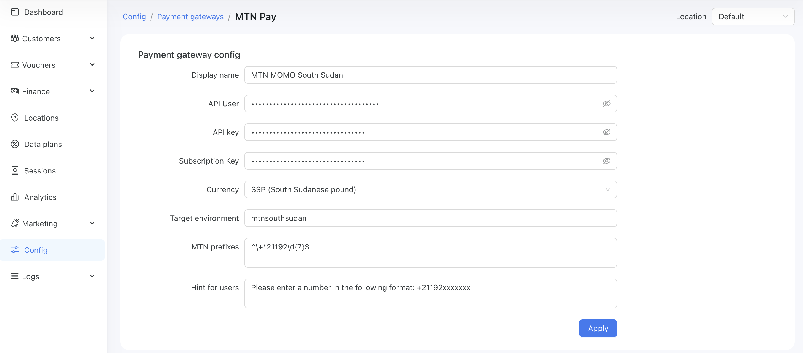
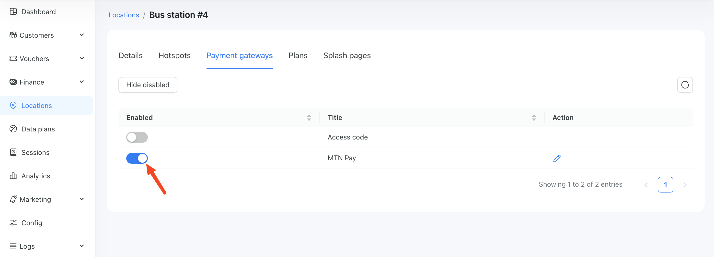
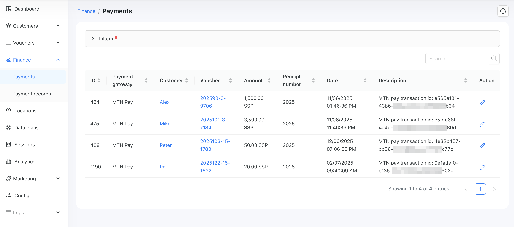

# MTN MoMo

[MTN MoMo](https://momo.mtn.com/home-page/) is a payment gateway available in the following countries: Benin, Congo, Cameroon, Ghana Guinea Guenia-Bissau, Liberia, Nigeria, Rwanda, Eswatini, Uganda, South Africa, Zambia, South Sudan.

To set up MTN integration in Powerlynx, ensure you've selected one of the following countries under `Config/System/Localization`: Benin, Congo, Cameroon, Ghana Guinea Guenia-Bissau, Liberia, Nigeria, Rwanda, Eswatini, Uganda, South Africa, Zambia, South Sudan.

## Configuration

Log in to your MTN account and retrieve the following details: **API User**, **API Key**, **Subscription Key**, and **Target Environment**. If you're unsure where to find these values, please contact MTN MoMo support.

Next, go to **Config → Payment Gateways → MTN Pay** in Powerlynx and enter the copied values into the corresponding fields: *API User*, *API Key*, *Subscription Key*, and *Target Environment*. Select the appropriate currency in the **Currency** field.

You’ll also need to configure **MTN Prefixes** with valid MTN mobile number prefixes for your country. For example, in South Sudan, the valid prefix is **+21192**.

In your MTN account, you also need to set the `Payment Server URL`, which should be your Powerlynx URL followed by /mtn-pay/callback.
For example, if your Powerlynx URL is `https://my.powerlynx.app`, then your Payment Server URL should be `https://my.powerlynx.app/mtn-pay/callback`. Additionally, the `Provider Callback Host` should be set to your Powerlynx domain in the following format - `my.powerlynx.app
`:



Your config of this integration should be as following:



Our example is based on an MTN MoMo account for South Sudan. Please note that values such as `Target Environment` may vary depending on your country.

## Enable Payment Gateway for a Location

The next crucial step is to enable MTN Pay for a specific location. Navigate to Locations, select the desired location, and open the "Payment Gateways" tab. From there, enable MTN Pay for this location:

{data-zoomable}

If it's disabled, your clients will not have the option to pay with MTN Pay.

## Networking: Walled Garden

Another crucial step is to configure the allow list of hosts on your hotspot. For instance, if you've connected a Mikrotik hotspot using this [manual](https://docs.powerlynx.app/networking/mikrotik.html), you now need to add a list of allowed hosts related to MTN Pay. This allows your customers to be redirected to the authentication page during the payment process. You can find more about Mikrotik Walled Garden [here](https://wiki.mikrotik.com/wiki/Manual:IP/Hotspot/Walled_Garden).

To do this, you should access your router (in my case, Mikrotik), open the Terminal, and run this command with the list of hosts you wish to allow:

```
/ip hotspot walled-garden
add dst-host=*.digitaloceanspaces.com
add dst-host=*.powerlynx.app
add dst-host=proxy.momoapi.mtn.com
add dst-host=*momoapi*
add dst-host=*mtn*
```
It might be useful to visit our forum, especially [this topic](https://forum.powerlynx.app/t/mikrotik-walled-garden/19), to discuss all questions related to the walled garden.

## Buying a voucher with MTN Pay

Customers can now buy a voucher on a splash page using MTN Pay.

{data-zoomable}

Simply click on the `Buy` button and you will be redirected to MTN confirmation page.

Payment captured by Powerlynx are stored under `Finance/Payments`:

{data-zoomable}