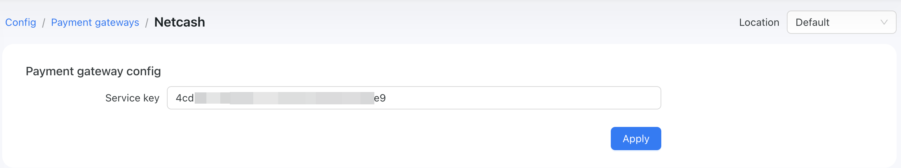
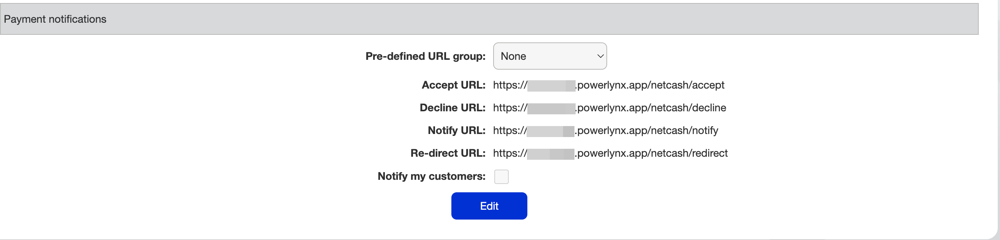
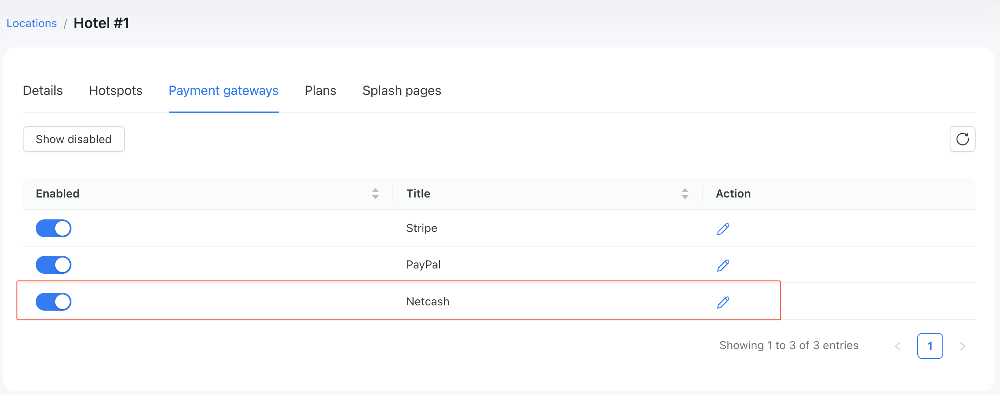
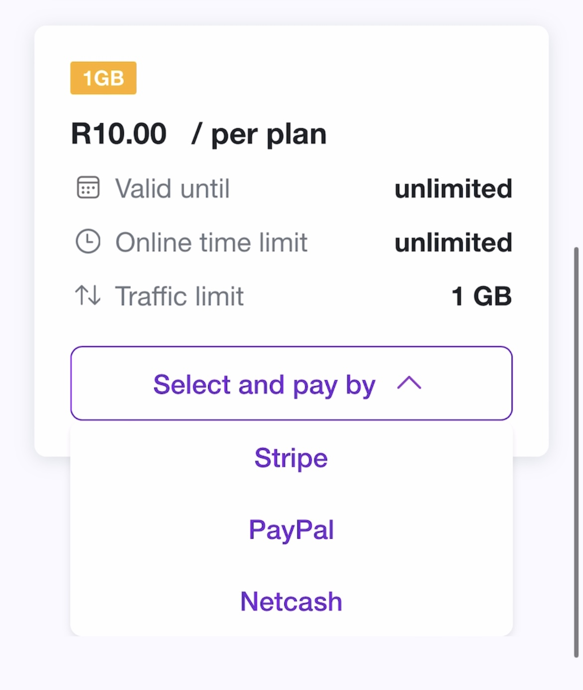
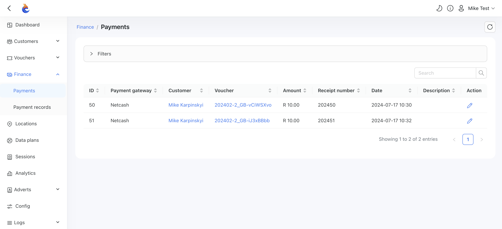

# Netcash

[Netcash](https://netcash.co.za/) is an online payment processing service for South African merchants of all sizes.

To set up Netcash integration in Powerlynx, ensure you've selected country `South Africa` under `Config/System/Localization`.

## Configuration

Open your Netcash account, navigate to `Account Profile -> NetConnector -> Pay Now`. On that page, you will find your service key that should be copied and inserted into Powerlynx in the "Service key" field under `Config/Payment gateways/Netcash`:

{data-zoomable}

After that, in Netcash scroll down and find the "Payment notifications" section where you need to configure URLs. This step is crucial for Netcash integration working correctly:

{data-zoomable}

Here is the list of URLs to use (my Powerlynx URL is `my.powerlynx.app`):

|Netcash URL|Value|
|---|---|
|Accept URL|`https://my.powerlynx.app/netcash/accept`|
|Decline URL|`https://my.powerlynx.app/netcash/decline`|
|Notify URL|`https://my.powerlynx.app/netcash/notify`|
|Redirect URL|`https://my.powerlynx.app/netcash/redirect`|

Replace `my.powerlynx.app` value with your Powerlynx URL.

## Enable Payment Gateway for a Location

The next crucial step is to enable Netcash for a specific location. Navigate to Locations, select the desired location, and open the "Payment Gateways" tab. From there, enable Netcash for this location:

{data-zoomable}

If it's disabled, your clients will not have the option to pay with Netcash.

## Networking: Walled Garden

Another crucial step is to configure the allow list of hosts on your hotspot. For instance, if you've connected a Mikrotik hotspot using this [manual](https://docs.powerlynx.app/networking/mikrotik.html), you now need to add a list of allowed hosts related to Netcash. This allows your customers to be redirected to the 3D authentication page during the payment process. You can find more about Mikrotik Walled Garden [here](https://wiki.mikrotik.com/wiki/Manual:IP/Hotspot/Walled_Garden).

To do this, you should access your router (in my case, Mikrotik), open the Terminal, and run this command with the list of hosts you wish to allow:

```
/ip hotspot walled-garden
add dst-host=*.digitaloceanspaces.com
add dst-host=*.powerlynx.app
add comment=Netcash dst-host=cde.netcash.co.za dst-port=443 path=\
    /Site/CardPayment.aspx
add comment=Netcash dst-host=js-agent.newrelic.com dst-port=443 path=\
    /nr-spa-1216.min.js
add comment=Netcash dst-host=seal.digicert.com
add comment=Netcash dst-host=*.netcash.co.za
add comment=Netcash dst-host=*.digicert.com
add comment=Netcash dst-host=*.newrelic.com
add comment=Netcash dst-host=js-agent.newrelic.com
add comment=Netcash dst-host=netdna.bootstrapcdn.com
add comment=Netcash dst-host=netcashcde.azurewebsites.net
add comment=Netcash dst-host=*.ozow.com
add comment=Netcash dst-host=*.azurefd.net
add comment=Netcash dst-host=*.trafficmanager.net
add comment=Netcash dst-host=*.msedge.net
add comment=Netcash dst-host=*.hostserv.co.za
add comment=Netcash dst-host=*.paynow.co.za
add dst-host=*.microsoft.com
add dst-host=*.awsglobalaccelerator.com
add dst-host=*.cloudflare.net
add dst-host=*.cardinalcommerce.com
add dst-host=*.paygate.co.za
add dst-host=*.cloudfront.net
add dst-host=*.dpopayments.io
add dst-host=*.dpopayments.io
add dst-host=*.fnb*
add dst-host=*.standardbank.*
add dst-host=*.capitec.*
add dst-host=*.absa.*
add dst-host=*.nedbank.*
add dst-host=authentication.cardinalcommerce.com/ThreeDSecure/
add dst-host=3ds.capitecbank.co.za/acs/
add dst-host=*bankserv*
/ip hotspot walled-garden ip
add action=accept disabled=no dst-address=151.101.2.137 !dst-address-list \
    !dst-port !protocol !src-address !src-address-list
add action=accept disabled=no dst-address=151.101.66.137 !dst-address-list \
    !dst-port !protocol !src-address !src-address-list
add action=accept disabled=no dst-address=151.101.130.137 !dst-address-list \
    !dst-port !protocol !src-address !src-address-list
add action=accept disabled=no dst-address=151.101.194.137 !dst-address-list \
    !dst-port !protocol !src-address !src-address-list
add action=accept disabled=no dst-address=185.221.86.0/23 !dst-address-list \
    !dst-port !protocol !src-address !src-address-list
add action=accept disabled=no dst-address=99.81.96.137 !dst-address-list \
    !dst-port !protocol !src-address !src-address-list
add action=accept disabled=no dst-address=52.0.0.0/8 !dst-address-list \
    !dst-port !protocol !src-address !src-address-list
add action=accept disabled=no dst-address=102.133.154.32 !dst-address-list \
    !dst-port !protocol !src-address !src-address-list
add action=accept disabled=no dst-address=40.127.3.0/24 !dst-address-list \
    !dst-port !protocol !src-address !src-address-list
add action=accept disabled=no dst-address=40.127.0.0/24 !dst-address-list \
    !dst-port !protocol !src-address !src-address-list
add action=accept disabled=no dst-address=41.21.175.145 !dst-address-list \
    !dst-port !protocol !src-address !src-address-list
add action=accept disabled=no dst-address=13.107.246.0/24 !dst-address-list \
    !dst-port !protocol !src-address !src-address-list
add action=accept disabled=no dst-address=75.2.62.89 !dst-address-list \
    !dst-port !protocol !src-address !src-address-list
add action=accept disabled=no dst-address=99.83.232.8 !dst-address-list \
    !dst-port !protocol !src-address !src-address-list
add action=accept disabled=no dst-address=13.73.248.8/29 !dst-address-list \
    !dst-port !protocol !src-address !src-address-list
add action=accept disabled=no dst-address=13.107.192.0/18 !dst-address-list \
    !dst-port !protocol !src-address !src-address-list
add action=accept disabled=no dst-address=104.18.40.135 !dst-address-list \
    !dst-port !protocol !src-address !src-address-list
add action=accept disabled=no dst-address=172.64.147.121 !dst-address-list \
    !dst-port !protocol !src-address !src-address-list
add action=accept disabled=no dst-address=198.217.251.0/24 !dst-address-list \
    !dst-port !protocol !src-address !src-address-list
add action=accept disabled=no dst-address=18.0.0.0/8 !dst-address-list \
    !dst-port !protocol !src-address !src-address-list
add action=accept disabled=no dst-address=99.80.231.39 !dst-address-list \
    !dst-port !protocol !src-address !src-address-list
add action=accept comment=api.dpopayments.io disabled=no dst-address=\
    46.137.27.229 !dst-address-list !dst-port !protocol !src-address \
    !src-address-list
add action=accept disabled=no dst-address=3.248.100.28 !dst-address-list \
    !dst-port !protocol !src-address !src-address-list
add action=accept disabled=no dst-address=63.34.141.3 !dst-address-list \
    !dst-port !protocol !src-address !src-address-list
add action=accept disabled=no dst-address=34.0.0.0/8 !dst-address-list \
    !dst-port !protocol !src-address !src-address-list
add action=accept disabled=no dst-address=54.0.0.0/8 !dst-address-list \
    !dst-port !protocol !src-address !src-address-list
```
It might be useful to visit our forum, especially [this topic](https://forum.powerlynx.app/t/mikrotik-walled-garden/19), to discuss all questions related to the walled garden.

## Buying a voucher with Netcash

Customers can now buy a voucher on a splash page using Netcash.

{data-zoomable}

After selecting "Netcash," the customer will be redirected to the Netcash page to complete the payment:

{data-zoomable}

Control the payment methods available for your customers in your Netcash account under `Account Profile -> NetConnector -> Pay Now`. You can enable or disable various payment methods such as credit card, bank EFT, [1Voucher](https://www.netcash.co.za/pay-now/flash-1voucher/), etc.

Payment captured by Powerlynx are stored under `Finance/Payments`:

{data-zoomable}