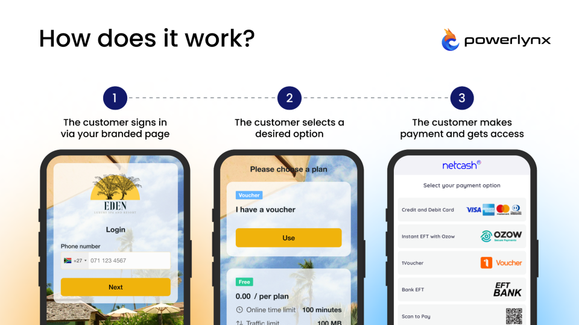

# Netcash

[Netcash](https://netcash.co.za/) is an online payment processing service for South African merchants of all sizes.

To set up Netcash integration in Powerlynx, ensure you've selected country `South Africa` under `Config/System/Localization`.

## Configuration

Open your Netcash account, navigate to `Account Profile -> NetConnector -> Pay Now`. On that page, you will find your service key that should be copied and inserted into Powerlynx in the "Service key" field under `Config/Payment gateways/Netcash`:

{data-zoomable}

After that, in Netcash scroll down and find the "Payment notifications" section where you need to configure URLs. This step is crucial for Netcash integration working correctly:

{data-zoomable}

Here is the list of URLs to use (my Powerlynx URL is `my.powerlynx.app`):

|Netcash URL|Value|
|---|---|
|Accept URL|`https://my.powerlynx.app/netcash/accept`|
|Decline URL|`https://my.powerlynx.app/netcash/decline`|
|Notify URL|`https://my.powerlynx.app/netcash/notify`|
|Redirect URL|`https://my.powerlynx.app/netcash/redirect`|

Replace `my.powerlynx.app` value with your Powerlynx URL.

## Enable Payment Gateway for a Location

The next crucial step is to enable Netcash for a specific location. Navigate to Locations, select the desired location, and open the "Payment Gateways" tab. From there, enable Netcash for this location:

{data-zoomable}

If it's disabled, your clients will not have the option to pay with Netcash.

## Networking: Walled Garden

Another crucial step is to configure the allow list of hosts on your hotspot. For instance, if you've connected a Mikrotik hotspot using this [manual](https://docs.powerlynx.app/networking/mikrotik.html), you now need to add a list of allowed hosts related to Netcash. This allows your customers to be redirected to the 3D authentication page during the payment process. You can find more about Mikrotik Walled Garden [here](https://wiki.mikrotik.com/wiki/Manual:IP/Hotspot/Walled_Garden).

To do this, you should access your router (in my case, Mikrotik), open the Terminal, and run this command with the list of hosts you wish to allow:

```
/ip hotspot walled-garden
add dst-host=*.digitaloceanspaces.com
add dst-host=*.powerlynx.app
add comment=Netcash dst-host=cde.netcash.co.za dst-port=443 path=\
    /Site/CardPayment.aspx
add comment=Netcash dst-host=js-agent.newrelic.com dst-port=443 path=\
    /nr-spa-1216.min.js
add comment=Netcash dst-host=seal.digicert.com
add comment=Netcash dst-host=*.netcash.co.za
add comment=Netcash dst-host=*.digicert.com
add comment=Netcash dst-host=*.newrelic.com
add comment=Netcash dst-host=js-agent.newrelic.com
add comment=Netcash dst-host=netdna.bootstrapcdn.com
add comment=Netcash dst-host=netcashcde.azurewebsites.net
add comment=Netcash dst-host=*.ozow.com
add comment=Netcash dst-host=*.azurefd.net
add comment=Netcash dst-host=*.trafficmanager.net
add comment=Netcash dst-host=*.msedge.net
add comment=Netcash dst-host=*.hostserv.co.za
add comment=Netcash dst-host=*.paynow.co.za
add dst-host=*.microsoft.com
add dst-host=*.awsglobalaccelerator.com
add dst-host=*.cloudflare.net
add dst-host=*.cardinalcommerce.com
add dst-host=*paygate.co.za
add dst-host=*paygate*
add dst-host=dsecure.tymedigital.com
add dst-host=*.amazonaws.com
add dst-host=*.cloudfront.net
add dst-host=*.dpopayments.io
add dst-host=*.dpopayments.io
add dst-host=*.fnb*
add dst-host=*.standardbank.*
add dst-host=*.capitec.*
add dst-host=*absa*
add dst-host=*.nedbank.*
add dst-host=*.nedsecure.co.za
add dst-host=authentication.cardinalcommerce.com/ThreeDSecure/
add dst-host=3ds.capitecbank.co.za/acs/
add dst-host=3dsbrowser.capitecbank.co.za
add dst-host=3dsbrowser.capitecbank.*
add dst-host=3dsbrowser.capitecbank.co.za/
add dst-host=*bankserv*
add dst-host=acsabsa.dnslb.bankserv.co.za
add dst-host=api.raygun.io
add dst-host=connect.facebook.net/en_US/fbevents.js
add dst-host=get.zapper.com
add dst-host=t.clarity.ms/collect
add dst-host=*.snapscan.*
add dst-host=secure1.ecentricpaymentgateway.co.za
add dst-host=*googletagmanager*
add dst-host=*google-analytics*
/ip hotspot walled-garden ip
add action=accept disabled=no dst-address=151.101.2.137 !dst-address-list \
    !dst-port !protocol !src-address !src-address-list
add action=accept disabled=no dst-address=151.101.66.137 !dst-address-list \
    !dst-port !protocol !src-address !src-address-list
add action=accept disabled=no dst-address=151.101.130.137 !dst-address-list \
    !dst-port !protocol !src-address !src-address-list
add action=accept disabled=no dst-address=151.101.194.137 !dst-address-list \
    !dst-port !protocol !src-address !src-address-list
add action=accept disabled=no dst-address=185.221.86.0/23 !dst-address-list \
    !dst-port !protocol !src-address !src-address-list
add action=accept disabled=no dst-address=99.81.96.137 !dst-address-list \
    !dst-port !protocol !src-address !src-address-list
add action=accept disabled=no dst-address=52.0.0.0/8 !dst-address-list \
    !dst-port !protocol !src-address !src-address-list
add action=accept disabled=no dst-address=102.133.154.32 !dst-address-list \
    !dst-port !protocol !src-address !src-address-list
add action=accept disabled=no dst-address=40.127.3.0/24 !dst-address-list \
    !dst-port !protocol !src-address !src-address-list
add action=accept disabled=no dst-address=40.127.0.0/24 !dst-address-list \
    !dst-port !protocol !src-address !src-address-list
add action=accept disabled=no dst-address=41.21.175.145 !dst-address-list \
    !dst-port !protocol !src-address !src-address-list
add action=accept disabled=no dst-address=13.107.246.0/24 !dst-address-list \
    !dst-port !protocol !src-address !src-address-list
add action=accept disabled=no dst-address=75.2.62.89 !dst-address-list \
    !dst-port !protocol !src-address !src-address-list
add action=accept disabled=no dst-address=99.83.232.8 !dst-address-list \
    !dst-port !protocol !src-address !src-address-list
add action=accept disabled=no dst-address=13.73.248.8/29 !dst-address-list \
    !dst-port !protocol !src-address !src-address-list
add action=accept disabled=no dst-address=13.107.192.0/18 !dst-address-list \
    !dst-port !protocol !src-address !src-address-list
add action=accept disabled=no dst-address=104.18.40.135 !dst-address-list \
    !dst-port !protocol !src-address !src-address-list
add action=accept disabled=no dst-address=172.64.147.121 !dst-address-list \
    !dst-port !protocol !src-address !src-address-list
add action=accept disabled=no dst-address=198.217.251.0/24 !dst-address-list \
    !dst-port !protocol !src-address !src-address-list
add action=accept disabled=no dst-address=18.0.0.0/8 !dst-address-list \
    !dst-port !protocol !src-address !src-address-list
add action=accept disabled=no dst-address=99.80.231.39 !dst-address-list \
    !dst-port !protocol !src-address !src-address-list
add action=accept comment=api.dpopayments.io disabled=no dst-address=\
    46.137.27.229 !dst-address-list !dst-port !protocol !src-address \
    !src-address-list
add action=accept disabled=no dst-address=3.248.100.28 !dst-address-list \
    !dst-port !protocol !src-address !src-address-list
add action=accept disabled=no dst-address=63.34.141.3 !dst-address-list \
    !dst-port !protocol !src-address !src-address-list
add action=accept disabled=no dst-address=34.0.0.0/8 !dst-address-list \
    !dst-port !protocol !src-address !src-address-list
add action=accept disabled=no dst-address=54.0.0.0/8 !dst-address-list \
    !dst-port !protocol !src-address !src-address-list
```
It might be useful to visit our forum, especially [this topic](https://forum.powerlynx.app/t/mikrotik-walled-garden/19), to discuss all questions related to the walled garden.

### Walled Garden hosts for Cudy devices

If you are using Cudy hotspot controllers and want your customers to pay via Netcash, you need to add the following set of hosts to the UAM Allowed section on your Cudy device:

```
fra1.digitaloceanspaces.com
3d.dpopayments.io
3ds2.standardbank.co.za
3dsecure.starlingbank.com
*.absa.*
acs-challenge.apata.io
acs21.nedsecure.co.za
africanbank.co.za
api.ozow.com
*payflex.co.za
authentication.cardinalcommerce.com
bankzero.co.za
bidvestbank.co.za
*capitec*
cardinalcommerce.com
cde.netcash.co.za
checkout.payflex.co.za
cloudflare.net
digicert.com
discovery.bank
*fnb.co.za
hostserv.co.za
investec.com
js-agent.newrelic.com
masterpass.oltio.co.za
*microsoft.com
nedbank.co.za
netcash.co.za
netcashcde.azurefd.net
netcashcde.azurewebsites.net
netdna.bootstrapcdn.com
newrelic.com
*.ozow.com
paygate.co.za
paynow.netcash.co.za
sasfin.com
seal.digicert.com
*msedge.net
*azurefd.net
*trafficmanager.net
*.americanexpress.com
*bankserv.co.za
*clarity.ms
api.raygun.io
13.107.192.0/18
34.0.0.0/8
99.83.232.8
185.221.86.0/23
52.0.0.0/8
40.127.3.0/24
40.127.0.0/24
13.107.246.0/24
13.73.248.8/29
192.178.0.0/15
74.125.0.0/16
108.170.192.0/18
142.250.0.0/15
```

UAM Domain

```
your_subdomain.powerlynx.app
3ds.capitecbank.co.za
3d.dpopayments.io
3ds2.standardbank.co.za
3dsbrowser.capitecbank.co.za
3dsecure.starlingbank.com
absa.co.za
acs-challenge.apata.io
acs21.nedsecure.co.za
acsab.bankserv.co.za
acsabsa.bankserv.co.za
acsemid.bankserv.co.za
acsnedcor.bankserv.co.za
acssasfin.bankserv.co.za
acstutuka.bankserv.co.za
africanbank.co.za
api.ozow.com
api.payflex.co.za
auth.payflex.co.za
authentication.cardinalcommerce.com
bankzero.co.za
bidvestbank.co.za
capitec.co.za
capitecbank.co.za
cardinalcommerce.com
cde.netcash.co.za
checkout.payflex.co.za
cloudflare.net
digicert.com
discovery.bank
fnb.co.za
hostserv.co.za
investec.com
js-agent.newrelic.com
masterpass.oltio.co.za
microsoft.com
msedge.net
nedbank.co.za
netcash.co.za
netcashcde.azurefd.net
netcashcde.azurewebsites.net
netdna.bootstrapcdn.com
newrelic.com
ozow.com
pay.ozow.com
paygate.co.za
paynow.netcash.co.za
safekey-1.americanexpress.com
safekey2uplifthydra.americanexpress.com
sasfin.com
seal.digicert.com
standardbank.co.za
tymebank.co.za
ubank.co.za
www.absa.co.za
www.capitecbank.co.za
www.fnb.co.za
www.investec.com
www.online.fnb.co.za
www.tymebank.co.za
www.ubank.co.za
```

### The Google Fonts Delay Issue

The Cudy hotspot proxy can introduce a significant delay when blocking requests to disallowed hosts - sometimes lasting more than one or two minutes.

On a Cudy NAS, hotspot users do not have direct access to `fonts.googleapis.com` and `fonts.gstatic.com` by default. As a result, users may experience a delay of up to 2 minutes before the Netcash page loads.

Simply allowing these domains by name is not sufficient because they are hosted on Google Cloud resources. The routes to these domains go through various Google IPs which change dynamically. Therefore, we recommend adding specific Google IP ranges instead of the domains `fonts.googleapis.com` and `fonts.gstatic.com`.

### How to Identify IP Networks

To identify which IP networks should be allowed, you can use tools such as `traceroute` or `mtr` (if available) to trace the route to `fonts.googleapis.com` and `fonts.gstatic.com`.

It is recommended to perform these tests several times to ensure you capture the correct IP networks, as the routes may vary due to dynamic IP allocation.

> **Note:** You should check which Google IP ranges are most commonly used to reach these domains from your specific location, as routing differs depending on the geographic zone.

### Configuration Example

In our example, we determined that the following networks should be allowed:

```
192.178.0.0/15
74.125.0.0/16
142.250.0.0/15
```

For a comprehensive list of all Google IP ranges, you can refer to the official JSON file: <https://www.gstatic.com/ipranges/goog.json>

If you need assistance with identifying Google IP networks, please email <support@powerlynx.app>.

## Buying a voucher with Netcash

Customers can now buy a voucher on a splash page using Netcash.

{data-zoomable}

After selecting "Netcash," the customer will be redirected to the Netcash page to complete the payment:

{data-zoomable}

Control the payment methods available for your customers in your Netcash account under `Account Profile -> NetConnector -> Pay Now`. You can enable or disable various payment methods such as credit card, bank EFT, [1Voucher](https://netcash.co.za/services/payment-gateway/payment-methods/flash-1voucher/), etc.

Payment captured by Powerlynx are stored under `Finance/Payments`:

{data-zoomable}