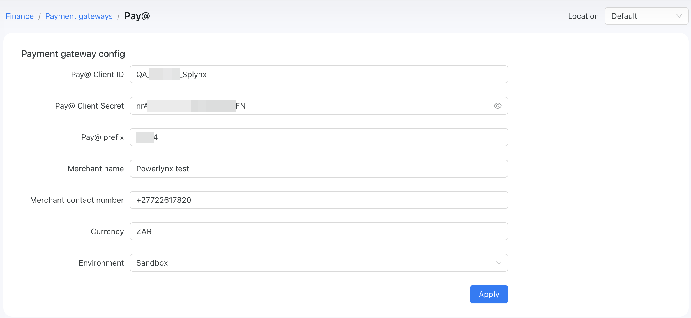
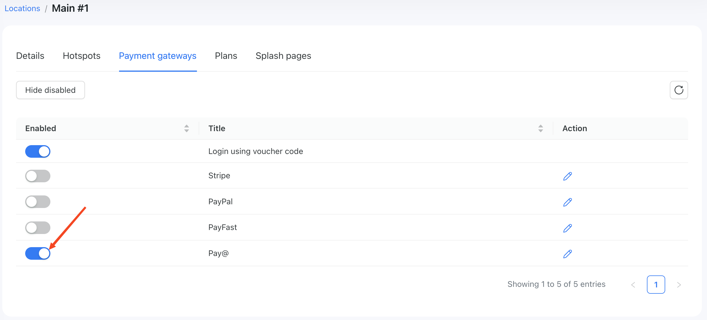
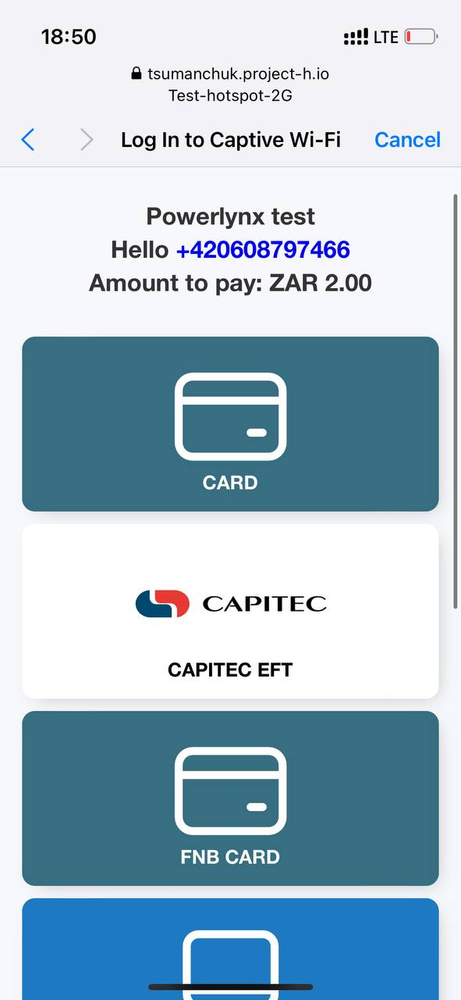
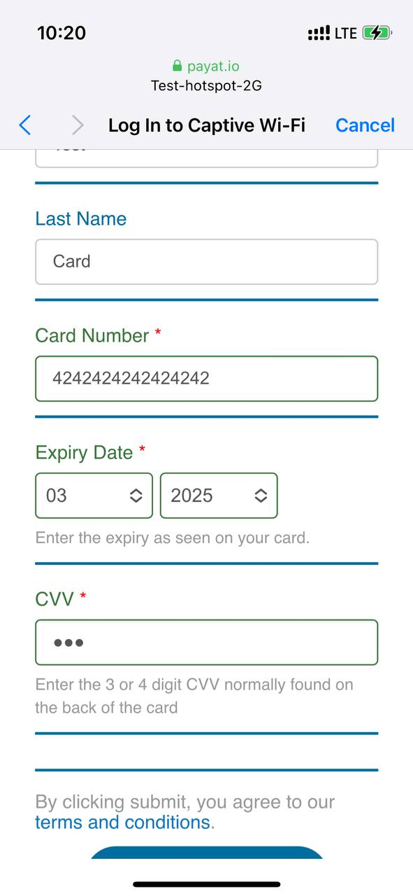
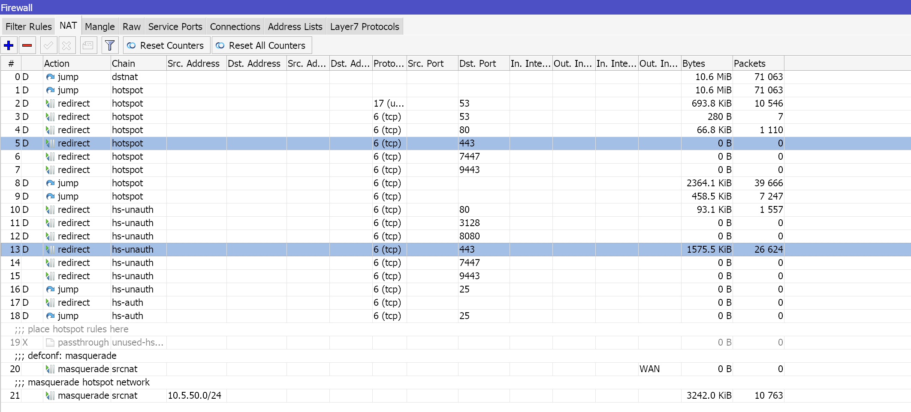
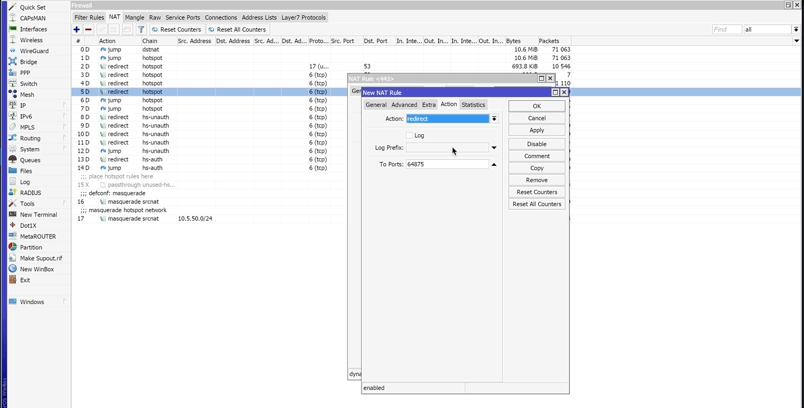

# Payat (Pay@)

By default, you can accept payments in Powerlynx using the [Payat payment system](https://www.payat.co.za/). Payat is supported only in South Africa.

To set up the Payat integration in Powerlynx, ensure that under `Config/System/Localization`, you've selected South Africa

## Configuration

First of all, you should contact the Pay@ team (**carel@payat.co.za**) with a request indicating that you plan to use Pay@ in Powerlynx. They will create an account for you that can accept payments from your Powerlynx account. You should receive the following credentials: Client ID, Client Secret, Prefix, and Merchant Name. Once you have these values, you can navigate to `Config/Finance/Payment gateways/Pay@` and enter them into the corresponding fields:

{data-zoomable}

* **Merchant contact number** - is the number of a contacted person in your organization;

* **Currency** - should be "ZAR"

* **Environment** - Live or Sandbox(test) depending on what type of account do you have. 

## Enable Payment Gateway for a Location

The next crucial step is to enable Payat for a specific location. Navigate to Locations, select the desired location, and open the "Payment Gateways" tab. From there, enable Payat for this location:

{data-zoomable}

If it's disabled, your clients will not have the option to pay with Payat.

## Buying a voucher with Payat

Now, your customers can buy a voucher on a splash page using Payat by selecting this payment method on a splash page:

{data-zoomable}

After clicking on the "Card" option, the customer will be redirected to the page, where they should provide the credit card details to complete the purchase:

{data-zoomable}

## Networking: Walled Garden and firewall

To integrate Pay@, you need to make a minor adjustment to your firewall. Simply duplicate the selected firewall rules twice and change the Dst.Port to 9443 and 7447:

{data-zoomable}

Below is a demonstration of this process in a GIF:

{data-zoomable}

Another crucial step is to configure the allow list of hosts on your hotspot. For instance, if you've connected a Mikrotik hotspot using [this manual](https://docs.powerlynx.app/networking/mikrotik.html), you now need to add a list of allowed hosts related to Payat. This allows your customers to be redirected to Payat pages without accessing the rest of the internet. You can find more about Mikrotik Walled Garden [here](https://wiki.mikrotik.com/wiki/Manual:IP/Hotspot/Walled_Garden).

To do this, you should access your router (in my case, Mikrotik), open the Terminal, and run this command with the list of hosts you wish to allow:

```
/ip hotspot walled-garden
add dst-host=www.google-analytics.com
add dst-host=trackjs-prod.b-cdn.net
add dst-host=secure.stitch.money
add dst-host=sandbox.ms.fnb.co.za
add dst-host=q-api-market.nedbank.co.za
add dst-host=payat.io
add dst-host=mesu.g.aaplimg.com
add dst-host=maxcdn.bootstrapcdn.com
add dst-host=powerlynx.fra1.digitaloceanspaces.com
add dst-host=fonts.googleapis.com
add dst-host=eftsecure.callpay.com
add dst-host=edge.api.flagsmith.com
add dst-host=*trackjs.com
add dst-host=*.nedbank.co.za
add dst-host=*.akadns.net
add dst-host=*.powerlynx.app

```

It might be useful to visit our forum, especially [this topic](https://forum.powerlynx.app/t/mikrotik-walled-garden/19), to discuss all questions related to the walled garden.
