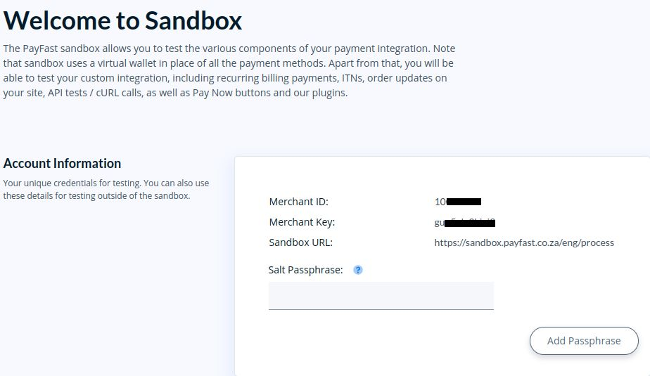
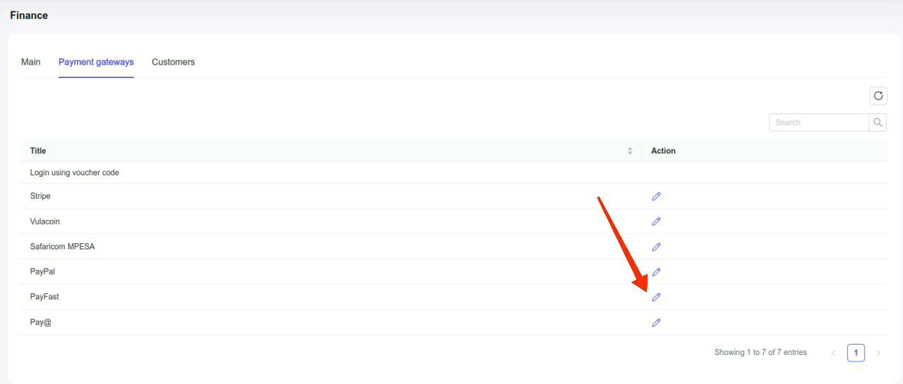
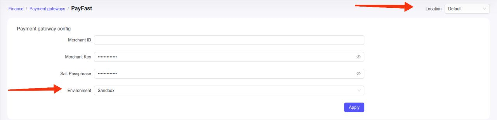
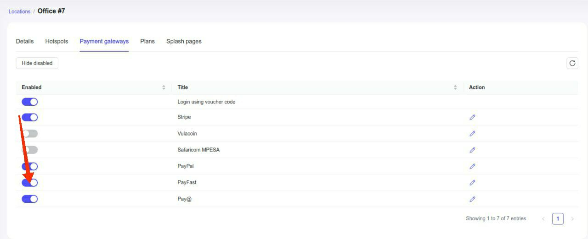
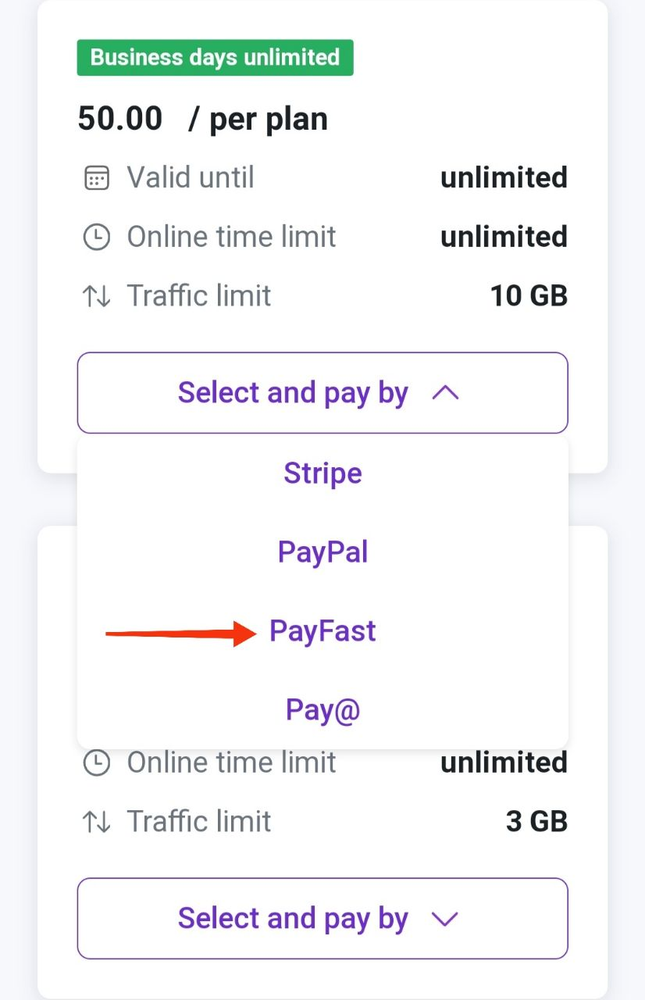

# PayFast

[PayFast](https://payfast.io/about-us/) is an online payment processing service for South African merchants of all sizes.

PayFast supports multiple payment methods, including MTN MoMo, card payments, Instant EFT, Mukuru Pay, and more. You can find the full list on [their website](https://payfast.io/features/payment-methods/).

To set up PayFast integration in Powerlynx, ensure you've selected country `South Africa` under `Config/System/Localization`.

## Configuration

Before integrating PayFast with Powerlynx, you can use the [sandbox enviroment](https://sandbox.payfast.co.za/) for testing.
To use `live enviroment` you need obtain the access to your [business PayFast account](https://www.payfast.co.za) and follow the provided steps. For this demonstration, we'll use the sandbox environment.

To integrate PayFast with Powerlynx, you need three crucial credentials:

* **Merchant ID**      - unique data, generated automatically by PayFast;
* **Merchant Key**     - unique data, generated automatically by PayFast;
* **Salt Passphrase**  - unique data, you must set it.

{data-zoomable}

In your Powerlynx account, navigate to the `Config/Finance/Payment Gateways/PayFast`.

{data-zoomable}

and insert them into the correspondingly named fields:

{data-zoomable}

Pay attention to the "Location" filter — you can configure your PayFast account as the default for the system (all locations will use this account which means all payments collected on all locations will go to this account), or you can select a specific location and link your account only with that location. Using this method, you can connect different PayFast accounts to different locations in Powerlynx. 

::: warning 
Please, be careful! If you are testing integration with Powerlynx you must use credentials from [sandbox account](https://sandbox.payfast.co.za/). 
If you want to use `live enviroment`, you must use credentials from your [business PayFast account](https://www.payfast.co.za)
:::

## Enable Payment Gateway for a Location

The next crucial step is to enable PayFast for a specific location. Navigate to Locations, select the desired location, and open the "Payment Gateways" tab. From there, enable PayFast for this location:

{data-zoomable}

If it's disabled, your clients will not have the option to pay with PayFast.

## Networking: Walled Garden

Another crucial step is to configure the allow list of hosts on your hotspot. For instance, if you've connected a Mikrotik hotspot using this [manual](https://docs.powerlynx.app/networking/mikrotik.html), you now need to add a list of allowed hosts related to PayFast. This allows your customers to be redirected to the 3D authentication page during the payment process. You can find more about Mikrotik Walled Garden [here](https://wiki.mikrotik.com/wiki/Manual:IP/Hotspot/Walled_Garden).

To do this, you should access your router (in my case, Mikrotik), open the Terminal, and run this command with the list of hosts you wish to allow:

```
/ip hotspot walled-garden
add dst-host=*.digitaloceanspaces.com
add dst-host=*.powerlynx.app
add dst-host=*payfast*
add dst-host=*.fnb.co.za
add dst-host=.api.ravepay.co
add dst-host=*.bankserv.co.za
add dst-host=*.cardinalcommerce.com
add dst-host=*.capitecbank.co.za
add dst-host=*oppwa.com
add dst-host=*.absa.co.za
add dst-host=*.africanbank.co.za
add dst-host=*.bidvestbank.co.za
add dst-host=*.fnb.co.za
add dst-host=*.investec.com
add dst-host=*.nedbank.co.za
add dst-host=*.sasfin.co.za
add dst-host=*.standardbank.co.za
add dst-host=*.ubank.co.za
add dst-host=dsecureprd.fnb.co.za
add dst-host=acs.nedsecure.co.za
add dst-host=*ctpe.net
add dst-host=*ppipe.net
add dst-host=secure.stitch.money
add dst-host=ol.css
add dst-host=ipapi.co
add dst-host=3dsecureprd.fnb.co.za
add dst-host=*.cloudfront.net  
add dst-host=*.kxcdn.com
add dst-host=*.amazonaws.com
```
It might be useful to visit our forum, especially [this topic](https://forum.powerlynx.app/t/mikrotik-walled-garden/19), to discuss all questions related to the walled garden.

## Buying a voucher with PayFast

Customers can now buy a voucher on a splash page using PayFast.

{data-zoomable}

After selecting "PayFast," the customer will be redirected to the PayFast page to complete the payment.