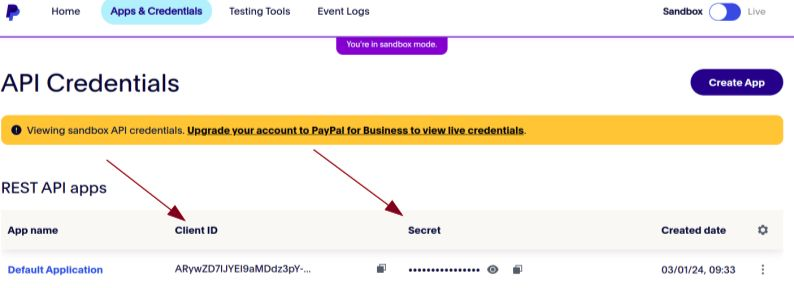
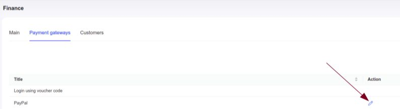
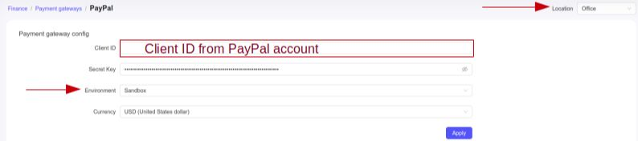
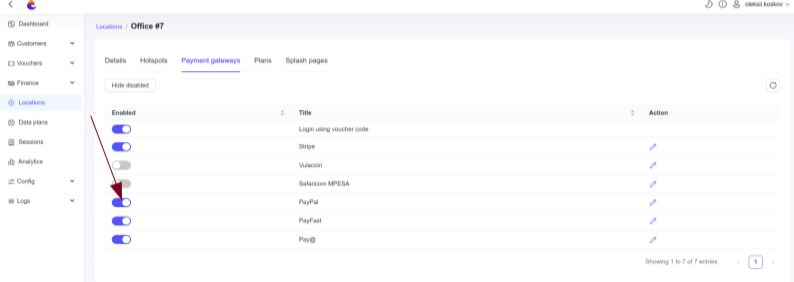
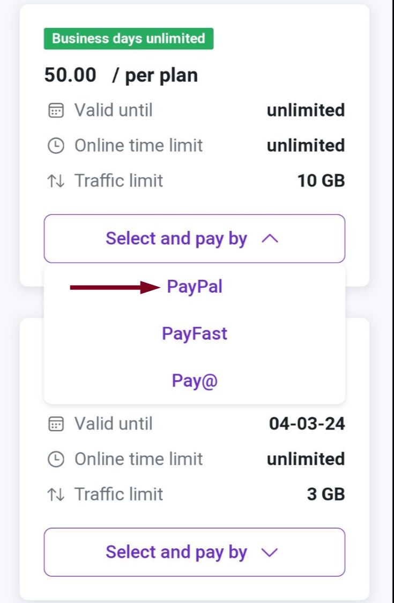
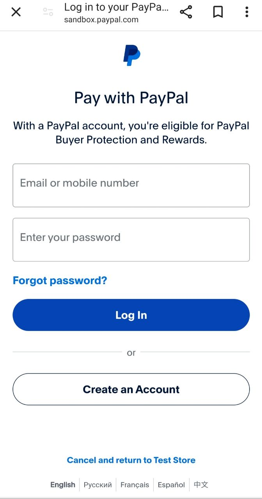

# PayPal

By default, you can accept payments in Powerlynx using the [PayPal payment system](https://www.paypal.com/). PayPal is available in more than 200 countries/regions and support 25 currencies - https://www.paypal.com/en/webapps/mpp/country-worldwide. 

To set up PayPal integration in Powerlynx, ensure you've selected a [country that supports PayPal payments](https://www.paypal.com/en/webapps/mpp/country-worldwide) under `Config/System/Localization`.

## Configuration

You need obtain the access to your business PayPal account on the following website: https://developer.paypal.com

Client ID and client Secret are the values required by Powerlynx to configure the payment gateway. 

Here's how to get your client ID and client secret:

1. Select [Log in](https://developer.paypal.com/) and log in or sign up in PayPal for developers.
2. Select Apps & Credentials.
3. New accounts come with a Default Application in the REST API apps section. To create a new project, select Create App.
4. Copy the client ID and client secret for your Powerlynx.

{data-zoomable}

Then, get back to your Powerlynx account, navigate to the `Config/Finance/Payment Gateways/PayPal`

{data-zoomable}

and insert them into the correspondingly named fields:

{data-zoomable}

Pay attention to the "Location" filter — you can configure your PayPal account as the default for the system (all locations will use this account which means all payments collected on all locations will go to this account), or you can select a specific location and link your account only with that location. Using this method, you can connect different PayPal accounts to different locations in Powerlynx. Last but not least, you have to select Environment-Live, because the Sandbox mode exists to test payments.

## Enable Payment Gateway for a Location

The next crucial step is to enable PayPal for a specific location. Navigate to Locations, select the desired location, and open the "Payment Gateways" tab. From there, enable PayPal for this location:

{data-zoomable}

If disabled, customers will not have the option to pay with PayPal.

## Buying a voucher with PayPal

Now, your customers can buy a voucher on a splash page using PayPal. 

{data-zoomable}

After that your customers can log in to PayPal using own account or another option - create new one to make a payment.

{data-zoomable}

## Networking: Walled Garden

Another crucial step is to configure the allow list of hosts on your hotspot. For instance, if you've connected a Mikrotik hotspot using this [manual](https://docs.powerlynx.app/networking/mikrotik.html), you now need to add a list of allowed hosts related to PayPal. This allows your customers to be redirected to PayPal pages without accessing the rest of the internet. You can find more about Mikrotik Walled Garden [here](https://wiki.mikrotik.com/wiki/Manual:IP/Hotspot/Walled_Garden).

To do this, you should access your router (in my case, Mikrotik), open the Terminal, and run this command with the list of hosts you wish to allow:

```
/ip hotspot walled-garden
add dst-host=*.digitaloceanspaces.com
add dst-host=*paypal*
add dst-host=*betacdn.net
add dst-host=*.powerlynx.app
add dst-host=*.akamaiedge.net
```
It might be useful to visit our forum, especially [this topic](https://forum.powerlynx.app/t/mikrotik-walled-garden/19), to discuss all questions related to the walled garden.