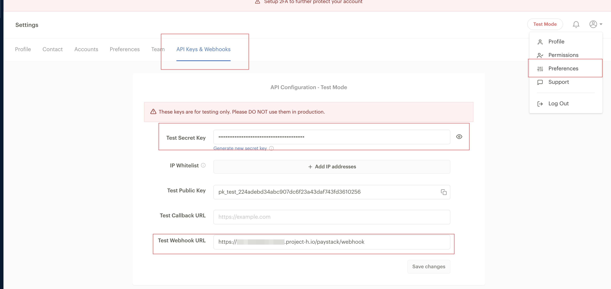

# Paystack

[Paystack](https://paystack.com/) is a payment gateway available in the following countries: Nigeria, Ghana, Kenya, South Africa, and Côte d’Ivoire (Ivory Coast).

To set up Paystack integration in Powerlynx, ensure you've selected one of the following countries under `Config/System/Localization`: Nigeria, Ghana, Kenya, South Africa, and Côte d’Ivoire (Ivory Coast).

## Configuration

Open your Paystack account, and obtain your secret key under `Preferences/API keys & Webhooks`:



Copy this value and in Powerlynx, under `Config/Payment gateways/Paystack` fill in the "Secret key" field with previously copied vaue from Paystack account and select your currency in the "Currency" field.

Also, in your Pastack account configure the "Webhook URL" value. It should contain your Powerlynx URL in the following format:

```
https://your.powerlynx.app/paystack/webhook
```

Replace `your.powerlynx.app` with your URL.

## Enable Payment Gateway for a Location

The next crucial step is to enable Paystack for a specific location. Navigate to Locations, select the desired location, and open the "Payment Gateways" tab. From there, enable Paystack for this location.

If it's disabled, your clients will not have the option to pay with Paystack.

## Networking: Walled Garden

Another crucial step is to configure the allow list of hosts on your hotspot. For instance, if you've connected a Mikrotik hotspot using this [manual](https://docs.powerlynx.app/networking/mikrotik.html), you now need to add a list of allowed hosts related to Paystack. This allows your customers to be redirected to the 3D authentication page during the payment process. You can find more about Mikrotik Walled Garden [here](https://wiki.mikrotik.com/wiki/Manual:IP/Hotspot/Walled_Garden).

To do this, you should access your router (in my case, Mikrotik), open the Terminal, and run this command with the list of hosts you wish to allow:

```
/ip hotspot walled-garden
add dst-host=*.digitaloceanspaces.com
add dst-host=*.powerlynx.app
add dst-host=checkout.paystack.com
add dst-host=*.amazonaws.com
add dst-host=www.googletagmanager.com
add dst-host=fonts.googleapis.com
add dst-host=s3-eu-west-1.amazonaws.com
add dst-host=fonts.gstatic.com
add dst-host=region1.google-analytics.com
add dst-host=api.paystack.co
add dst-host=public-files-paystack-prod.s3.eu-west-1.amazonaws.com
```
It might be useful to visit our forum, especially [this topic](https://forum.powerlynx.app/t/mikrotik-walled-garden/19), to discuss all questions related to the walled garden.