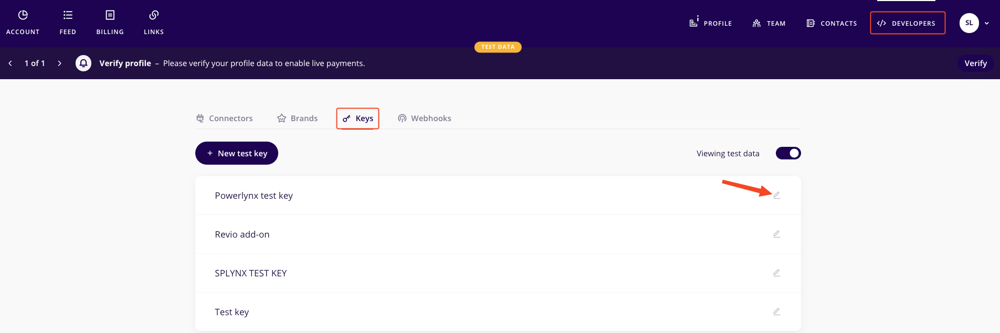
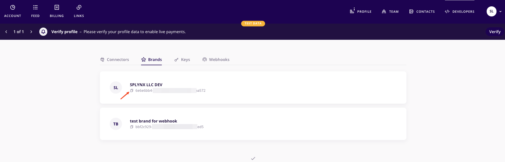
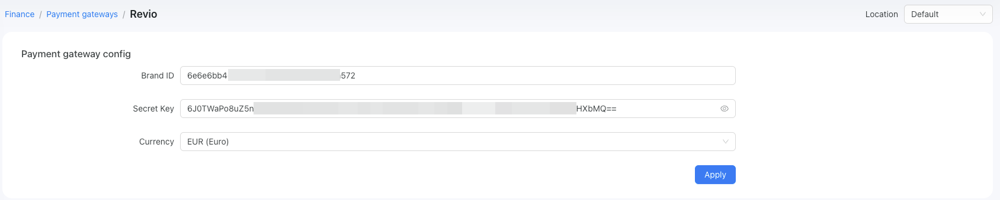
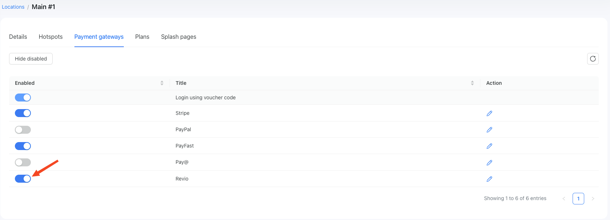
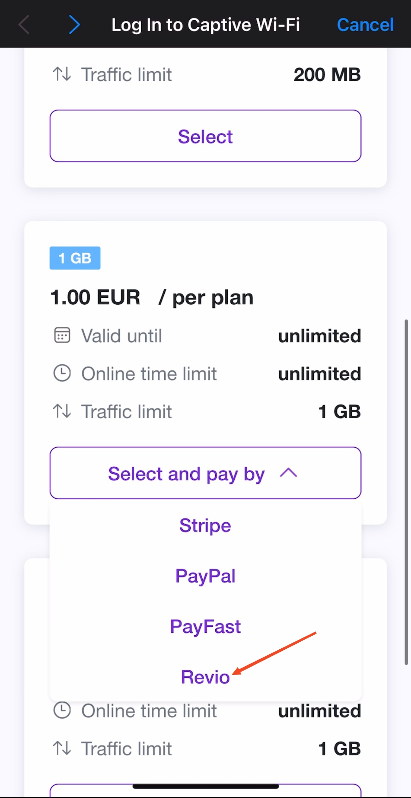
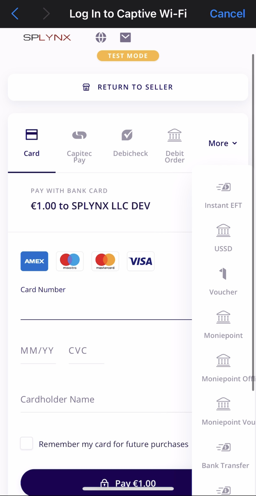

# Reviopay

By default, you can accept payments in Powerlynx using the [Revio payment system](https://www.reviopay.com/). Reviopay is supported in more than 40 countries.

To set up the Reviopay integration in Powerlynx, ensure that under `Config/System/Localization`, you've selected a country that supports Reviopay payments:

<details>
  <summary>List of countries</summary>
    <ul>
        <li>South Africa</li>
        <li>Nigeria</li>
        <li>Kenya</li>
        <li>Egypt</li>
        <li>Ghana</li>
        <li>Botswana</li>
        <li>Namibia</li>
        <li>Morocco</li>
        <li>Cote d'Ivoire</li>
        <li>Tanzania</li>
        <li>Uganda</li>
        <li>Cameroon</li>
        <li>Ethiopia</li>
        <li>Rwanda</li>
        <li>Zambia</li>
        <li>Burkina Faso</li>
        <li>Senegal</li>
        <li>Malawi</li>
        <li>Mozambique</li>
        <li>Madagascar</li>
        <li>Congo (DRC)</li>
        <li>Sierra Leone</li>
        <li>Angola</li>
        <li>Gabon</li>
        <li>Gambia</li>
        <li>Lesotho</li>
        <li>Eswatini</li>
        <li>Mauritius</li>
        <li>United Kingdom</li>
        <li>United States</li>
        <li>SEPA countries</li>
    </ul>

</details>


## Configuration

In your Reviopay account, navigate to the Home page and find the "Developers" section. You need to generate an API key in order to use it in Powerlynx. Please refer to [this guide](https://docs.reviopay.com/docs/api-keys) on how to create an API key in Reviopay.

You need to obtain the Secret key" value from Reviopay:

{data-zoomable}

and brand ID from the "Brands" tab:

{data-zoomable}

Then, open the Revio settings in Powerlynx under `Config/Finance/Payment gateways/Revio`:

{data-zoomable}

and insert them into the correspondingly named fields and select your currency.

Pay attention to the "Location" filter — you can configure your Reviopay account as the default for the system (all locations will use this account which means all payments collected on all locations will go to this account), or you can select a specific location and link your account only with that location. Using this method, you can connect different Reviopay accounts to different locations in Powerlynx.

## Enable Payment Gateway for a Location

The next crucial step is to enable Reviopay for a specific location. Navigate to Locations, select the desired location, and open the "Payment Gateways" tab. From there, enable Reviopay for this location:

{data-zoomable}

If it's disabled, your clients will not have the option to pay with Reviopay.

## Networking: Walled Garden

Another crucial step is to configure the allow list of hosts on your hotspot. For instance, if you've connected a Mikrotik hotspot using [this manual](https://docs.powerlynx.app/networking/mikrotik.html), you now need to add a list of allowed hosts related to Reviopay. This allows your customers to be redirected to Reviopay pages without accessing the rest of the internet. You can find more about Mikrotik Walled Garden [here](https://wiki.mikrotik.com/wiki/Manual:IP/Hotspot/Walled_Garden).

To do this, you should access your router (in my case, Mikrotik), open the Terminal, and run this command with the list of hosts you wish to allow:

```
/ip hotspot walled-garden
add dst-host=*.cloudfront.net
add dst-host=*.fastly.net
add dst-host=*.fontawesome.com
add dst-host=*arcot.com
add dst-host=*.digitaloceanspaces.com
add dst-host=*.reviopay.com
add dst-host=*.akamaiedge.net
add dst-host=*gstatic*
add dst-host=*apple-pay-gateway*
add dst-host=hcaptcha.com
add dst-host=*.amazonaws.com
add dst-host=*.seondnsresolve.com
add dst-host=*pay*apple*
add dst-host=*.powerlynx.app
```

It might be useful to visit our forum, especially [this topic](https://forum.powerlynx.app/t/mikrotik-walled-garden/19), to discuss all questions related to the walled garden.

## Buying a voucher with Reviopay

Now, your customers can buy a voucher on a splash page using Reviopay:

{data-zoomable}

After clicking on the "Reviopay" option, the customer will be redirected to the Reviopay page, where they can select their desired payment method, such as credit card, 1Voucher, etc:

{data-zoomable}
