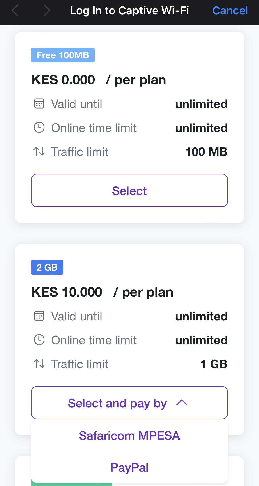

# Safaricom MPESA

By default, you can accept payments in Powerlynx using the [Safaricom MPESA](https://www.safaricom.co.ke/). Safaricom MPESA is supported only in Kenya.

To set up the Safaricom MPESA integration in Powerlynx, ensure that under `Config/System/Localization`, you've selected Kenya as your country.

## Configuration

In order to connect Powerlynx with your MPESA account you need to open the [developers MPESA account](https://developer.safaricom.co.ke), navigate to the Home page and find the "My Apps" section. Find the app you want to connect to Powerlynx and take these values (you'll need to insert them in the module config in Powerlynx):

You need to obtain the "Consumer key" and "Consumer secret" values from MPESA:

{data-zoomable}

You will also need your shortcode. A shortcode is the unique number allocated to a pay bill or buy goods organization through which they can receive customer payments. It could be a Pay Bill, Buy Goods, or Till Number.

Additionally, you need to know your "Lipa Na Mpesa Online Passkey." 

It is recommended to reach out to MPESA API support to clarify which credentials to use with the Powerlynx app. They will provide guidance if you are unsure.

Now it's time to insert them into the corresponding fields:

{data-zoomable}

You need to fill in the "Consumer Key," "Consumer Secret," "Short Code," and "Lipa Na Mpesa Online Key" with the values previously taken from your MPESA account accordingly.

Then, in the "Create payment on" field, select the desired method to use. MPESA sends validation and confirmation responses to Powerlynx, and sometimes you might not receive one of them. For this purpose, we designed it so you can create a payment after either the validation or confirmation request.

In the "Environment" field, select the environment you use in your MPESA app. For testing purposes, we use the sandbox environment.

Pay attention to the "Location" filter — you can configure your MPESA account as the default for the system (all locations will use this account which means all payments collected on all locations will go to this account), or you can select a specific location and link your account only with that location. Using this method, you can connect different MPESA accounts to different locations in Powerlynx.

Once all these fields are configured, press the "Apply" button to save the configuration. Next, you need to register the callback URLs for your Powerlynx account in MPESA. To do this, click the "Register" button and wait for the result. If everything went well, you should see the following result:

{data-zoomable}

You should see some values for the registered URLs. Now we can proceed to the next step.

## Enable Payment Gateway for a Location

The next crucial step is to enable Safaricom MPESA for a specific location. Navigate to Locations, select the desired location, and open the "Payment Gateways" tab. From there, enable Safaricom MPESA for this location:

{data-zoomable}

If it's disabled, your clients will not have the option to pay with MPESA.

## Buying a voucher with Safaricom MPESA

Now, your customers can buy a voucher on a splash page using Safaricom MPESA:

{data-zoomable}

After clicking on the "Safaricom MPESA" option, the customer will be redirected to the Safaricom MPESA page, where they can make a payment.
