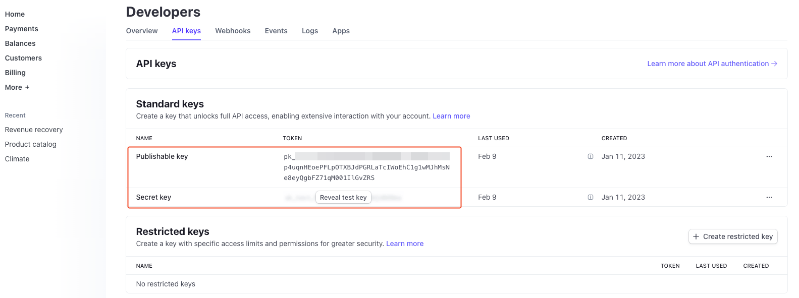
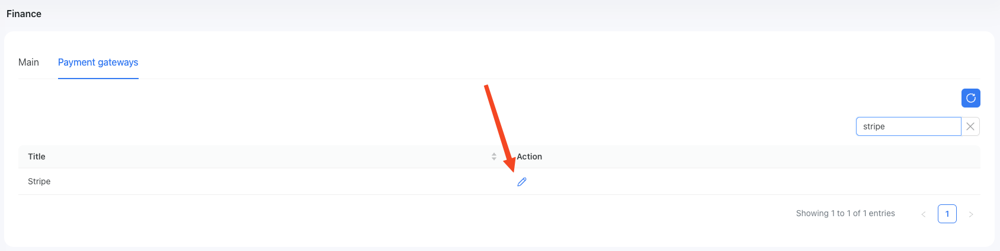
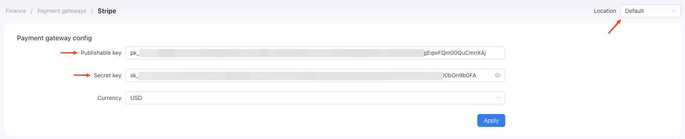
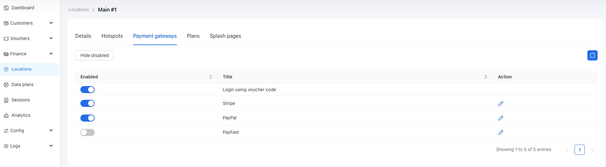
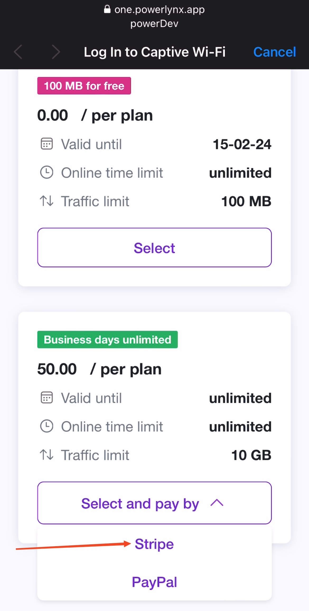

# Stripe

By default, you can accept payments in Powerlynx using the [Stripe payment system](https://stripe.com/). Stripe is supported in more than 46 countries, with more to come - https://stripe.com/global

To set up the Stripe integration in Powerlynx, ensure that under `Config/System/Localization`, you've selected a [country that supports Stripe payments](https://stripe.com/global).

## Configuration

In your Stripe account, navigate to the Home page and find the "Developers" section. You need to generate an API key in order to use it in Powerlynx. Please refer to [this guide](https://docs.stripe.com/keys) on how to create an API key in Stripe.

You need to obtain the "Publishable key" and "Secret key" values from Stripe:

{data-zoomable}

Then, open the Stripe settings in Powerlynx:

{data-zoomable}

and insert them into the correspondingly named fields:

{data-zoomable}

Pay attention to the "Location" filter — you can configure your Stripe account as the default for the system (all locations will use this account which means all payments collected on all locations will go to this account), or you can select a specific location and link your account only with that location. Using this method, you can connect different Stripe accounts to different locations in Powerlynx.

## Enable Payment Gateway for a Location

The next crucial step is to enable Stripe for a specific location. Navigate to Locations, select the desired location, and open the "Payment Gateways" tab. From there, enable Stripe for this location:

{data-zoomable}

If it's disabled, your clients will not have the option to pay with Stripe.

## Networking: Walled Garden

Another crucial step is to configure the allow list of hosts on your hotspot. For instance, if you've connected a Mikrotik hotspot using [this manual](https://docs.powerlynx.app/networking/mikrotik.html), you now need to add a list of allowed hosts related to Stripe. This allows your customers to be redirected to Stripe pages without accessing the rest of the internet. You can find more about Mikrotik Walled Garden [here](https://wiki.mikrotik.com/wiki/Manual:IP/Hotspot/Walled_Garden).

To do this, you should access your router (in my case, Mikrotik), open the Terminal, and run this command with the list of hosts you wish to allow:

```
/ip hotspot walled-garden
add dst-host=*.digitaloceanspaces.com
add dst-host=*powerlynx.app
add dst-host=*.cloudfront.net
add dst-host=*.fastly.net
add dst-host=*.fontawesome.com*
add dst-host=*arcot.com*
add dst-host=*stripe*
add dst-host=*.akamaiedge.net
add dst-host=*apple-pay-gateway*
add dst-host=hcaptcha.com
add dst-host=*betacdn.net
add dst-host=*pay*apple*
add dst-host=*.amazonaws.com
```

It might be useful to visit our forum, especially [this topic](https://forum.powerlynx.app/t/mikrotik-walled-garden/19), to discuss all questions related to the walled garden.

## Buying a voucher with Stripe

Now, your customers can buy a voucher on a splash page using Stripe:

{data-zoomable}

After clicking on the "Stripe" option, the customer will be redirected to the Stripe page, where they can select their desired payment method, such as credit card, Apple Pay, or Google Pay, etc.
