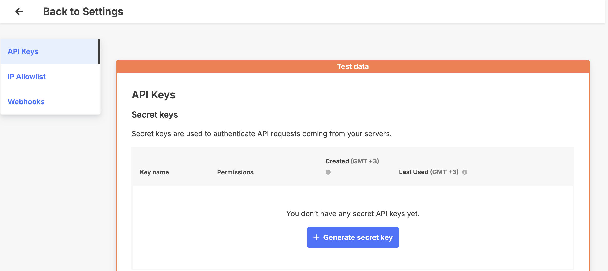
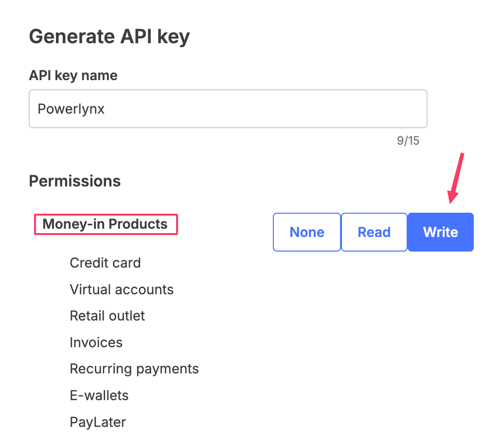
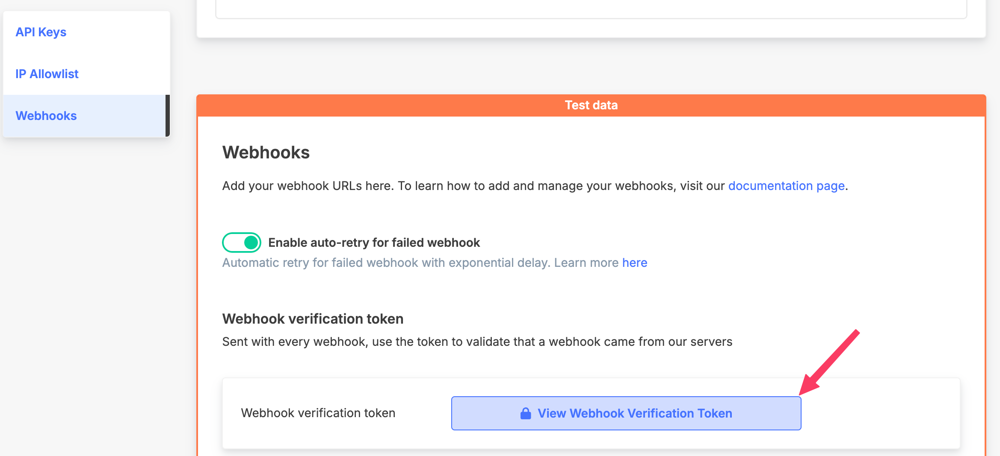
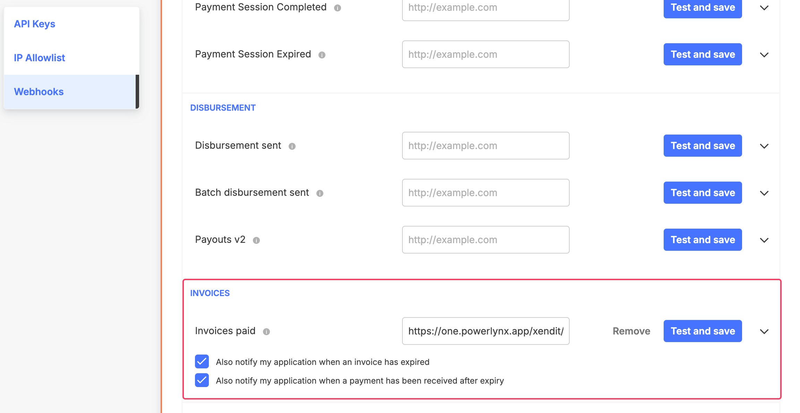
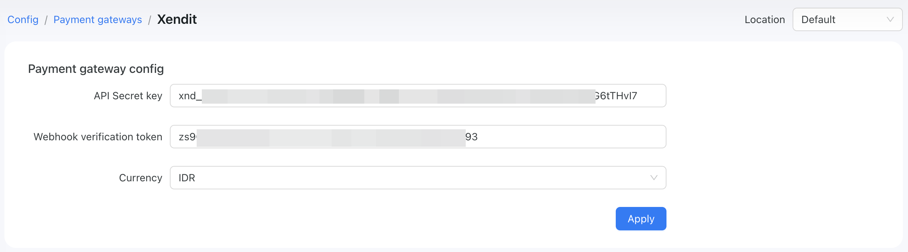
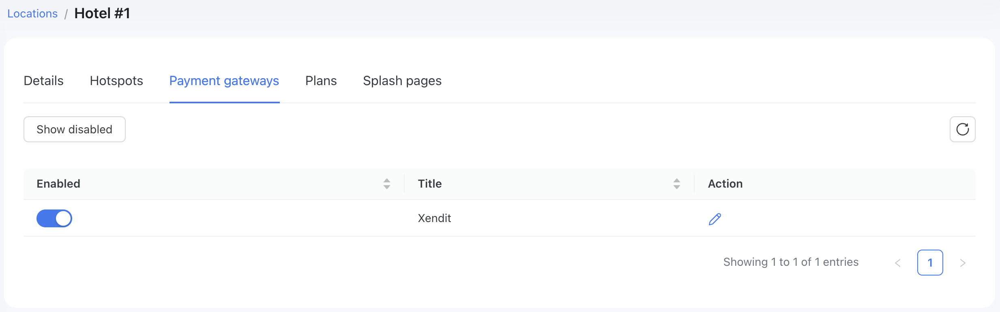
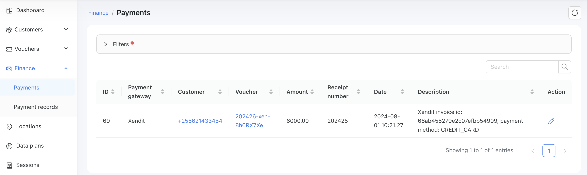

# Xendit

[Xendit](https://www.xendit.co/en/) a Payment Gateway Uniquely built for Indonesia, the Philippines and Southeast Asia.

To set up Xendit integration in Powerlynx, ensure you've selected one of the following countries under `Config/System/Localization`: 
Indonesia 🇲🇨, Philippines 🇵🇭, Malaysia 🇲🇾, Thailand 🇹🇭, and Vietnam 🇻🇳

## Configuration

Open your Xendit account, navigate to `Settings -> Developers -> API Keys`. On that page, you will need to generate secret key:



with the "Write" permissions for the "Money-in Products" section:



the received value should be copied and inserted into Powerlynx in the "API secret key" field under `Config/Payment gateways/Xendit`.

Next, you need to navigate to `Settings -> Developers -> Webhooks` in your Xendit account. On that page, you will need to click this button to get the webhook value:



the received value should be copied and inserted into Powerlynx in the "Webhook verification token" field under `Config/Payment gateways/Xendit`.

Next, in your Xendit account navigate to `Settings -> Developers -> Webhooks` and find the "Webhook URL" section and scroll down to the "Invoices" settings:



Activate 2 checkboxes as per our screenshot and insert the URL into the "Invoices paid" field. The URL should be in the following format:

```
https://one.powerlynx.app/xendit/notify
```
Make sure you've replaced `one.powerlynx.app` with your Powerlynx URL. Click "Test and save" button.

After that, in Powerlynx, under `Config/Payment gateways/Xendit` select your currency in the "Currency" field.

Your config of this integration should be as following:



## Enable Payment Gateway for a Location

The next crucial step is to enable Xendit for a specific location. Navigate to Locations, select the desired location, and open the "Payment Gateways" tab. From there, enable Xendit for this location:

{data-zoomable}

If it's disabled, your clients will not have the option to pay with Xendit.

## Networking: Walled Garden

Another crucial step is to configure the allow list of hosts on your hotspot. For instance, if you've connected a Mikrotik hotspot using this [manual](https://docs.powerlynx.app/networking/mikrotik.html), you now need to add a list of allowed hosts related to Xendit. This allows your customers to be redirected to the 3D authentication page during the payment process. You can find more about Mikrotik Walled Garden [here](https://wiki.mikrotik.com/wiki/Manual:IP/Hotspot/Walled_Garden).

To do this, you should access your router (in my case, Mikrotik), open the Terminal, and run this command with the list of hosts you wish to allow:

```
/ip hotspot walled-garden
add dst-host=*.digitaloceanspaces.com
add dst-host=*.powerlynx.app
add dst-host=www.googletagmanager.com
add dst-host=googletagmanager.com
add dst-host=www.datadoghq-browser-agent.com
add dst-host=datadoghq-browser-agent.com
add dst-host=static.cloudflareinsights.com
add dst-host=snowplow-collector.iluma.ai
add dst-host=fonts.gstatic.com
add dst-host=fonts.googleapis.com
add dst-host=cloudflareinsights.com
add dst-host=cdnjs.cloudflare.com
add dst-host=cdn.growthbook.io
add dst-host=*.xendit.co
add dst-host=*.fastly.net
add dst-host=*.elasticbeanstalk.com
add dst-host=*.cloudfront.net
add dst-host=*.cdn.cloudflare.net
add dst-host=*.cardinalcommerce.com
add dst-host=*.amazonaws.com
```
It might be useful to visit our forum, especially [this topic](https://forum.powerlynx.app/t/mikrotik-walled-garden/19), to discuss all questions related to the walled garden.

## Buying a voucher with Xendit

Customers can now buy a voucher on a splash page using Xendit.

{data-zoomable}

After selecting "Xendit," the customer will be redirected to the Xendit page to complete the payment:

{data-zoomable}

{data-zoomable}

{data-zoomable}

Payment captured by Powerlynx are stored under `Finance/Payments`:

{data-zoomable}