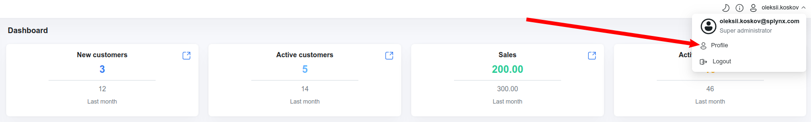
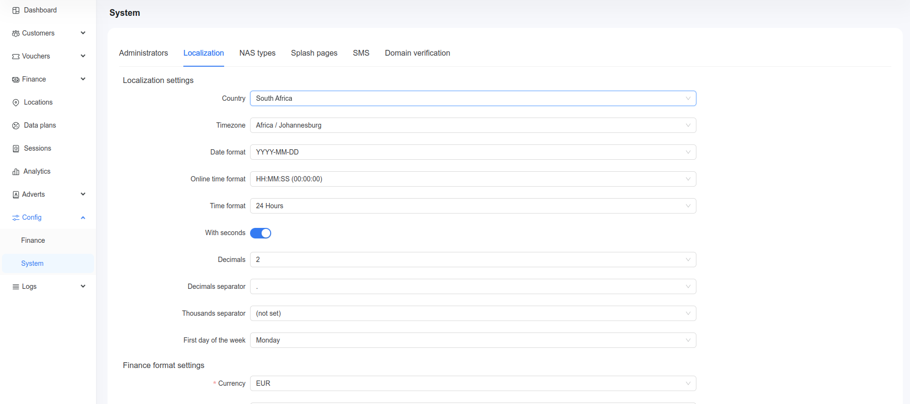
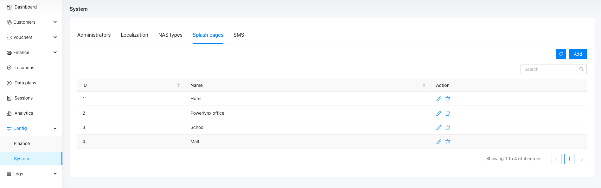
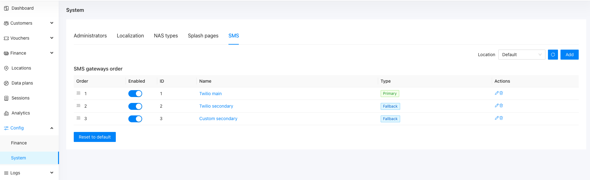
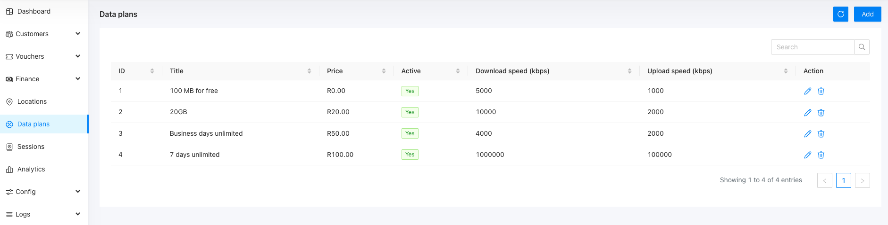
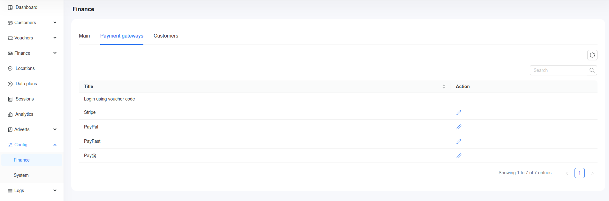
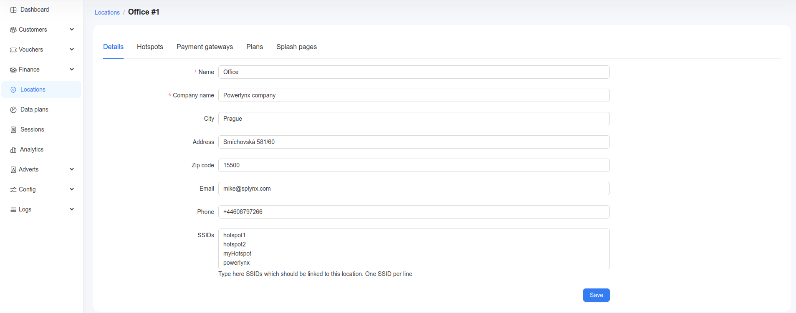
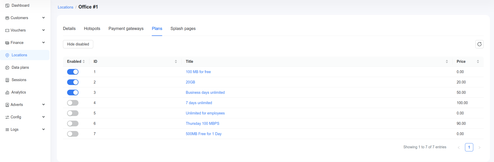
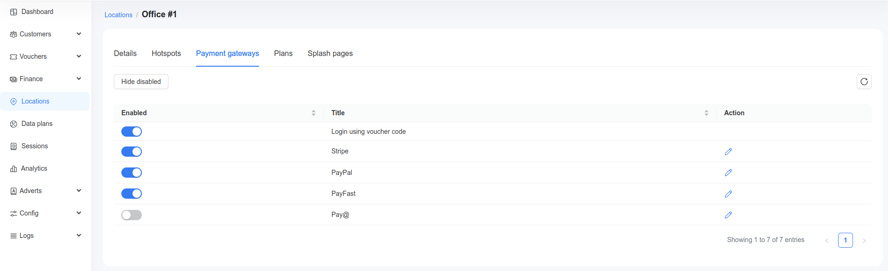
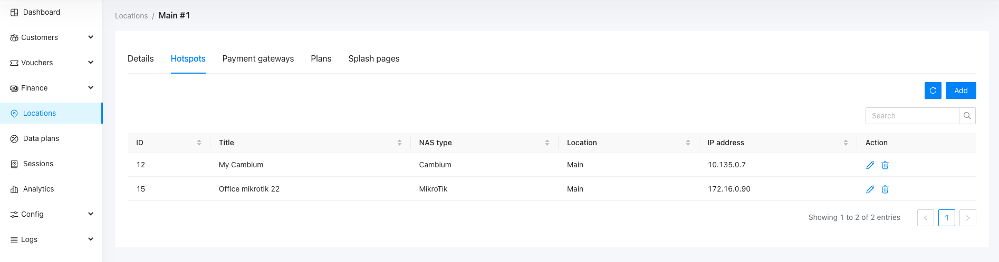

# How to start 

Right after the registration, open your Powerlynx instance and do next:

1. Ensure the security of your account by setting up Two-Factor Authentication (2FA). To enable 2FA, go to your account settings (located in the top right corner -> Profile) and configure it in the 'Two-factor authentication' section:

2. Navigate to Config/System/Localization and verify that all parameters are correct:

3. Go to Config/System/Splash pages and create a Splash page. This is a crucial step, as each location must be configured with its splash page:

4. Set up SMS sending under Config/System/SMS if you plan to verify your customers' phone numbers with OTP codes. Configure your SMS gateway:

5. Create some tariff plans under Data plans:

6. Configure payment methods under Config/Finance/Payment gateways.

7. Configure your location under the Locations menu:
    - Ensure the Details/SSIDs field is not empty and contains the identifier of your hotspot.
    
    - Under the Splash pages section, select the previously created splash page.
    
    - Under the Plans tab, select available tariff plans for this location.
    
    - Under the Payment gateways tab, select available payment methods.
    
    - Under the Hotspots tab, create a router.
    