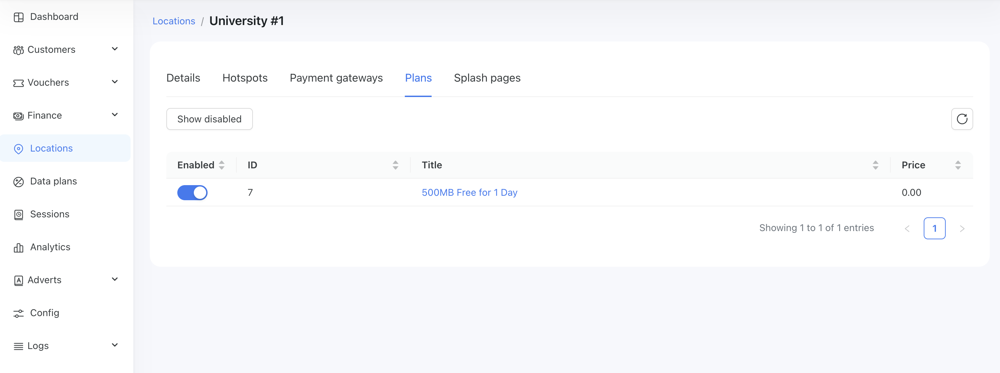

# Quick‑Start Guide (~10 minutes)

This guide walks you through the minimum set‑up required to see Powerlynx in action. Follow the six steps below with any supported access point or gateway.

## Prerequisites

- A Powerlynx admin account ([sign up for free](https://powerlynx.app/) if you haven’t already).

- A compatible device that can redirect to an external captive portal and speak RADIUS.

- Basic network connectivity from the device to the internet.

## 1️⃣ [Create & brand your splash page](https://docs.powerlynx.app/system/splash-pages.html)

1. In the Powerlynx dashboard, navigate to `Config/System/Splash pages`

2. Press the "Add" button and configure your splash page.

3. Upload your logo, tweak colours/fonts, and add optional elements (T&C, social login, adverts, etc.).

4. Hit Save & Publish.

## 2️⃣ [Create a FREE data plan (for quick testing)](https://docs.powerlynx.app/system/data-plans.html)

Using [this manual](https://docs.powerlynx.app/system/data-plans.html), create a data plan with a price of 0. When the plan price is zero, the customer won't be redirected to the payment gateway. This allows us to test whether the user flow works correctly without triggering a redirect to the payment page. Later, we can update the price to test the flow with the payment gateways.

## 3️⃣ [Assign the splash page to a location](https://docs.powerlynx.app/system/data-plans.html)

Open the `Locations` menu and select a default location (or create a new one). Then, switch to the `Splash Pages` tab and enable the splash page you created in step #1 for this location.

{data-zoomable}

## 4️⃣ [Enable the data plan for that location](https://docs.powerlynx.app/system/splash-pages.html#how-to-enable-the-splash-page)

Switch to the `Plans` tab and enable the data plan you created in step #2 for this location.

{data-zoomable}

## 5️⃣ [Connect your hotspot](https://docs.powerlynx.app/networking/mikrotik.html)

Using one of the [manuals](https://docs.powerlynx.app/networking/main.html), add your hotspot to this location.

[MikroTik](https://docs.powerlynx.app/networking/mikrotik.html) is the easiest option and is perfectly suitable for Powerlynx.

## 6️⃣ Test the flow

Connect to the WiFi and verify the user flow.

{data-zoomable}