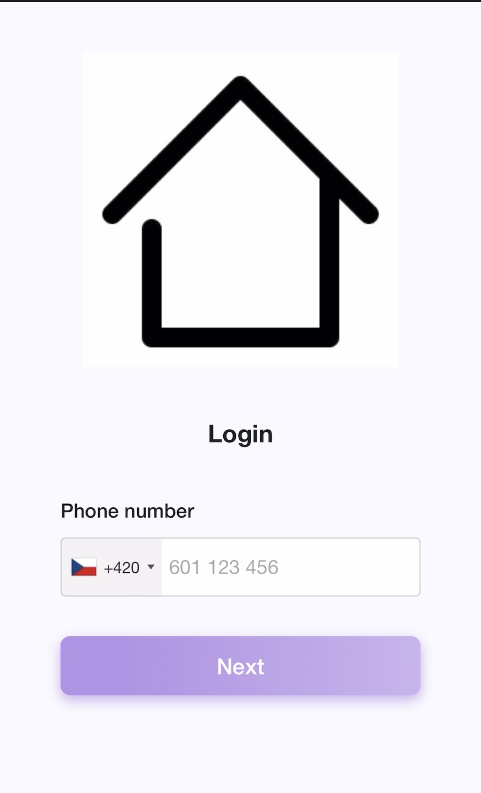

---
# https://vitepress.dev/reference/default-theme-home-page
layout: home

hero:
  name: "Powerlynx"
  text: "Documentation"
  tagline: Maximize your revenue by monetizing your Wi-Fi with Powerlynx.
  actions:
    - theme: brand
      text: Guidance and manuals
      link: /manuals
    - theme: alt
      text: About us
      link: /about
    - theme: alt
      text: Get started
      link: /getstarted

features:
  - title: Payment gateways
    details: Explore various payment gateway options to seamlessly accept payments.
  - title: Captive portal
    details: A captive portal is a webpage that the user of a public network is required to view and interact with before they can access the network.
  - title: SMS failover
    details: Ensures SMS delivery to end-users even when the primary SMS gateway is unavailable.
  - title: Flexible configuration of tariff plans
    details: Configure tariff plans as desired, specifying traffic limits, time online limits, and the days of the week and hours during which this plan is available for selection.
  - title: Printed vouchers
    details: Generate vouchers in Powerlynx, print them and sell them offline.
  - title: A fully cloud-based solution
    details: You need not worry about managing your own server; we will take care of it for you.
  - title: An assortment of graphs and reports.
    details: Gain insights into your top-performing products, revenue trends, peak traffic days, and more.
  - title: Customer statistics
    details: Analyze usage statistics for your customers to understand their data consumption and preferred payment options.

hero1:
  text: "A sample user journey"
  tagline: How the user journey looks in Powerlynx
features:
  - title: Connect to Wifi
    details: 
---

