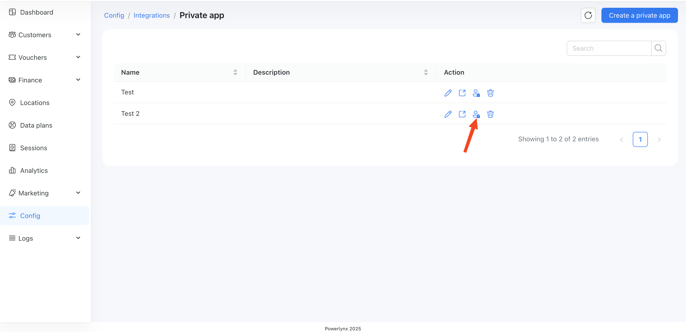
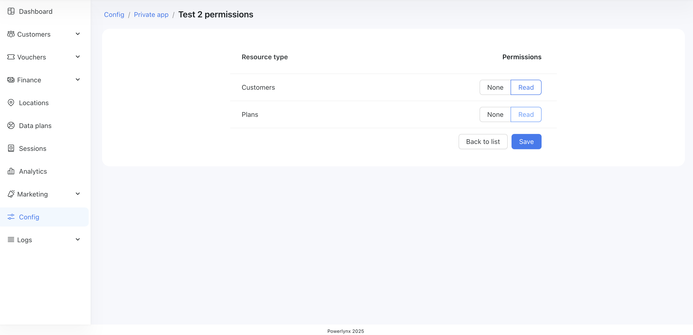

# Private app

Powerlynx allows you to connect your own private applications using secure API tokens. This feature is designed for developers or advanced users who want to automate workflows, integrate with third-party systems, or build custom dashboards using the [Powerlynx API](https://api-doc.powerlynx.app/).

## How to create a private app
1. Go to `Config / Integrations / Private app`
2. Click "Create a private app"
3. Enter a name and optional description
4. Copy generated token and save it somewhere
5. Update permissions for your private app:

{data-zoomable}

{data-zoomable}

6. Run API calls to Powerlynx


## Examples

### Search customer by phone number. PHP CURL

```
$curl = curl_init();

curl_setopt_array($curl, [
  CURLOPT_URL => "https://my.powerlynx.app/api/customers?".http_build_query(
  [
    'server_side' => [
        'pagination' => [
            'perPage' => 5,
            'page' => 1
        ],
        'search' => '+420608222444'
    ]
]),
  CURLOPT_RETURNTRANSFER => true,
  CURLOPT_ENCODING => "",
  CURLOPT_MAXREDIRS => 10,
  CURLOPT_TIMEOUT => 30,
  CURLOPT_HTTP_VERSION => CURL_HTTP_VERSION_1_1,
  CURLOPT_CUSTOMREQUEST => "GET",
  CURLOPT_HTTPHEADER => [
    "Accept: application/json",
    "Authorization: Bearer {your access token}"
  ],
]);

$response = curl_exec($curl);
$err = curl_error($curl);

curl_close($curl);

if ($err) {
  echo "cURL Error #:" . $err;
} else {
  echo $response;
}
```

Or get all customers 50 per page (change the `PerPage` and `page` values as you need):

```
$curl = curl_init();

curl_setopt_array($curl, [
  CURLOPT_URL => "https://one.stage.powerlynx.app/api/customers?".http_build_query(
  [
    'server_side' => [
        'pagination' => [
            'perPage' => 50,
            'page' => 2
        ]
    ]
]),
  CURLOPT_RETURNTRANSFER => true,
  CURLOPT_ENCODING => "",
  CURLOPT_MAXREDIRS => 10,
  CURLOPT_TIMEOUT => 30,
  CURLOPT_HTTP_VERSION => CURL_HTTP_VERSION_1_1,
  CURLOPT_CUSTOMREQUEST => "GET",
  CURLOPT_HTTPHEADER => [
    "Accept: application/json",
    "Authorization: Bearer 1|YiGFGUySej6RbssME1knfOrKOjym2X0yOkjzyLAx80dfba5b"
  ],
]);

$response = curl_exec($curl);
$err = curl_error($curl);

curl_close($curl);

if ($err) {
  echo "cURL Error #:" . $err;
} else {
  echo $response;
}
```