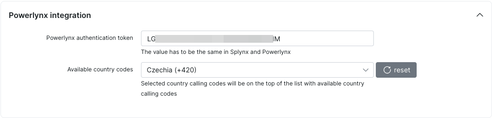

# Integration with Splynx

Do you use [Splynx](https://splynx.com/) ISP billing and network management system? If the answer is "Yes", you might want your active Splynx customers to gain free Wi-Fi access in Powerlynx when connecting to a hotspot. This integration will help you connect your Splynx server with your Powerlynx account and provide free internet to your Splynx customers who connect to a hotspot managed by Powerlynx.

What does the user journey look like?

{data-zoomable}

It's simple. When the customer connects to WiFi, they can choose how to log in: either as a new customer by providing their phone number and selecting a plan, or by clicking on `I'm a customer of {ISP name}` to be redirected to the Splynx portal for login. After logging in, the system checks if the customer is active or new, and if so, authorizes the user. If the customer is blocked or inactive in Splynx, or if they use incorrect login credentials, they can return and log in as a new customer.

# Configuration

First of all, your Splynx version must be 4.3 or newer. In Splynx, navigate to `Config/Integrations/Add-ons` and find the `splynx-powerlynx` package in the list, then install it.

After the installation, navigate to `Config/Integrations/Modules list`, locate the `splynx_powerlynx` module, and click on the button.

{data-zoomable}

Copy this value and save it. We will use it in Powerlynx configurations:

{data-zoomable}

**Now, let's configure the integration in Powerlynx.**

In Powerlynx, navigate to `Config/System/Integrations/Splynx` and click the "Edit" button. You will see this window:

{data-zoomable}

* **Splynx external authentication URL** - This is the URL of your Splynx server where the splynx-powerlynx module is installed. Make sure you set it in the correct format: `https://yoururl.com/powerlynx`. The `/powerlynx` part after the URL of your Splynx server is required;

* **Powerlynx token** - The token value copied from Splynx under the module settings;

* **ISP name** - The name of your ISP. This will be visible to customers on the splash page when they click on `I'm a customer of {ISP name}`.

Now, go to Locations, select the desired location, and then select the Payment gateways tab. You will see this integration listed:

{data-zoomable}

Enable it, and click the "Edit" button.

Here, you need to select a [data plan](https://docs.powerlynx.app/system/data-plans.html) that will be used. The voucher for this customer will be created from this tariff plan:

{data-zoomable}

If the voucher was created using this method, you can easily track it:

{data-zoomable}

You will see the "Login via Splynx" value in the "Remark" field.