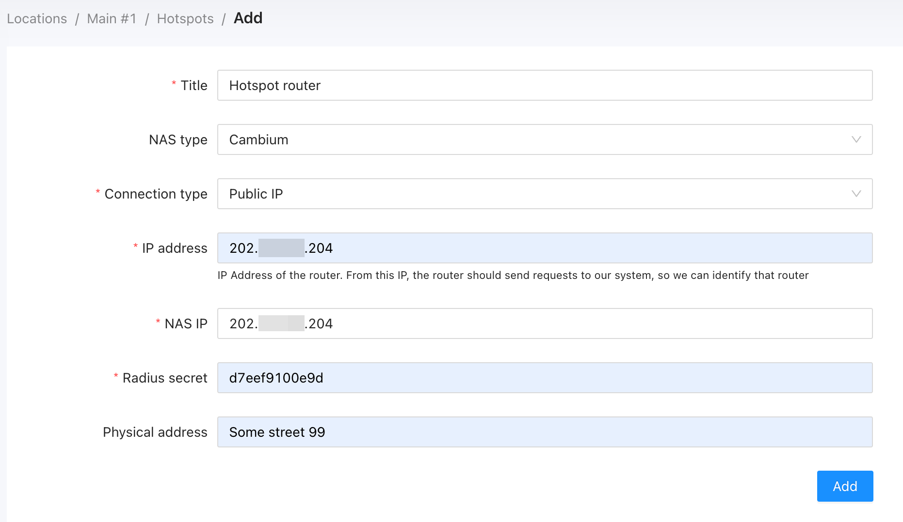
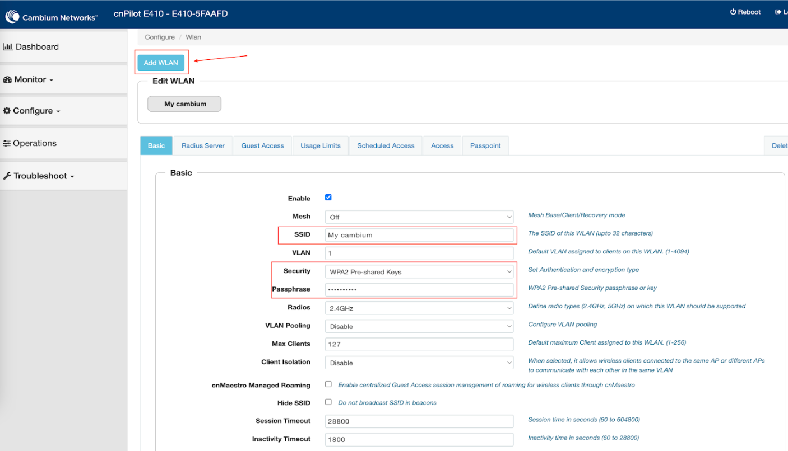
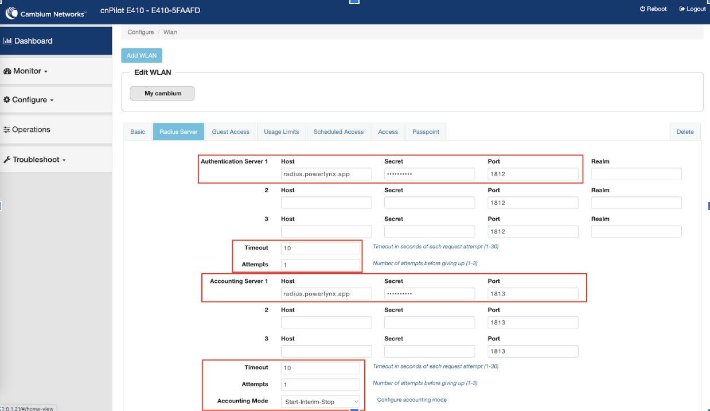
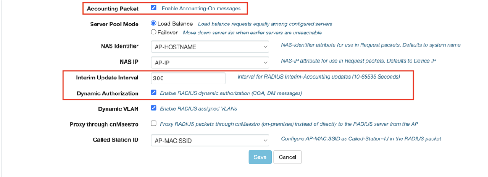
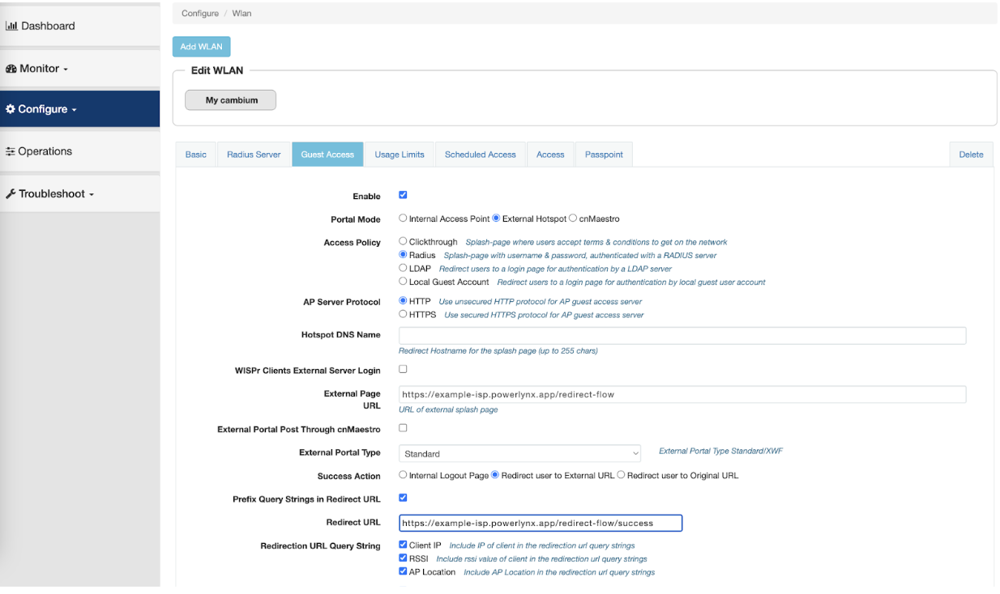
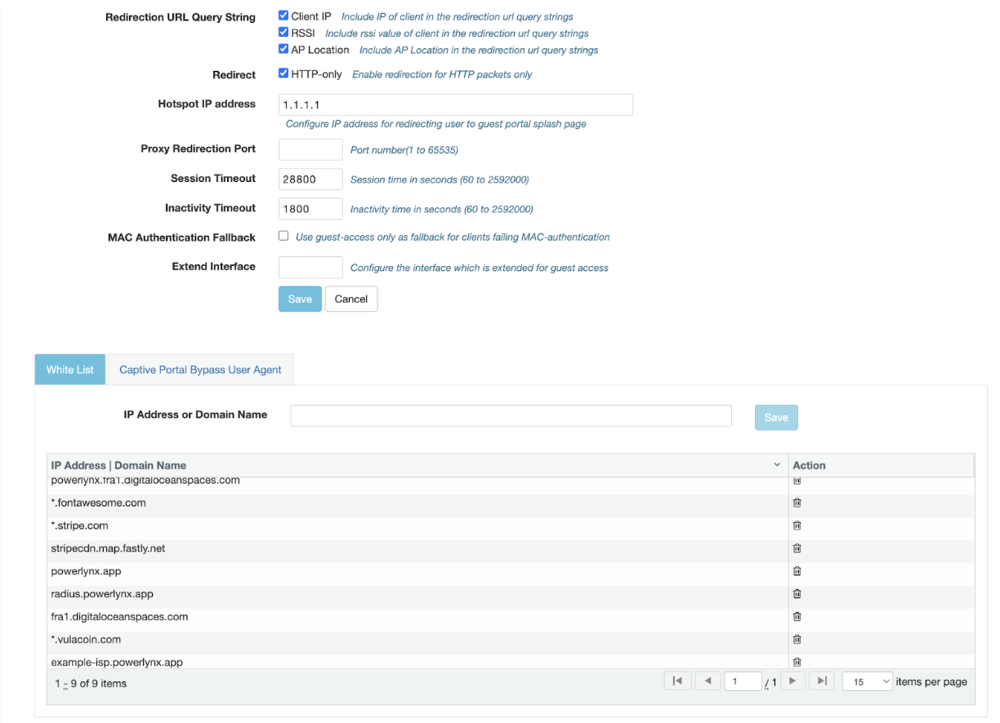
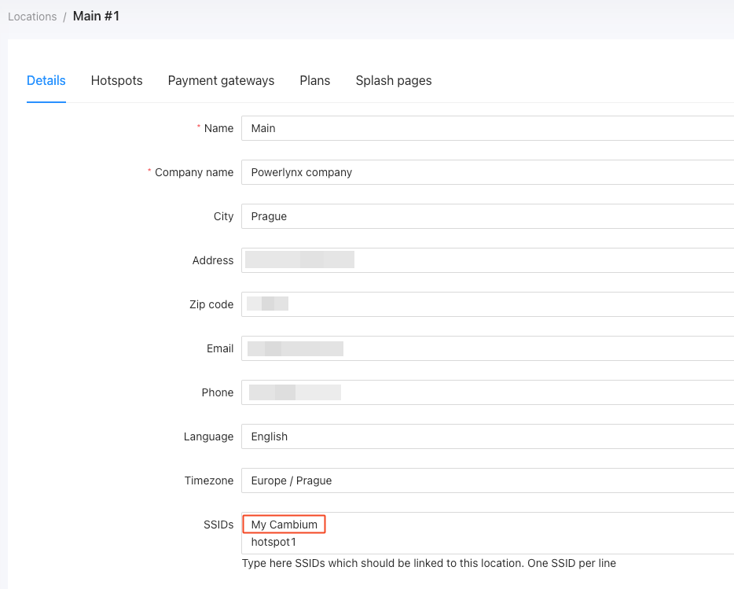
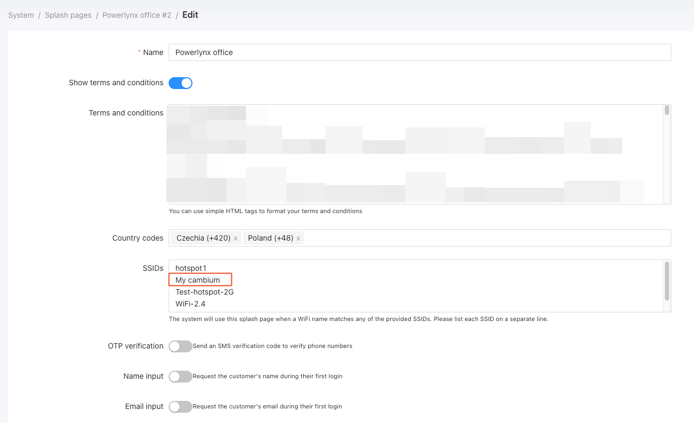

# Connect Cambium hotspot with Powerlynx

In this manual, we will guide you on how to add a Cambium router as a hotspot in Powerlynx.
In our example, we are using a Cambium router with wireless interfaces. Customers will connect to the Wi-Fi provided by the router.

Navigate to the desired location, open the "Hotspots" tab, and click on the "Add" button:

{data-zoomable}

* **Title** - title for your router;

* **NAS type** - select Cambium as a NAS type;

* **Connection type** - The only available connection type for Cambium devices is "Public IP";

* **IP address** - IP Address of the router. From this IP, the router should send requests to our system, so we can identify that router;

* **NAS IP** - the real IP source address for radius packets. It is recommended that in the Radius settings of the Mikrotik router Src. address = NAS IP in Splynx.

* **Radius secret** - RADIUS secret of your RADIUS server on the router;

* **Physical address** - address of your router (optional).

After adding Hotspot to Powerlynx, configure your Cambium device as follows:

1. Navigate to `Configure/WLAN`.
2. Click on `Add WLAN`.
3. Fill out the form based on your requirements and click the Save button.

{data-zoomable}

4. Go to the Radius Server tab, fill the form and save:

**Authentication Server 1:**

	Host - radius.powerlynx.app
	
	Secret - Hotpost secret from the Hotspot in Powerlynx
	
	Port - 1812
	
	Timeout - 10
	
	Attempts - 1

**Accounting Server 1:**

	Host - radius.powerlynx.app
	
	Secret - Hotpost secret from the Hotspot in Powerlynx
	
	Port - 1813
	
	Timeout - 10
	
	Attempts - 1
	
	Account Mode - Start-Interim-Stop
	
	Accounting Packet - On (Enable Accounting-On messages)
    
	Server Pool Mode - Load Balance
	
	NAS Identifier - AP-HOSTNAME
	
	NAS IP - AP-IP
	
	Interim Update Interval - 300
	
	Dynamic Authorization - On
	
	Dynamic VLAN - On
	
	Proxy through cnMaestro - Off
	
	Called Station ID - AP-MAC:SSID

{data-zoomable}

{data-zoomable}

5. Go to the Guest Access tab, fill the form and save:

Enable - On

Portal Mode - External Hotspot

Access Policy - Radius

AP Server Protocol - HTTP

External Page URL - `https://{YOUR_DOMAIN}/redirect-flow`

External Portal Post Through cnMaestro - Off

External Portal Type - Standart

Success Action - Redirect user to External URL

Prefix Query Strings in Redirect URL - On

Redirect URL - `https://{YOUR_DOMAIN}/redirect-flow/success`

Redirection URL Query String - Client IP, RSSI, AP Location

Redirect HTTP-only - On

{data-zoomable}

6. On bottom of the same page	select White List tab and add all these records:
```
powerlynx.fra1.digitaloceanspaces.com
{YOUR_POWERLYNX_SYSTEM_DOMAIN}
*.fontawesome.com
*.powerlynx.app
fra1.digitaloceanspaces.com
```

The white list records depends on what payment gateway you are going to use. Each payment gateway has its own hosts to allow in this list.

{data-zoomable}

7. Powerlynx SSIDs

Add the SSID name into the SSID field under your location and under your splash page:

{data-zoomable}

{data-zoomable}

It is crucial to add the SSID in both places mentioned. It's not enough to add the SSID only under Location details or only under the splash page details.  