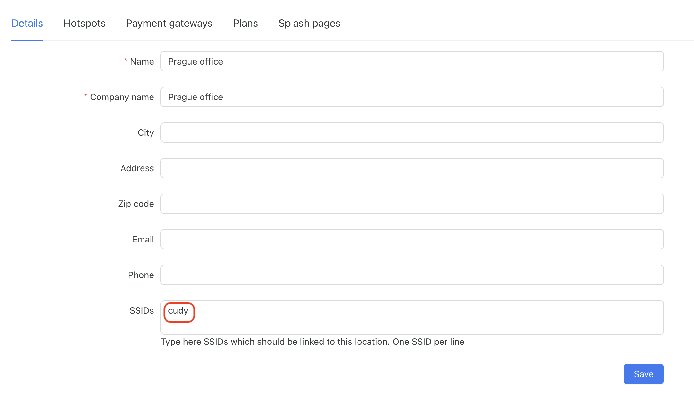

# Connect Cudy hotspot with Powerlynx
In this manual, we will guide you on how to add a Cudy router as a hotspot in Powerlynx.
In our example, we are using a Cudy WR1300 router. Customers will connect to the Wi-Fi provided by the router.

## Update firmware
Make sure that your device is using the latest available firmware. Go to the `General Settings / Firmware` page and click on the `Check for updates` button. 

## Configure Wireguard VPN
Create a new hotspot in Powerlynx with the NAS type set to `Cudy` and the connection type set to `WireGuard`.

{data-zoomable}

Click on the `Generate Wireguard keys` button and use them to create Wireguard interface on your device.

{data-zoomable}

On the Cudy device, go to `General settings / VPN`.

{data-zoomable}

{data-zoomable}

1. Turn on the `Enable` switch.
2. Choose `WireGuard Client` under the `Protocol` select.
3. Choose `Allow all devices` under the `Default Rule` select.
4. Disable the `Site-to-Site` switch.
5. Choose `Remote Subnet` under the `VPN Policy` select.
6. Click the `Edit item` button near the `Remote Subnet` field. Add a new subnet as shown in the screenshot and click on the `Save` button.
   {data-zoomable}
7. Under the `Interface` section, set the `IP Address` to the value of the `Your VPN IP` field in Powerlynx.
8. Set the `Subnet Mask` field to `255.240.0.0`.
9. Set the `Private Key` field to the value of the `Client private key` field in Powerlynx.
10. Keep the default value for the `MTU` field.
11. Copy the `Public key` field value from Powerlynx under the `VPN server credentials` and paste it into the `Public Key` field on your Cudy device under the `Peer` section.
12. Copy the `Server host` field value from Powerlynx under the `VPN server credentials` and paste it into the `Endpoint Host` field on your Cudy device.
13. Input `443` into the `Endpoint port` field. 
14. Click on the `Save & Apply` button.

Confirm the VPN is up by using the Ping tool located on the `Diagnostic Tools / Ping` page to ping the `172.16.0.1` IP address:

{data-zoomable}

## Setup captive portal

Next, navigate to the `General Settings / Captive portal` page.

{data-zoomable}
{data-zoomable}

1. Turn on the `Enable` switch.
2. Select the desired interfaces to enable the Captive portal under the `Interface` field.
3. Set the `Profile` field to `Manual`.
4. Set the `UAM Server` to value `https://<your_subdomain>.powerlynx.app/redirect-flow` replacing `<your_subdomain>` with your Powerlynx installation subdomain.
5. Set the `RADIUS server 1` and `RADIUS server 2` to `172.16.0.1`.
6. Set the `RADIUS secret` to the same value as the `Radius secret` field in the Powerlynx hotspot form.
7. Set the `RADIUS NAS ID` to `cudy`. You can change it to whatever you want, but remember that this value is used to match specific locations and splash pages in Powerlynx.
8. Set the `Preferred DNS` to `8.8.8.8`.
9. Set the `CoA Port` to `3799`.
10. Add `fra1.digitaloceanspaces.com` and `<your_subdomain>.powerlynx.app` to both the `UAM Allowed` and the `UAM Domain` lists.
11. Click on the `Save & Apply` button.

## Link the device by its SSID

Go to Powerlynx and open the location where you have added your hotspot. Add the value `cudy` to the `SSIDs` field under the location and save the form.

{data-zoomable}

Go to the location's splash pages and click on the desired splash page that should be used with your device. Add the value `cudy` to the `SSIDs` field under the splash page and save the form.

{data-zoomable}