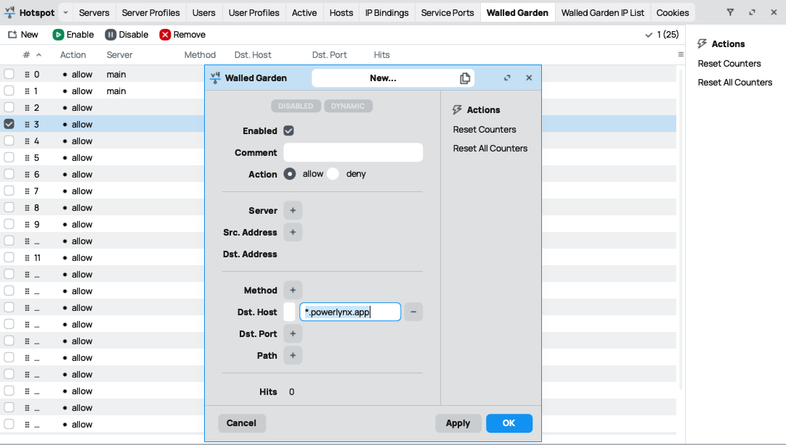

# Connect Mikrotik hotspot with Powerlynx

In this manual, we will guide you on how to add a Mikrotik router as a hotspot in Powerlynx.
In our example, we are using a MikroTik router with wireless interfaces. Customers will connect to the Wi-Fi provided by the router.

Navigate to the desired location, open the "Hotspots" tab, and click on the "Add" button:


* **Title** - title for your router;

* **NAS type** - select Mikrotik as a NAS type;

* **Connection type** - This one is important. We recommend using the "Wireguard" option instead of the "Public IP";

* **Radius secret** - RADIUS secret of your RADIUS server on the router;

* **Physical address** - address of your router (optional).

We will create a hotspot with the "Wireguard" connection type, as it's the recommended and secure option. After selecting of the "Wireguard" connection type you will see the "Generate Wireguard keys" button - you should click on it. After that, you will see this window:


::: warning
Please copy and use these keys to configure the Wireguard connection immediately. The private key is shown only once.
We recommend to store all these values somewhere.
:::

Click the 'Add' button to create a new hotspot in Powerlynx. Now, let's link this router with Powerlynx.

**1. Wireguard** 

Create a Wireguard interface - log in to your router using Winbox, navigate to Wireguard section, and create a new Wireguard with the following settings:


* **Name** - the name of your interface;

* **Listen port** - leave it empty. The system will detect this port automatically;

* **Private key** - set the "Client private key" value that you received during the hotspot creation in Powerlynx.

Save the configuration and proceed to the "Peers" tab in the "Wireguard" section to add a new peer:

* **Interface** - previously created Wireguard interface

* **Public key** - always use this value - ```lPYDyIwk5X4tyUMNT9ny/nyPSyHwk31mzm2ahOH7iV0=```

* **Endpoint** - vpn.powerlynx.app

* **Endpoint port** - 443

* **Allowed Address** - 172.16.0.0/12

* **Persistent Keepalive** - 00:00:15


**2. IP/Addresses** 

On Mikrotik, under IP -> Addresses create a new entry for Wireguard IP of your router (in our example we were given the 172.16.0.69 address during the hotspot creation in Powerlynx):


Afterward, your Wireguard peer should display live values in the "Last Handshake" field. If it remains frozen or shows static data, there might be an issue, and there's likely no connection between Powerlynx and this router and you should double-check steps #1 and #2. 

**3. Hotspot server setup**

Next step is to create [a Hotspot server under IP/Hotspot](https://wiki.mikrotik.com/wiki/Manual:IP/Hotspot). The simplest way to setup HotSpot server on a router is by `/ip hotspot setup` command. Router will ask to enter parameters required to successfully set up HotSpot. When finished, default configuration will be added for HotSpot server. Also, you can create it manually. 

Once created, let's change some settings:


* **Name** - set name for your hotspot server. You will use it later in Powerlynx setup;

* **Interface** - select interface to run your hotspot server;

* **Address Pool** - select the IP/Pool to assign IPs from;

* **Profile** - select hotspot profile;

* **Idle timeout** - recommended value = 1m;

* **Keepalive timeout** - recommended value = 1m;

* **Addresses Per MAC** - recommended value = 1.

after that modify the hotspot profile that is use by the hotspot server:


**4. Hotspot files**

Next step is to replace the `login.html` file that can be found under the Files section with a special login.html file ([click to download](https://drive.google.com/file/d/1nkNdKN7Jfu8RKyqoMxcrmnknMY3DGIqo/view)). There are only 2 points to change:


Replace the highlighted values, as shown in the screenshot above, with your Powerlynx URL.

**5. RADIUS server** 

Next step is to create a RADIUS server on the router:


Pay attention to:

* **Address** - if you use Wireguard connection type - use this value: *172.16.0.1*;

* **Secret** - RADIUS secret - must be the same in Powerlynx Hotspot and here;

* **Timeout** - recommended value 3000 or more;

* **Src.Address** -  IP address of the router in Powerlynx. It must be the same IP address added in step #2 under IP/Addresses.

**6. Walled Garden**

Next important step is to configure Walled Garden hosts. It is crucial to add your Powerlynx URL as well as bunch of other hosts:



One more host to add is `*.digitaloceanspaces.com` (this host is required to display the logos on the captive portal page).

You will also need to add additional Walled Garden hosts depending on what payment system you are going to use. The list of Walled Garden hosts to add to allow payment systems can be found in this [post on our forum](https://forum.powerlynx.app/t/mikrotik-walled-garden/19).


**7. Powerlynx SSIDs**

Add the hotspot server name into the SSID field under your location and under your splash page:


It is crucial to add the hotspot server name in both places mentioned. It's not enough to add the hotspot server name only under Location details or only under the splash page details.  