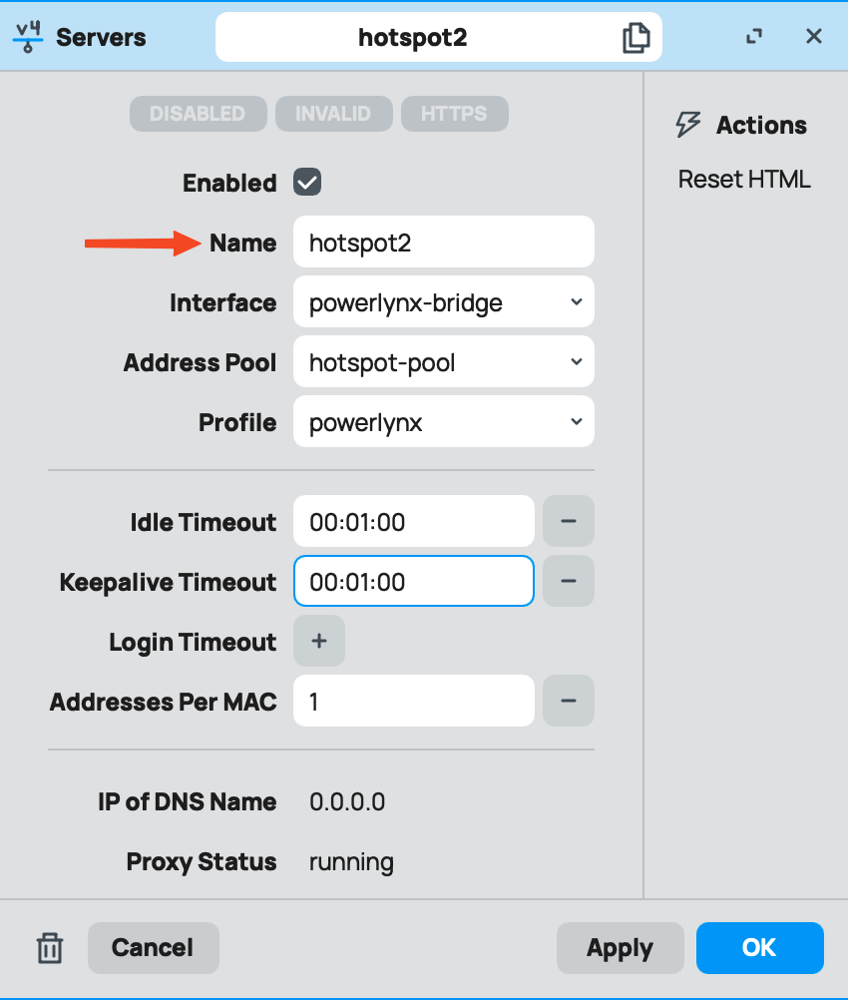

# Troubleshooting of Mikrotik hotspots

The list of troubleshooting steps. Each step is required to be completed before moving to the next one:

**0.** Ensure your Mikrotik router is running on ROS v7.x or newer. The Wireguard feature was introduced in ROS v7.0 and is not available on older versions.

**1.** Double-check your setup to ensure it was done according to this manual - https://docs.powerlynx.app/networking/mikrotik.html

**2.** Check the status of the Wireguard link - the "Last handshake" value should change dynamically, showing some live numbers rather than 00:00:00 or static values that do not change:

{data-zoomable}

**3.** Check the hotspot server name. In Powerlynx, under Location/Details/SSIDs field and under the enabled splash page, you should use the name of your hotspot server on Mikrotik under IP/Hotspot/Servers. It's case-sensitive.

{data-zoomable}

{data-zoomable}

{data-zoomable}

It is crucial to add the hotspot server name in both places mentioned. It's not enough to add the hotspot server name only under Location details or only under the splash page details.

**4.** Check the settings of the RADIUS server on Mikrotik. Double-check the Address, Secret, and Src.Address fields:

If you are using the Wireguard connection type, use the "172.16.0.1" value for the "Address" field on your RADIUS server on Mikrotik.

Make sure that the "Radius secret" value in your hotspot in Powerlynx matches exactly the "Secret" value under the RADIUS server on Mikrotik.

Do the same with the NAS IP on your hotspot; copy it and paste it into the Src.Address field of your RADIUS server:

{data-zoomable}

**5.** Traceroute to Powerlynx - ensure that the traffic reaches the `one.powerlynx.app host`. Try doing the traceroute from Mikrotik router to ensure the host is reachable. If you cannot reach this host, contact your upstream provider regarding this issue.

**6.** Walled Garden list - it is crucial to keep the list of Walled Garden hosts updated according to the payment system you use. In cases where one host is missing, payments may fail. There is a separate topic on our forum where we discuss Walled Garden hosts. - https://forum.powerlynx.app/t/mikrotik-walled-garden/19/4

**7.** Fasttrack - ensure that the Fasttrack feature is disabled on your router - https://wiki.mikrotik.com/wiki/Manual:IP/Fasttrack. If it's enabled, you need to disable it. There is a forum topic where the community discusses this process - https://forum.mikrotik.com/viewtopic.php?t=119262.

**8.** IP/Firewall/NAT - if your customers are saying that they are connected to Wi-Fi but have no internet access, it might be related to a missing masquerade rule. It depends on your network setup, but in most cases, it is necessary to "masquerade" the hotspot network. To do so, navigate to IP/Firewall/NAT and add a new rule with Chain = srcnat, Src.Address = your hotspot network (e.g., 10.5.50.0/24), Action = masquerade.

**9.** RADIUS timeouts - if you observe RADIUS timeouts in the Mikrotik logs, it can be helpful to change the RADIUS timeout value under the RADIUS server settings:

{data-zoomable}

Sometimes, it is necessary to set the timeout value to 20000 if the network delay is high. Before changing this value, ensure that step #2 has been checked.