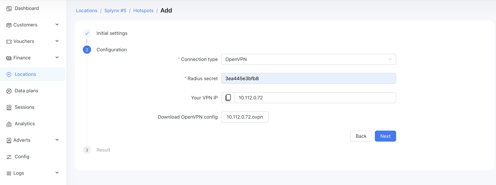
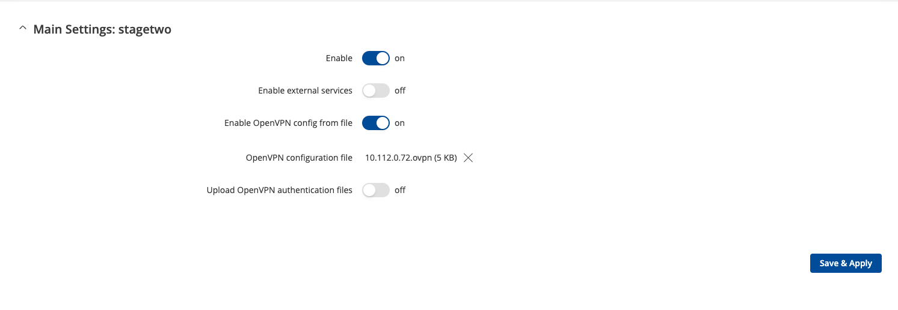
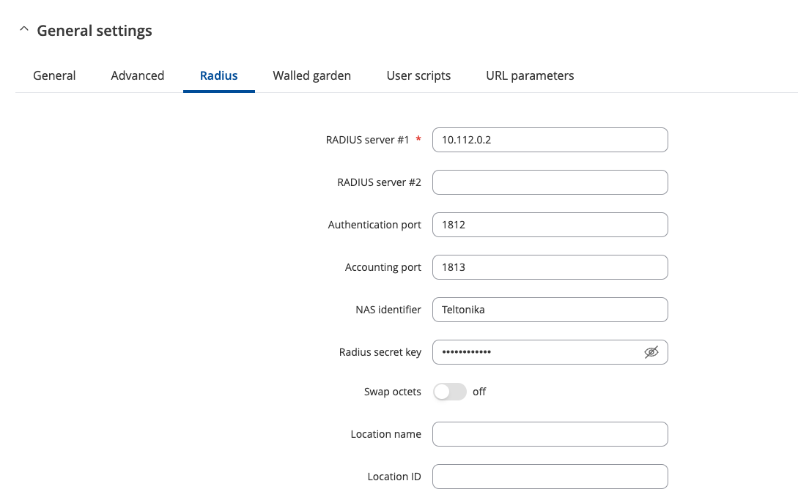

# OpenVPN

We provide you with the ability to connect your hotspots to Powerlynx using OpenVPN as an alternative to WireGuard VPN.

WireGuard remains our primary VPN and is available through the [Mikrotik router's simple setup](https://docs.powerlynx.app/networking/mikrotik.html#simple-setup), while OpenVPN is intended for advanced users with networking experience.

When adding a [hotspot](https://docs.powerlynx.app/system/hotspots.html), set the Setup Type to Advanced, and in the Connection Type field, select OpenVPN. This will generate a file that you need to download and use for setting up OpenVPN on your device.

## Example Teltonika

In the first step, select NAS Type as Teltonika, give your hotspot a name, and proceed to the second step:

{data-zoomable}

Here, select Connection Type as OpenVPN, generate a RADIUS Secret, and generate the OpenVPN configuration file, which you need to download.

On your Teltonika device, navigate to `Services > VPN > OpenVPN`, and at the bottom of the page, find the "Add New Instance" section. Here, specify the Connection Name and set the Role to Client.

Then, enable "OpenVPN Config from File", upload your configuration file to the "OpenVPN Configuration File" field, and save the settings.

{data-zoomable}

Ensure your connection has the "Connected" status:

{data-zoomable}

::: warning
Don't forget to update the RADIUS settings, as using the OpenVPN connection type requires a different RADIUS server address.
:::

| Attribute        |      Value      |
| ------------- | :-----------: |
| OpenVPN server IP     | 10.112.0.1 |
| RADIUS IP    |   10.112.0.2    |
| OpenVPN endpoint |   openvpn.powerlynx.app:443    |

{data-zoomable}

::: info
The provided example demonstrates how to set up an OpenVPN connection with Powerlynx on your hotspot. You can use this information when setting up an OpenVPN connection for MikroTik, Cambium, and other devices.

The process is the same: download the configuration file, create an OpenVPN client on your device, ensure it runs properly, and update the RADIUS IP.
:::

## Example Mikrotik

To set up an OpenVPN connection between Powerlynx and MikroTik, download the .ovpn file generated by Powerlynx, upload it to the Files section of your MikroTik, and then use the Terminal to run a command to create an OpenVPN client interface.

```
/interface/ovpn-client/import-ovpn-configuration ovpn-user=10.112.0.65 skip-cert-import=no
```
where 10.112.0.65 is your OpenVPN IP assigned by Powerlynx.

After that, you will be prompted for a file name – provide the full name of the file generated by Powerlynx.

A real-case example is available on our forum - https://forum.powerlynx.app/t/mikrotik-openvpn-with-radius/122

