# Connect Ruckus hotspot with Powerlynx

In this manual, we will guide you on how to add a Ruckus router as a hotspot in Powerlynx.
In our example, we are using a Ruckus R550 access point. Customers will connect to the Wi-Fi provided by the router.

## Update firmware
Make sure that your device is using the latest available firmware. Go to the `Admin & Services / Administration / Upgrade` page and click on the `Check for Updates` button.

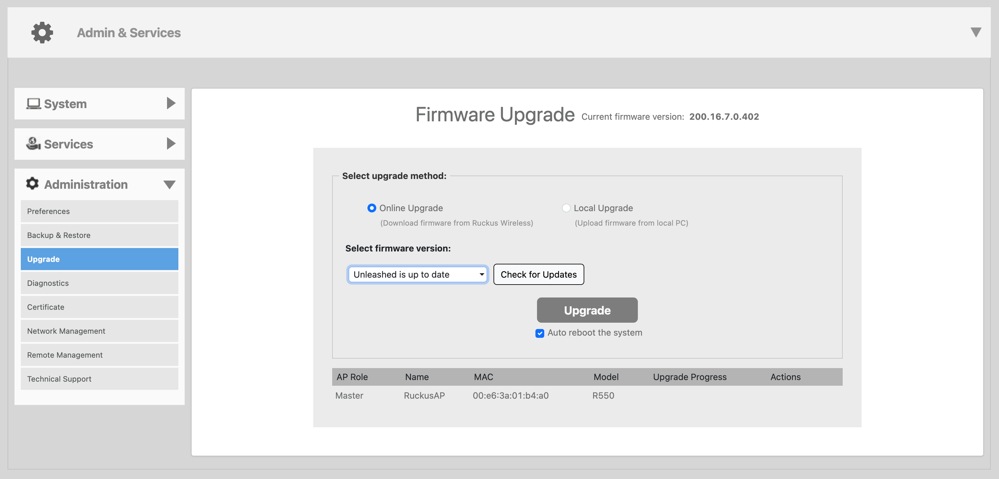{data-zoomable}

## Configure your device

### Add Radius server

Go to the `Admin & Services / Services / AAA Servers - Authentication Servers` page and click on the `Create` button.

Fill the form:
* **Name** - set to `Powerlynx Radius`
* **Type** - choose `RADIUS`
* **Auth Method** - choose `PAP`
* **Server Address** - set to `radius.powerlynx.app`
* **Port** - set to `1812`
* **Shared Secret** - must be the same in Powerlynx Hotspot and here
* **Confirm Secret** - input the same value as in **Shared Secret**
* **Request Timeout** - set to `5`
* **Max Number of Retries** - set to `2`

Then click on the `OK` button.

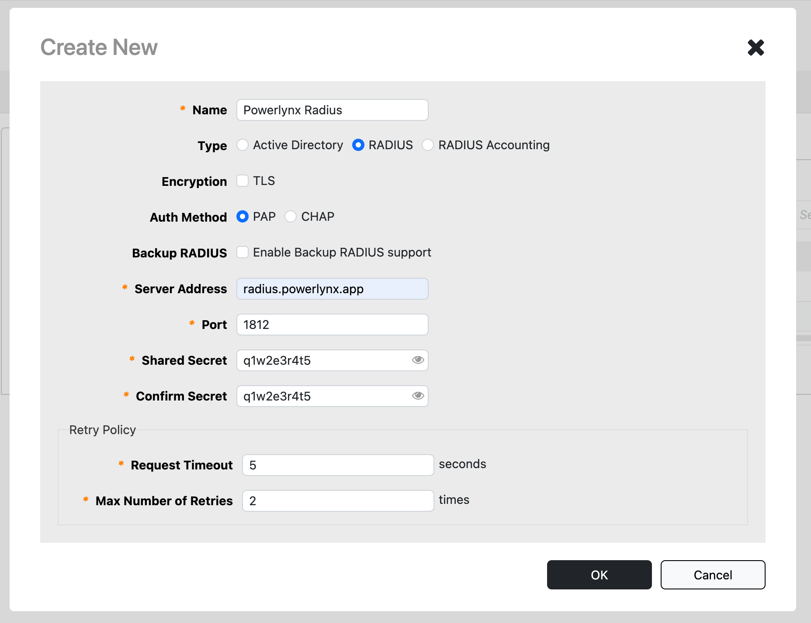{data-zoomable}

On the same page click again on the `Create` button.

Fill the form:
* **Name** - set to `Powerlynx Radius Acc`
* **Type** - choose `RADIUS Accounting`
* **Server Address** - set to `radius.powerlynx.app`
* **Port** - set to `1813`
* **Shared Secret** - must be the same in Powerlynx Hotspot and here
* **Confirm Secret** - input the same value as in **Shared Secret**
* **Request Timeout** - set to `5`
* **Max Number of Retries** - set to `2`

Then click on the `OK` button.

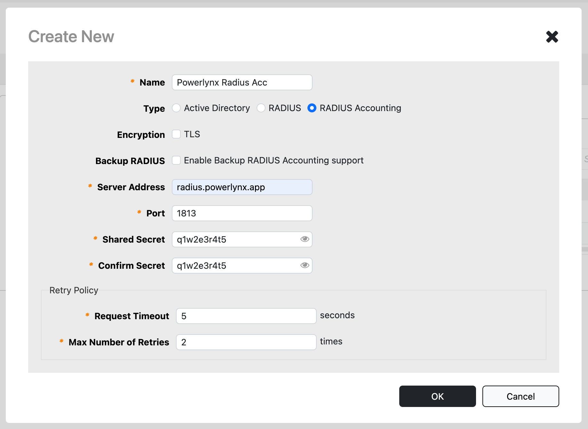{data-zoomable}

### Create a hotspot

Go to the `Admin & Services / Services / Hotspot Services` page and click on the `Create` button. On the `General` tab fill the form:

* **Name** - set to `Powerlynx`
* **WISPr Smart Client** - choose `None`
* **Login Page** - set to `https://{your_subdomain}.powerlynx.app/redirect-flow`
* **Start Page** - choose `redirect to the URL that the user intends to visit`

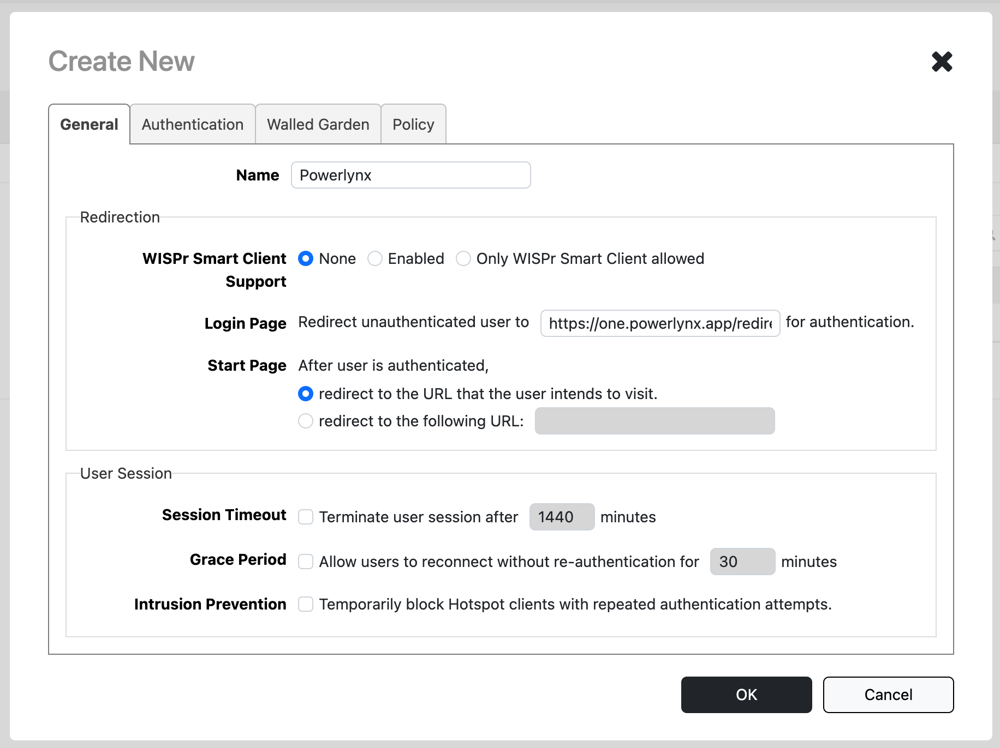{data-zoomable}

On the `Authentication` tab fill the form:
* **Authentication Server** - choose previously created Radius server called `Powerlynx Radius`
* **Accounting Server** - choose previously created Radius accounting server called `Powerlynx Radius Acc`

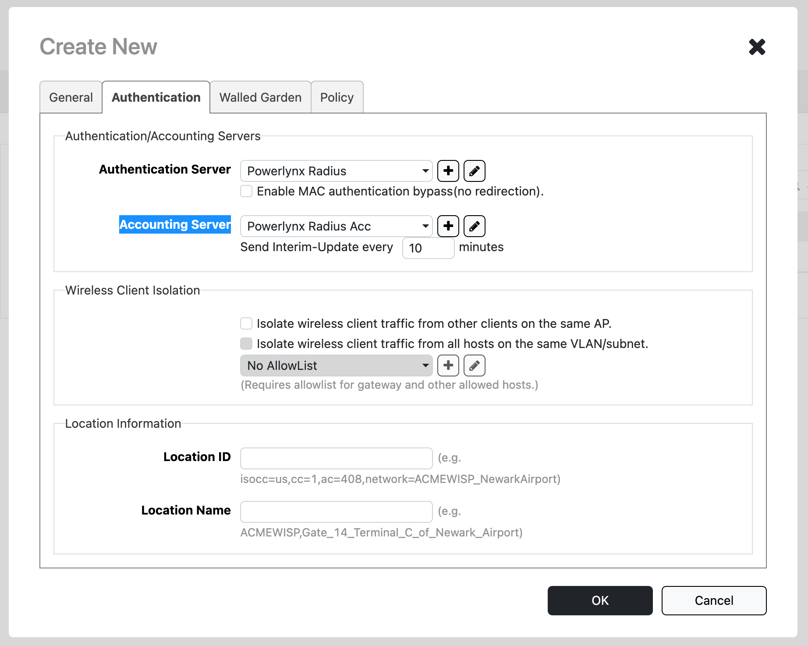{data-zoomable}

On the `Walled Garden` tab add the following hosts:
```
{your_subdomain}.powerlynx.app
*.digitaloceanspaces.com
```
The white list records depends on what payment gateway you are going to use. Each payment gateway has its own hosts to allow in this list.

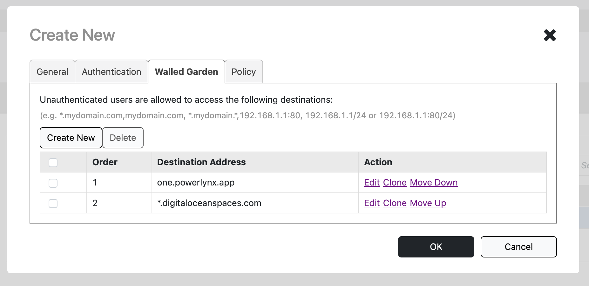{data-zoomable}

Click on the `OK` button to save the hotspot.

### Create a Wi-Fi network

Go to the `Wi-Fi Networks` page and click on the `Create` button. Fill the form:
* **Name** - type your desired Wi-Fi network name
* **Usage Type** -- choose the `Hotspot Service` option
* **Hotspot Services** - choose previously created hotspot called `Powerlynx`

Click on the `OK` button to save the WLAN.

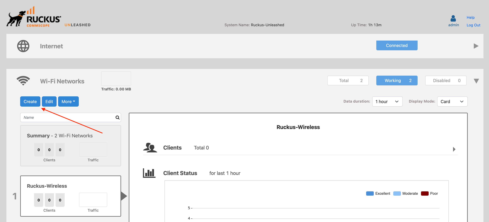{data-zoomable}

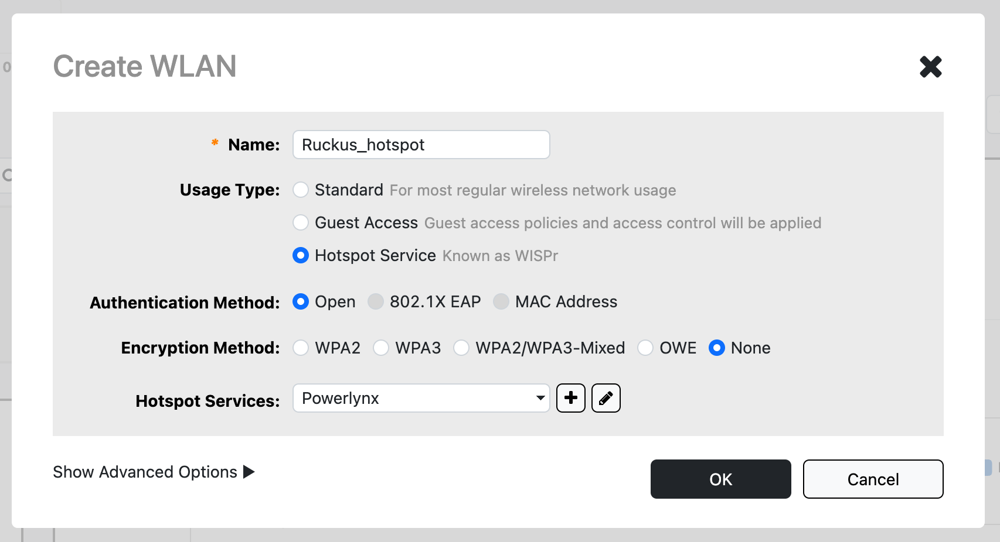{data-zoomable}

## Configure Powerlynx

### Add a Hotspot in Powerlynx

On Powerlynx portal navigate to the desired location, open the "Hotspots" tab, and click on the "Add" button and fill the form.

* **Title** - a title for your router
* **NAS type** - select `Ruckus` as a NAS type
* **Connection type** - the only available connection type for Ruckus devices is the `Public IP`
* **IP address** - IP Address of the router. From this IP, the router should send requests to our system, so we can identify that router
* **NAS IP** - the real IP source address for radius packets. It is recommended that in the Radius settings of the Mikrotik router Src. address = NAS IP in Splynx.
* **Radius secret** - RADIUS secret of your RADIUS server on the router
* **Physical address** - address of your router (optional)

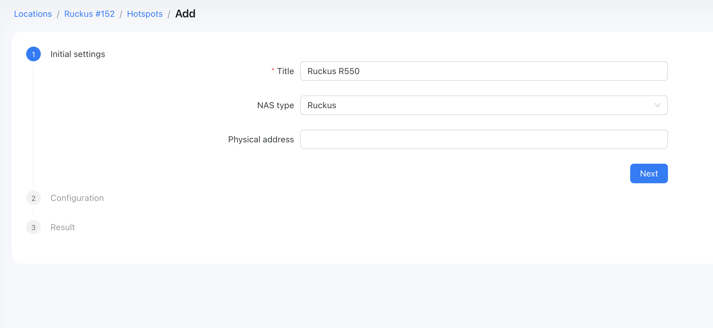{data-zoomable}

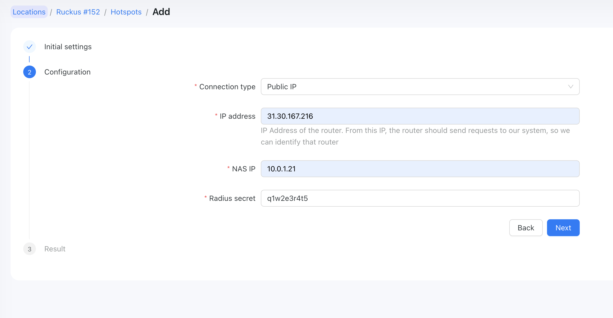{data-zoomable}

### Set correct SSID

Add the WLAN name from the Ruckus device into the SSID field under your location and under your splash page in Powerlynx portal.

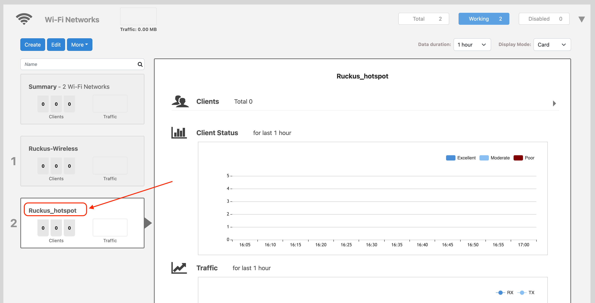{data-zoomable}
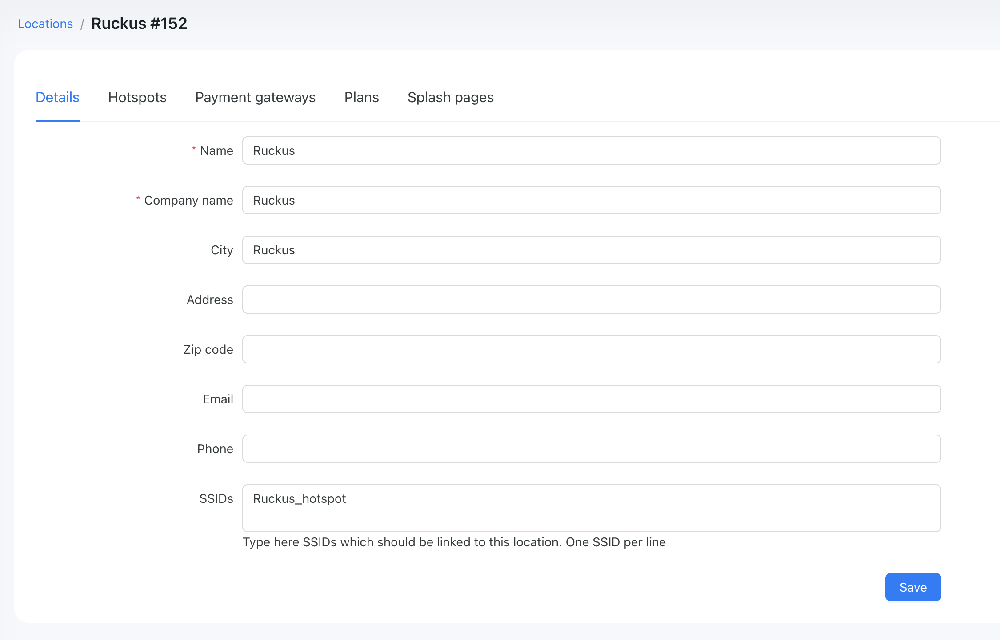{data-zoomable}
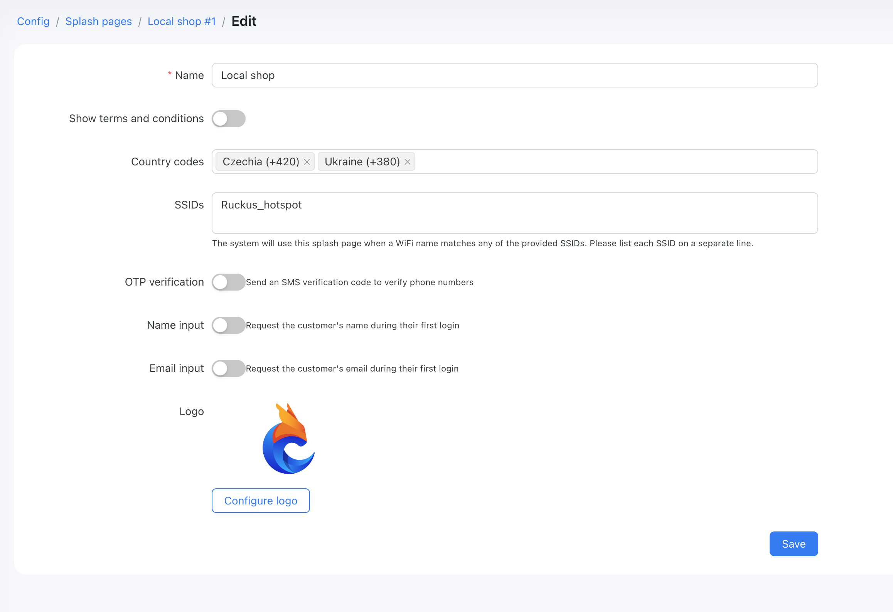{data-zoomable}

