# Connect Teltonika hotspot with Powerlynx

In this manual, we will guide you on how to add a Teltonika router as a hotspot in Powerlynx.
In our example, we are using a Teltonika router with wireless interfaces. Customers will connect to the Wi-Fi provided by the router.

## Configure your device

Open your Teltonika router configs and switch the mode to "Advanced":

{data-zoomable}

After that, install the hotspot package on the `System/Package manager/Packages` page

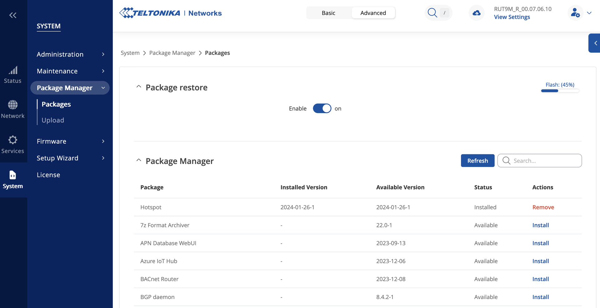{data-zoomable}

Also make sure the device is on the latest firmware.

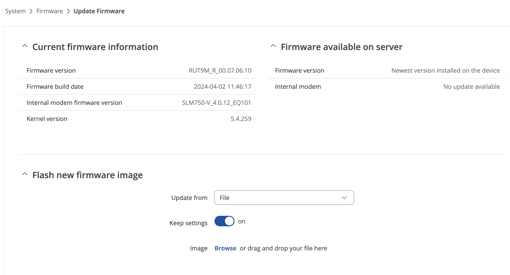{data-zoomable}

## Connect your device with Powerlynx using Wireguard. 

Create a new hotspot in Powerlynx with NAS type set to Teltonika and connection type set to WireGuard.

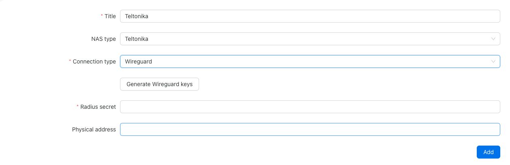{data-zoomable}

and click on the "Generate Wireguard keys" and use them to create Wireguard interface on your device.

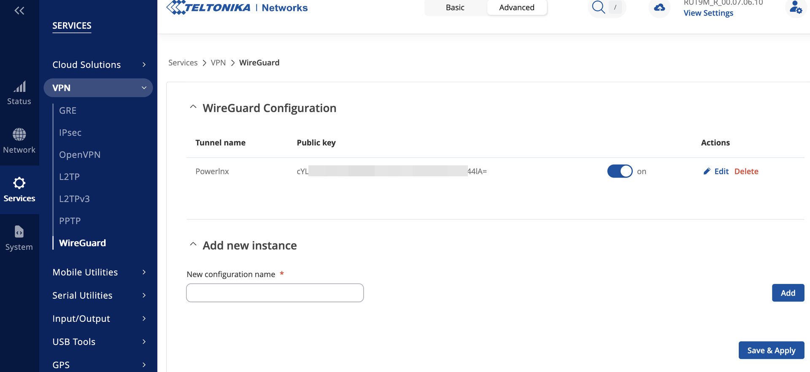{data-zoomable}

set the public and private keys as well as IP from the Powerlynx instance

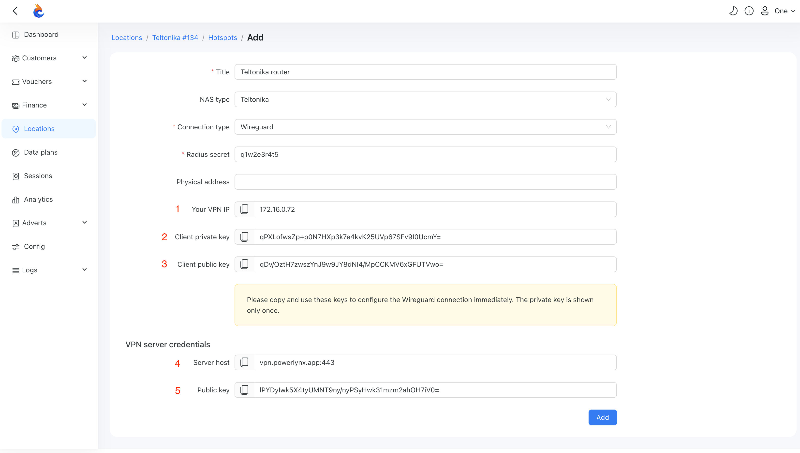{data-zoomable}

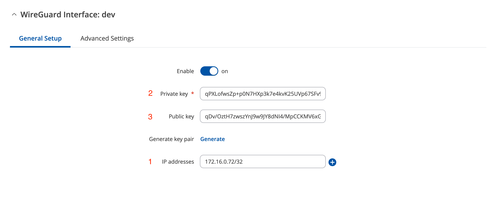{data-zoomable}

Add a Peer and configure it with the public key from Powerlynx (input here)

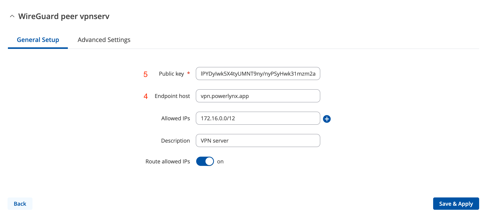{data-zoomable}

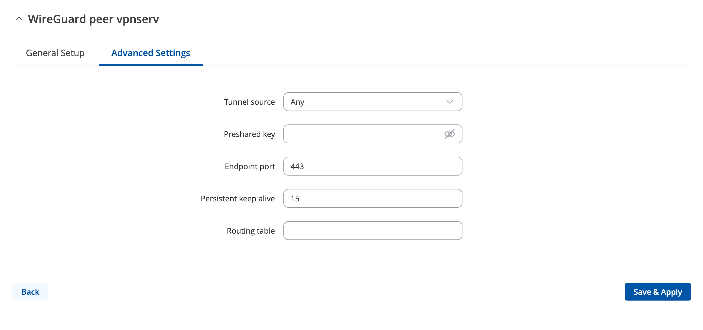{data-zoomable}

Use this public key: `lPYDyIwk5X4tyUMNT9ny/nyPSyHwk31mzm2ahOH7iV0=`

And all other values as per the screenshots above.

Confirm the VPN is up by using the Diagnostics tool located on the `System/Maintenance/Troubleshoot` page to ping `172.16.0.1`:

{data-zoomable}

## Setup hotspot server

Next navigate to hotspot package (1):

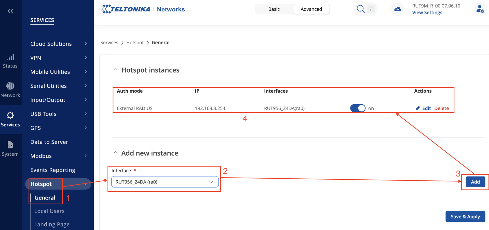{data-zoomable}

and set up a hotspot on the default wireless interface (SSID) (2 & 3) - this will create the hotspot you see in step 4.

Then edit the hotspot:

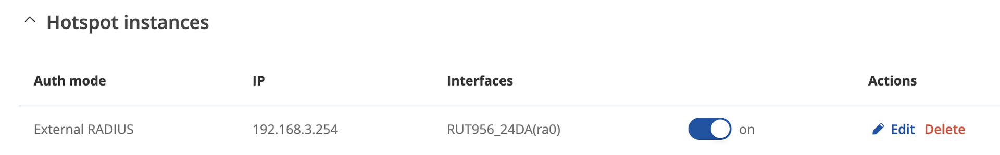{data-zoomable}

Under General:

1. Enable the hotspot
2. Set the hotspot network range & IP (different from any existing IP used on the LAN or WLAN)
3. Set Authentication mode to Radius
4. Set Landing page to External
5. Enable Password encoding
6. Set Landing page address to `https://powerlynx_domain/redirect-flow` where powerlynx_domain should be replaced by your Powerlynx domain
7. Set Success page to `Original URL`

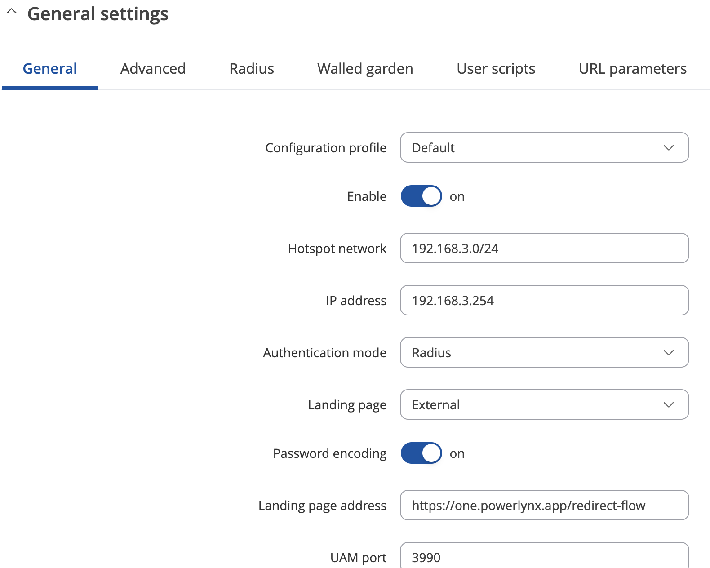{data-zoomable}

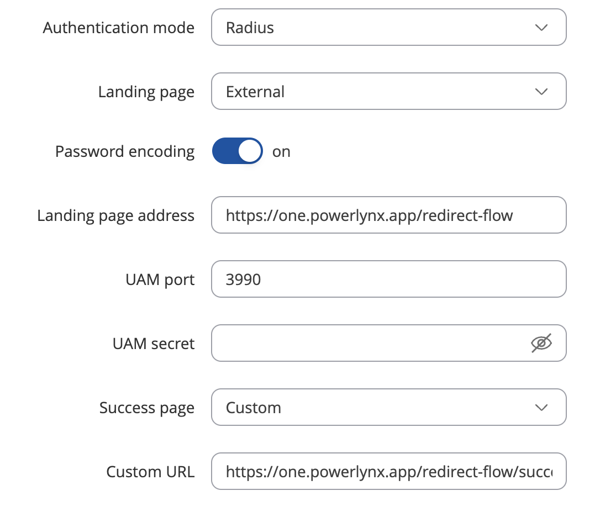{data-zoomable}

After that, In the Radius tab:

1. Set Radius server #1 to `172.16.0.1`
2. Put a unique value in the NAS identifier field that will be used to match the router with a location and a splash page in Powerlynx, for instance, `teltonika`. This value should be inserted into Powerlynx's location SSIDs and splash page SSIDs fields.
3. Set Radius secret key to the key used in Powerlynx under Locations - Hotspot

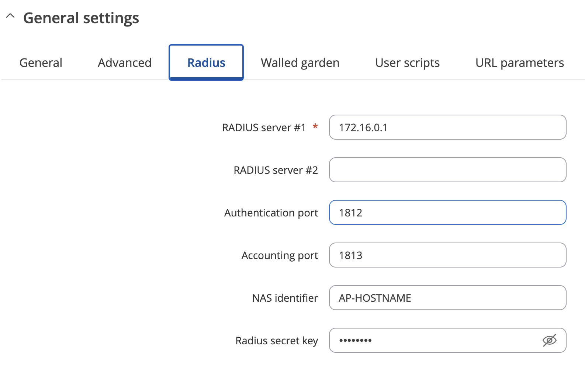{data-zoomable}

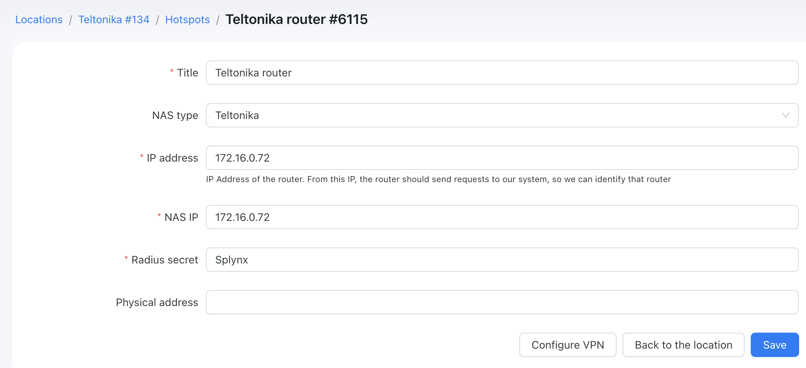{data-zoomable}

Add the NAS identifier into the SSIDs field under your location and under your splash page:

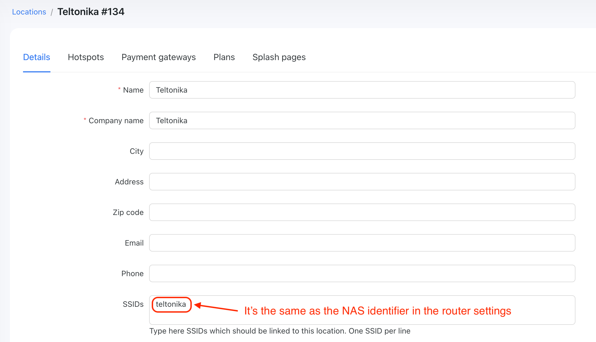{data-zoomable}

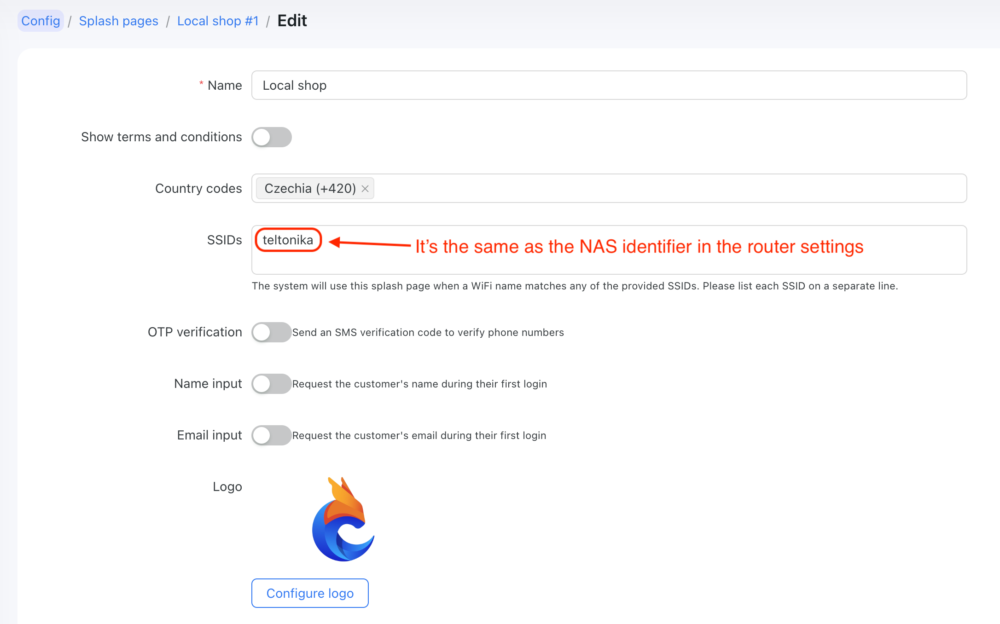{data-zoomable}

Go to the `System/Maintenance/CLI` page and log in to the CLI terminal. Use `root` as the login and your administrator password as the password. Use these commands to enable the Radius incoming port:
```
uci set chilli.@chilli[0].coaport=3799
uci set chilli.@chilli[0].coanoipcheck=1
uci commit
/etc/init.d/chilli restart
```

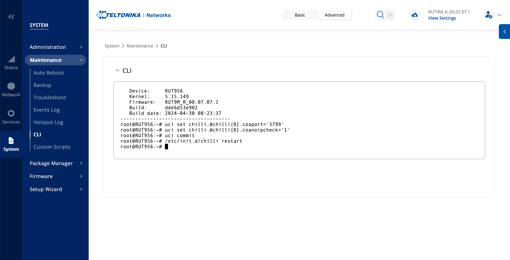{data-zoomable}

Then make sure wireless has no password and no encryption:

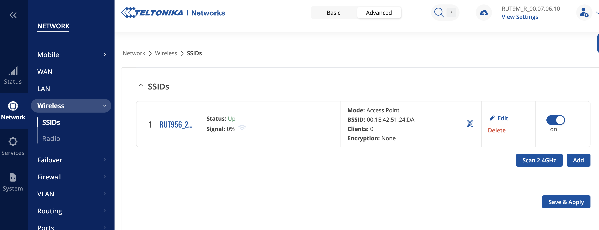{data-zoomable}

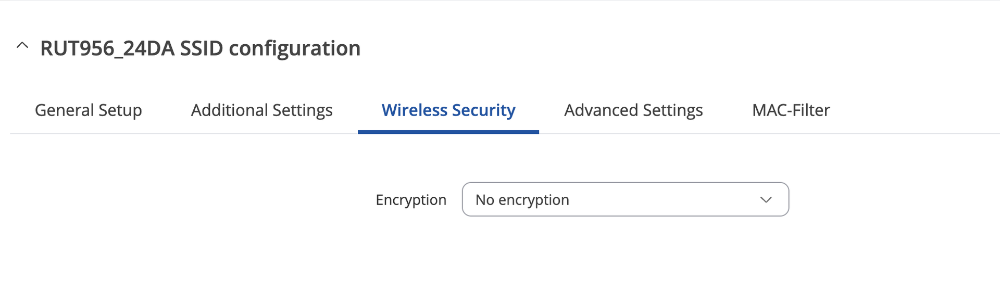{data-zoomable}

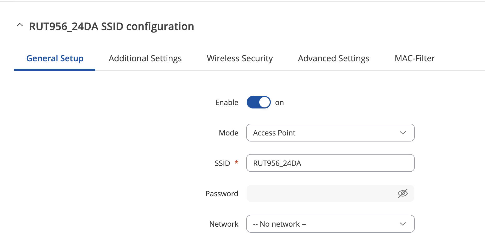{data-zoomable}

## Walled garden

In the walled garden section set: 

```
one.powerlynx.app
fra1.digitaloceanspaces.com
```
Where `one.powerlynx.app` is your Powerlynx domain. Replace it with your URL.

Also set any other required walled garden entries that might be required by your payment gateway/provider (see the individual payment gateways [here](https://docs.powerlynx.app/finance/main.html)

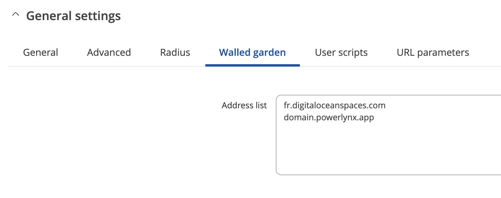{data-zoomable}

