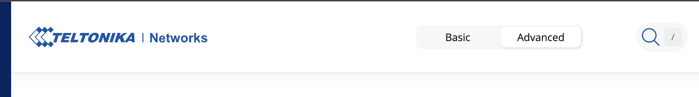
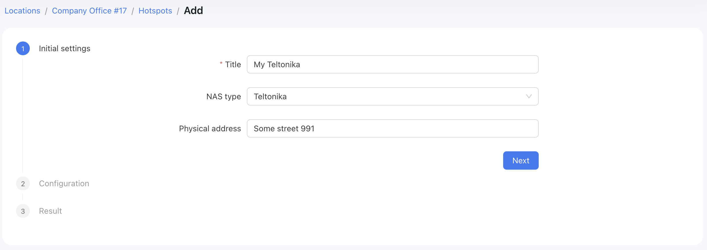
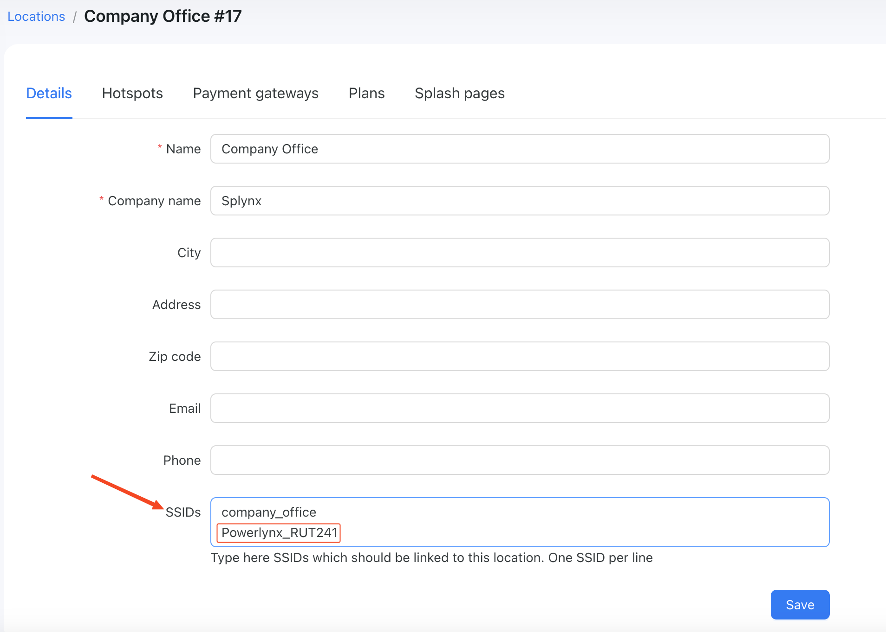
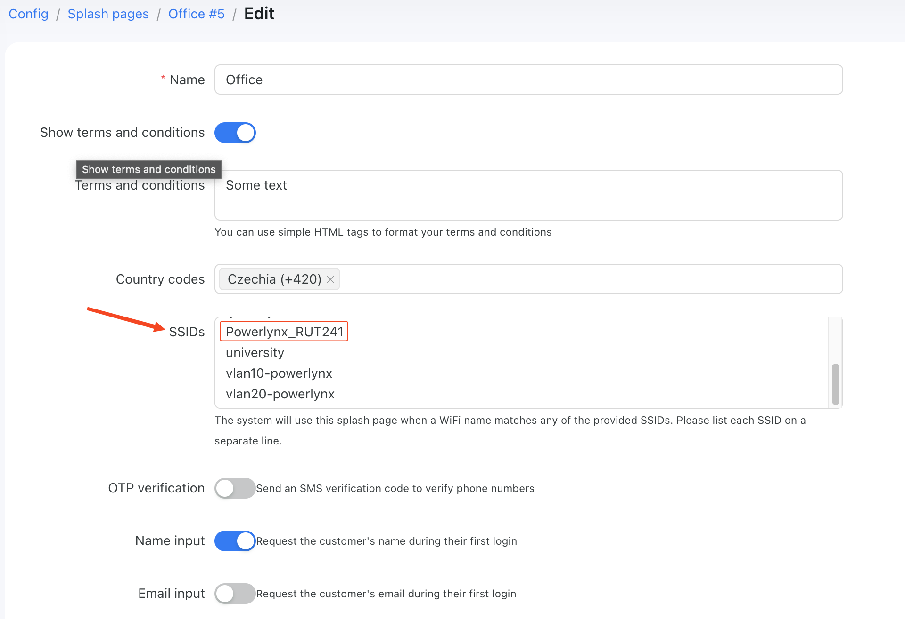

# Connect Teltonika hotspot with Powerlynx

In this manual, we will guide you on how to add a Teltonika router as a hotspot in Powerlynx.
In our example, we are using a Teltonika router with wireless interfaces. Customers will connect to the Wi-Fi provided by the router.

## Configure your device

Open your Teltonika router configs and switch the mode to "Advanced":

{data-zoomable}

After that, install the hotspot package on the `System/Package manager/Packages` page if not installed

{data-zoomable}

Also make sure the device is on the latest firmware.

{data-zoomable}

## Create hotspot in Powerlynx 

Create a new hotspot in Powerlynx with NAS type set to Teltonika:

{data-zoomable}

The next step is to select a connection type: Wireguard (recommended) or Public IP (if your Teltonika has one). In this example, we’ll use Wireguard as the connection type. Additionally, we need to specify a RADIUS secret, which must match on both the router and in Powerlynx.

Click on the "Generate Wireguard keys" and use them to create Wireguard interface on your device.

{data-zoomable}

::: warning
Please copy and use these keys to configure the Wireguard connection immediately. The private key is shown only once.
We recommend to store all these values somewhere in a safe place.
:::

Now, let's create a Wireguard interface on your device. Navigate to `Services/VPN/Wireguard` and add a new instance:

{data-zoomable}

Set the public and private keys, as well as the IP from the Powerlynx instance, in the format with the /32 network mask.

{data-zoomable}

Inside the Wireguard interface window, at the bottom, add a new peer. Set your public key and endpoint host, specify the allowed IPs, and enable the "Route allowed IPs" option, as shown in the screenshot above. Then, switch to the Advanced Settings tab.

{data-zoomable}

Here, set the Endpoint port to 443 and the Persistent Keepalive to a value between 5 and 15.

Save the settings and return to Powerlynx. In the final step, you'll see a "Ping" button, which will ping your Wireguard interface on the Teltonika device to check if the connection is active. If everything is set up correctly, the ping status should display as "OK."

{data-zoomable}

You can also ping Powerlynx from your Teltonika to ensure the connection is up and running by using the Diagnostics tool located on the `System/Maintenance/Troubleshoot` page to ping `172.16.0.1`:

{data-zoomable}

## Setup hotspot server

Next navigate to `Services/Hotspot/General` (1):

{data-zoomable}

and set up a hotspot on the default wireless interface (SSID) (2 & 3) - this will create the hotspot you see in step 4.

Then edit the hotspot:

{data-zoomable}

Under General:

1. Enable the hotspot
2. Set the hotspot network range & IP (different from any existing IP used on the LAN or WLAN)
3. Set Authentication mode to Radius
4. Set Landing page to External
5. Enable Password encoding
6. Set Landing page address to `https://powerlynx_domain/redirect-flow` where powerlynx_domain should be replaced by your Powerlynx domain
7. Set Success page to `Original URL` OR, you can modify it as described [here](https://docs.powerlynx.app/system/status-page.html#teltonika-redirect-to-the-status-page-after-logging-in) to redirect your customers to an external page if needed.

{data-zoomable}

{data-zoomable}

After that, In the Radius tab:

1. Set Radius server #1 to `172.16.0.1`
2. Put a unique value in the NAS identifier field that will be used to match the router with a location and a splash page in Powerlynx, for instance, `Powerlynx_RUT241`. This value should be inserted into Powerlynx's location SSIDs and splash page SSIDs fields.
3. Set Radius secret key to the key used in Powerlynx under Locations - Hotspot. This value must be exactly the same as the "RADIUS secret" value in newly created hotspot in Powerlynx. 

{data-zoomable}

Add the NAS identifier into the SSIDs field under your location and under your splash page:

{data-zoomable}

{data-zoomable}

Go to the `System/Maintenance/CLI` page and log in to the CLI terminal. Use `root` as the login and your administrator password as the password. Use these commands to enable the Radius incoming port:
```
uci set chilli.@chilli[0].coaport=3799
uci set chilli.@chilli[0].coanoipcheck=1
uci commit
/etc/init.d/chilli restart
```

{data-zoomable}

Then make sure wireless has no password and no encryption:

{data-zoomable}

{data-zoomable}

{data-zoomable}

## Walled garden

In the walled garden section set: 

```
one.powerlynx.app
fra1.digitaloceanspaces.com
```
Where `one.powerlynx.app` is your Powerlynx domain. Replace it with your URL.

Also set any other required walled garden entries that might be required by your payment gateway/provider (see the individual payment gateways [here](https://docs.powerlynx.app/finance/main.html)

{data-zoomable}

ℹ️ Teltonika does not support wildcards in the walled garden addresses to cover multiple subdomains. See the [forum topic](https://community.teltonika.lt/t/hotspot-walled-garden-wildcards/5919) for more details.