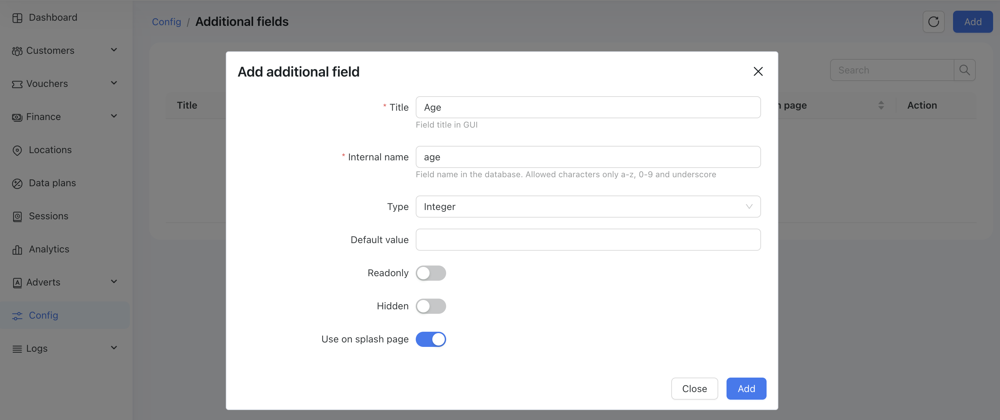
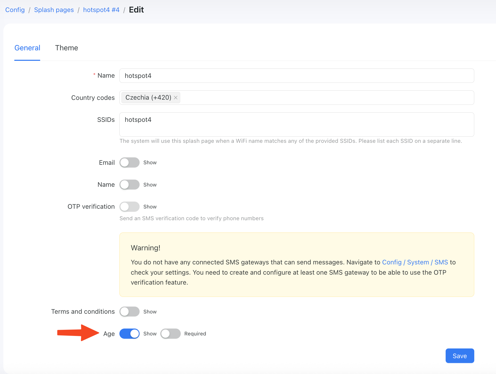
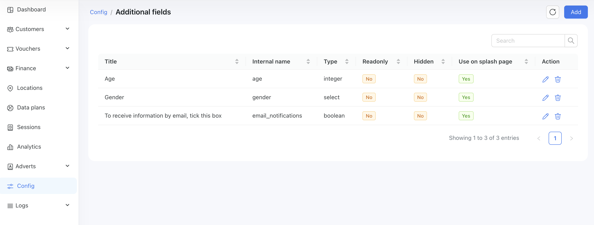
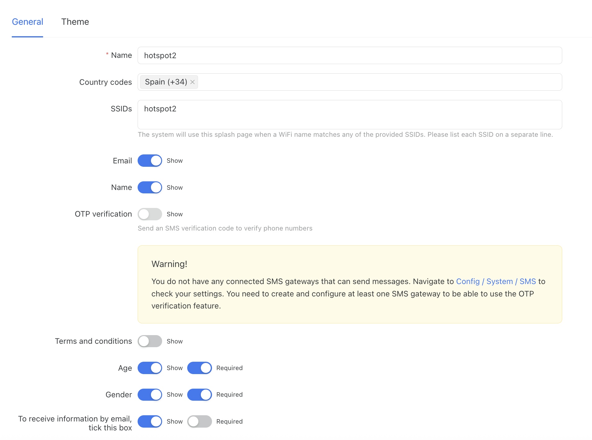
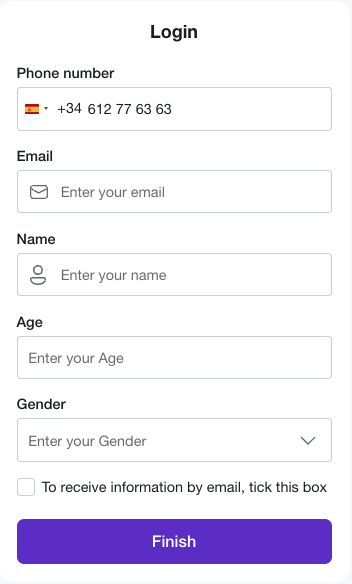
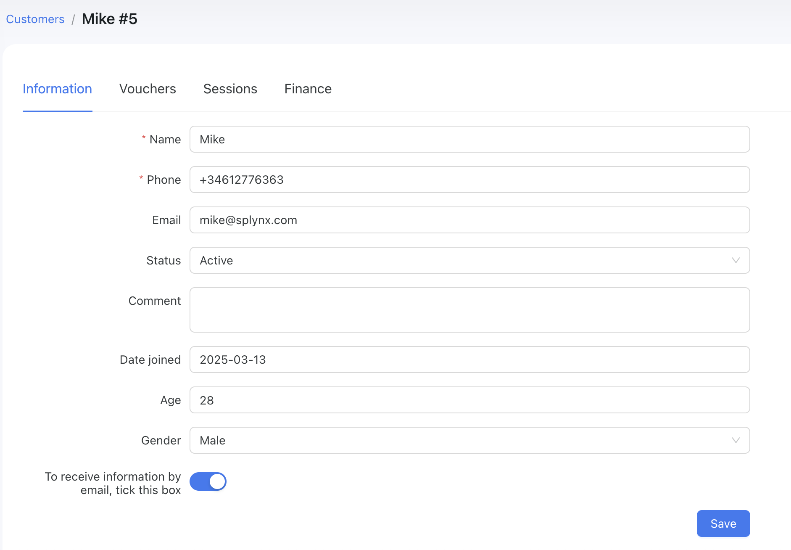

# Additional fields on the splash page

## Overview

Powerlynx Additional Fields is a feature that enables you to create custom fields and display them on a splash page. This allows you to collect specific information from your customers beyond the default fields like name, email, and phone number.

With this functionality, you can tailor the customer onboarding process to fit your business needs, ensuring you gather all necessary details before granting access.

## How it works

1. **Create Additional Fields** – Navigate to the `Config/System/Additional fields` and add the extra fields you want to collect.

{data-zoomable}

When adding an additional field, you need to set the following parameters:

* **Title** – The field's name visible to the customer.

* **Internal Name** – How the field is stored in the database.

* **Type** – The data type of the field depends on the data you want to store: string, integer, select, select multiple, date, and more.

* **Readonly** – If enabled, the field cannot be edited from the GUI.

* **Hidden** – If enabled, the field will be hidden from the GUI.

* **Use on Splash Page** (Most Important) – Defines whether this field can be assigned to the splash page.

2. **Assign to Splash Page** – Once the field is created and the "Use on Splash Page" toggle is enabled, you will see a new option available on your splash pages:

{data-zoomable}

Enable the "Required" toggle for this field to make it mandatory on the splash page.

3. **Collect and Store Data** – On the splash page, the customer will be prompted to enter data into the fields you have enabled.

## Example

I want to ask my customers for their age, gender, and whether they would like to receive various notifications from our product via email.

This is my set of additional fields:

{data-zoomable}

Splash page settings:

{data-zoomable}

With this setup, I will ask my customers to provide their email (required), and name (required), as well as their age (required), gender (required), and an optional checkbox to opt in for various emails from our product.

How it looks on the splash page:

{data-zoomable}

Customer in Powerlynx with collected data:

{data-zoomable}

You can export the collected data using our [reporting feature](https://docs.powerlynx.app/system/reports.html#customers-export).