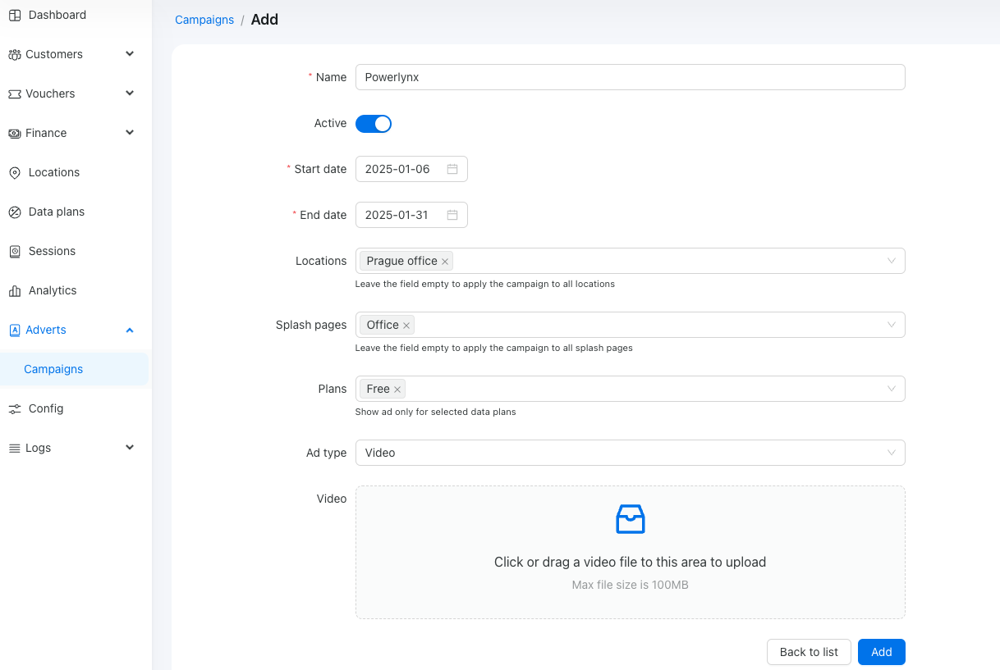
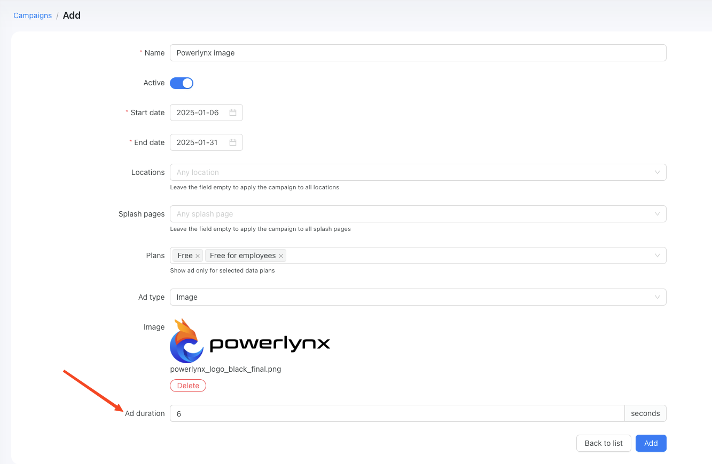

# Adverts

This module is a vital component of our system, aimed at boosting user engagement by presenting video and image ads to end users once they connect to the Wi-Fi network. The Adverts module provides advertisers with a distinctive opportunity to effectively reach their target audience and track the number of times an ad is displayed to customers. Within this documentation, you'll discover comprehensive guidance on setting up and managing ad campaigns, analyzing performance metrics, and optimizing ad delivery to maximize impact.

# Create an ad campaign

To create an ad campaign navigate to the `Adverts` module and click the "Add" button:

{data-zoomable}

This action will open a form where you can configure your campaign:

{data-zoomable}

In this example, we created the “Powerlynx” ad campaign, active from 2025-01-06 to 2025-01-31, at the location called “Prague office” and the splash page called “Office,” limited to the plan named “Free.” The ad type is video, and you can upload a file up to 100 MB in size, with no restrictions on file extension. Here, we’re using an .MP4 video.

Once created, you will see the parameters that can be modified and the uploaded video. You may also notice a new field called 'Ad view counter,' which displays the number of views for this specific ad:

{data-zoomable}

Let's see what the user see after the connecting to a WiFi:

{data-zoomable}

As you can see, the video ad was displayed to the customer after selecting a plan, with no option to skip it. The customer must watch the video in its entirety to gain access to the internet.

If you want to add an image ad, you'll need to set up the ad duration in seconds. This option determines how many seconds the image will be displayed:

{data-zoomable}

In the same manner as with video ads, after connecting to Wi-Fi, the customer will need to wait for 6 seconds before gaining access to the internet:

{data-zoomable}

You can view your campaign statistics below this counter:

{data-zoomable}

::: info
When multiple advertisements are configured for the same location, they will be displayed to customers in a randomized manner.
:::