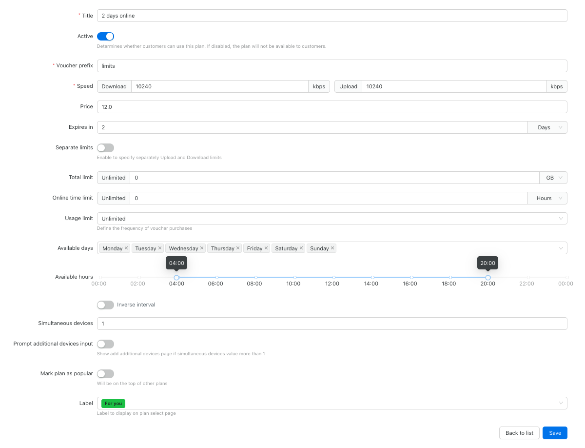
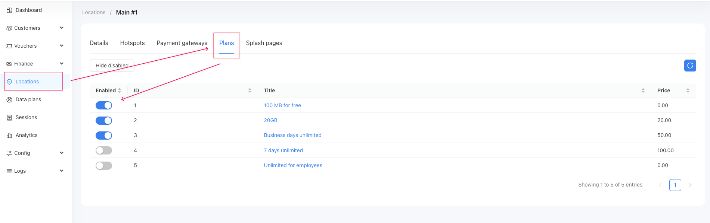

# Data plans

Data plans are offering subscription templates describing how customers can access the network and what limitations they will have.
Limitations can be network speed, traffic amount limitations, online time, number of devices connected and plan availability depending on the day of the week or time. 
Tariff plans in Powerlynx are templates for [vouchers](/system/vouchers.md) used for granting users network access.

You can view the list of all data plans and create a new one on the **Data plans** main menu section.

{data-zoomable}

## Data plans configuraitons

{data-zoomable}

Data plan configuration options:

* **Title** - the name of the plan. It will be displayed to customers on the splash page.

* **Active** – the checkbox to enable or disable the plan. If it plan is disabled, it will not be displayed on the splash page.

* **Voucher prefix** – the prefix that will be used for generating vouchers series for this plan.

* **Speed** - Download and Upload speed available for this data plan.

* **Price** - the price of the plan. It will be displayed to customers on the splash page and this value will be used for buying plan using a payment gateway.

* **Expires in** - Define the validity period for vouchers created from this data plan. The expiration can be set in minutes, hours, or days.
For example, if you set "Expires in = 7 days", the voucher will automatically deactivate 7 days after it is created.

* **Separate limits** – this checkbox allows you to separate download and upload traffic limits. If the checkbox is checked, limits from fields **Download limit** and **Upload limit** will be applied. If the checkbox is unchecked, the limit from the **Total limit** field will be applied for traffic limit.

* **Online time limit** – the maximum time the customer can be online after buying the plan on the splash page.

If one of these limits is reached, the customer will be disconnected, and the voucher will be transferred to the status *Used*

* **Usage limit** – it is a restriction how often the customer can buy the plan. It can be set to **Unlimited**, **On time**, **Once per day**, **Onse per 24 hours** **Once per week**, **Once per month**, **Once per year**. For example, if you set the limit to **Once 24 hours**, the customer will be able to buy the plan only once per 24 hours. This is useful when you want to limit free plans to prevent multiple uses per day. For example, if you want users to access the plan only once a day instead of 10 times, you can set this restriction.

* **Available days** – it is the list of days when the plan is available. For example, if you set the list to **Monday**, **Tuesday**, **Wednesday**, the plan will be available only on these days.

* **Available hours** – it is the time range when the plan is available. For example, if you set the range from **08:00** to **18:00**, the plan will be available only from 08:00 to 18:00.

* **Simultaneous devices** – The maximum number of devices that can connect to the network simultaneously using the same voucher, sharing its limits concurrently.

* **Prompt additional devices input** - If this option is enabled and **Simultaneous devices** is greater than 1, the customer will be prompted on the splash page to add additional devices. They must enter each device’s MAC address to connect it to the voucher.

* **Mark plan as popular** – the checkbox to mark the plan as popular. It will be displayed on the top of the list of plans on the splash page.

* **Label** - Create labels in `Config → Labels` and assign them to data plans. They’ll appear on the splash page.

{data-zoomable}

## Enabled data plans available for location

Customers can select data plans or buy using payment gateways on the [splash pages](/system/splash-pages.md) while trying to connect to Wi-Fi. For this, you should enable plans for the location.
To enable a data plan for a location, go to the ```Locations``` section location from a list, where you want to enable/disable the plan, click on the ```Plans``` tab, and enable or disable data plans using checkboxes **Enabled** to select the plans you want to allow for this location.

{data-zoomable}

## Usage examples

### Example №1. Paid plan with traffic limit

{data-zoomable}

In this case, the customer can purchase a plan with a 20 GB traffic limit for $20. There is no expiration until the data is fully used, and no session time limits. The user only pays for the data limit, and the plan can be purchased multiple times per day.

### Example №2. Free plan that can be used only once

{data-zoomable}

In this case, the customer can use the plan only once (Usage limit = One time). It includes a 100 MB traffic limit and expires 1 day after creation. This setup is ideal for guest access, where you want to offer 100 MB of free data per customer, one time only.