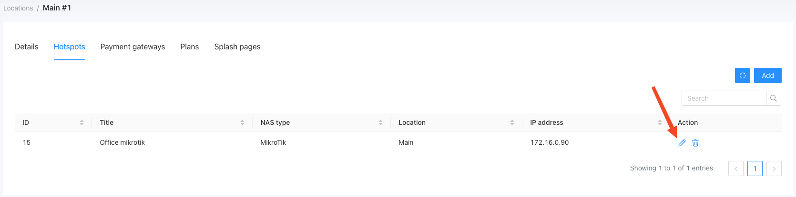

# Hotspots
## Introduction to Powerlynx Hotspots
Powerlynx Hotspots facilitate seamless integration of router hotspots with the Powerlynx system, leveraging the RADIUS protocol for effective communication and management of client connections. This document provides guidelines on the setup, functionality, and management of Powerlynx Hotspots.
Powerlynx currently supports Mikrotik and Cambium devices, but it can also accommodate other devices that support the RADIUS protocol.

Here's an example use case:
{data-zoomable}

The basic use case is depicted in the image above. It involves a wireless router connected to Powerlynx. Clients can connect to this router via WiFi. The router communicates with Powerlynx using the RADIUS protocol to determine whether clients should be granted internet access.

## Setting Up Powerlynx Hotspots
To set up a hotspot, navigate to "Locations," select the desired location, and open it. Under the "Hotspots" tab, click the "Add" button to create a hotspot:

{data-zoomable}

* **Title** - title for your hotspot;

* **NAS type** - select the correct NAS type;

* **Connection type** - Choose the desired connection type. For Mikrotik NAS type, we recommend using the Wireguard connection type. For Cambium, use only Public IP, as Wireguard is not supported by Cambium;

* **Radius secret** - Enter the RADIUS secret of your router's RADIUS server;

* **Physical address** - Provide the address of your router (optional).

For more detailed instructions on adding hotspots, refer to these guides:

#### [How to add Mikrotik hotspot](../networking/mikrotik.md)

#### [How to add Cambium hotspot](../networking/cambium.md)

## Updating or editing hotspots

To edit a hotspot, simply find it in the list of hotspots and click the "Edit" button:

{data-zoomable}

::: warning
Be careful when changing hotspot parameters, as incorrect modifications can disrupt the connection between the router and Powerlynx.
:::

Here, you can change some parameters and view the connection status indicator:

{data-zoomable}

{data-zoomable}

When the ping status is "Unreachable," it means that this hotspot can't connect to Powerlynx, and all customers coming from this hotspot will fail to connect. In this case, please use [our troubleshooting guide](https://docs.powerlynx.app/networking/mikrotik_troubleshooting.html).
