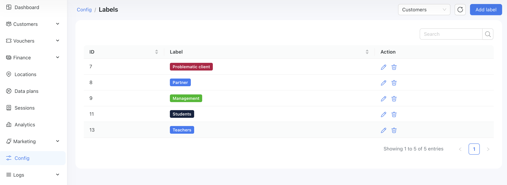
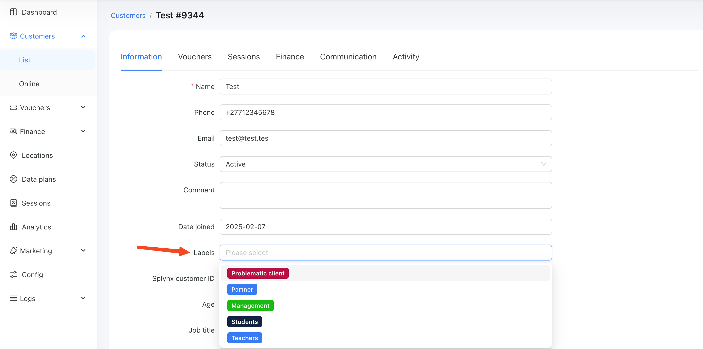

# Labels

The labels feature allows you to categorize your customers using custom tags that you define. By assigning labels to customers, you can easily segment your audience based on behavior, preferences, location, usage patterns, or any criteria relevant to your business.

This segmentation gives you powerful flexibility for future actions. You can quickly filter customers by label, making it easier to analyze specific groups or export targeted data. Labels enable you to tailor your communication and marketing efforts—such as offering personalized promotions, running focused ad campaigns, or creating special offers for selected customer groups.

Whether you want to identify loyal users, highlight customers who need follow-up, or separate prepaid from postpaid customers, labels help you manage and understand your customer base more effectively. They provide a simple yet powerful way to deliver more relevant experiences and improve your overall engagement strategy.

## Configuration

In Powerlynx, you can assign labels to both customers and data plans.

Navigate to `Config/System/Labels` to manage your labels:

{data-zoomable}

In the top-right corner, you’ll find a filter that lets you select a module (Customers, Data Plans). Choose the desired module to view and manage the labels associated with it.

## Customer Labels

You can manually assign a label to a customer by opening the customer profile and updating the “Labels” field:

{data-zoomable}

## Data plan labels

Similar to customers, you can create labels for data plans and assign a label to a data plan by editing it:

{data-zoomable}

Once assigned, the customer will see this label on the data plan selection page:

{data-zoomable}

