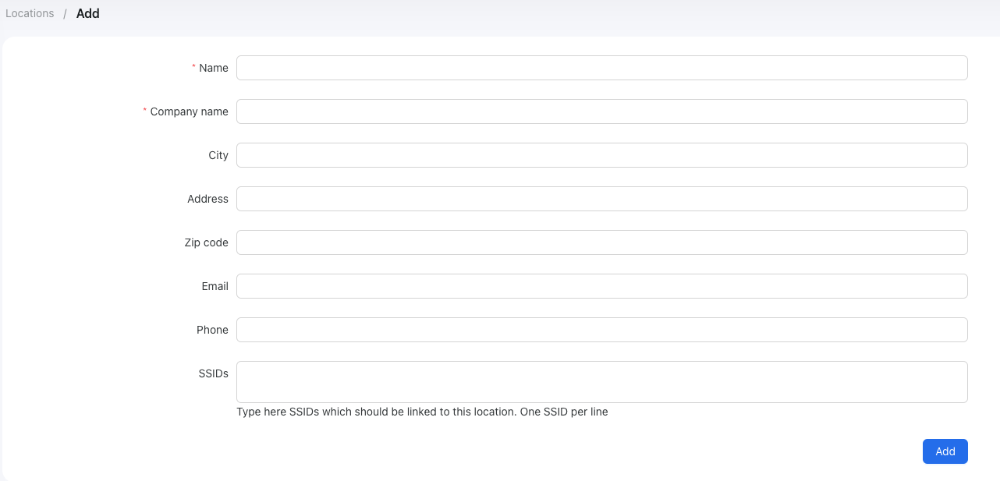

# Locations

## What is a location in Powerlynx?

In Powerlynx, a "Location" refers to a virtually separated segment of the system where you can configure specific parameters unique to that location. For instance, consider the list below, which includes four locations: two offices, a restaurant, and a hotel. Naturally, each can have distinct settings, branding, etc. Additionally, it's quite convenient to track customers originating from different locations. Undoubtedly, you would want to differentiate between customers connecting to hotspots in a hotel and those connecting in an office. 

{data-zoomable}

For example, in the restaurant, you might want to provide free Wi-Fi access, whereas in the hotel and offices, only paid Wi-Fi is offered. In the restaurant, you could request clients to input their phone number and name when connecting, while in the office, you might ask for their name, phone number, and email. These settings can be individually configured for each location in Powerlynx.

At Powerlynx, we offer multiple filters for various types of data, allowing you to filter almost any record by location, including customers, their sessions, payments, and more.

## Add a location

To create a location, simply click on the "Add" button in the top right corner, and you will be presented with a form to add a location:

{data-zoomable}

* **Name** - Enter the name for this location (required);

* **Company name** - Specify the company name for this location (required);

* **City** - Enter the city where the location is situated;

* **Address** - Provide the full address of the location;

* **Zip code** - Enter the zip code for the location;

* **Email** - Provide the email address associated with this location;

* **Phone** - Add the phone number of this location;

* **SSIDs** - This is the most critical field. Enter a list of SSIDs (or hotspot server names if you use Mikrotik devices). When a new connection is detected, we will compare the SSID from the connection information with this list to determine the location.

Once created, you can configure the location. 

{data-zoomable}

Pay attention to each tab you have here:

## Details
Here, you can configure the contact and address details of your location. The most important field here is "SSIDs," which is a list of SSIDs (or hotspot server names if you use Mikrotik devices). When a new connection is detected, we will compare the SSID from the connection information with this list to determine the location;

## Hotspots
This tab lists the hotspots (routers) at this location. You can find more details about hotspots [here](hotspots.md);
 
## Payment gateways
On this tab, you should configure and enable the available payment options for your customers:

{data-zoomable}

In the image above, you can see that at this location, customers can pay using Stripe and PayPal, or by using a voucher code. The "Login using voucher code" option means you have a code that you can provide to grant internet access. To generate these codes, navigate to Vouchers/Series, click on the "Generate" button, create a series of vouchers, export them, and either print them on paper or store them in an Excel file to provide to customers as needed. Each payment gateway should be configured with the correct payment credentials. By clicking on the "Edit" button, you can set the credentials to use.

## Plans
On this tab, you need to enable the available data plans that will be shown to the customers on the splash page. When you create a new plan, don't forget to enable it for each location where it should be available.

## Splash pages
On this tab, you need to enable the splash pages that will be used at this location. You can find more about splash pages [here](splash-pages.md).

{data-zoomable}

## Login options
A login option is simply the way your customers can sign in. On this tab, you can configure your customers’ login options. This section will be expanded later to include social login options such as Google and Facebook. Currently, customers can log in using their phone number or as a guest (without a phone number). 

{data-zoomable}

**Phone number** - This is the default login option, which requires customers to sign in with their phone number;

**Guest login** - A login method that does not require a phone number. This option is suitable in cases where customers cannot receive an OTP code or when it is unnecessary - for example, accessing public Wi-Fi in a hotel where requesting a phone number is not required:

{data-zoomable}

Here you can configure the button title for guest login and manage data plan availability. If the “Show all available data plans” option is enabled, customers will be able to select from the available data plans for this location. If it is disabled, you must select a default data plan, and vouchers will be generated using the selected plan.

You can also protect guest logins with a PIN code. In our case, we enabled PIN code protection, so the customer needs to know the PIN code before logging in. The text prompt is also configurable, ensuring that the customer isn’t confused about where to obtain the PIN code.

This is what customers will see when connecting to Wi-Fi with guest login enabled:

{data-zoomable}

Customers can click the “Guest Login” button to connect without entering their phone number. The system will redirect them to the data plan selection page if PIN code protection is not enabled. If PIN code protection is enabled, they will have an additional step where they need to enter the PIN code.

{data-zoomable}

## Default data plan

In some cases, when you offer only one data plan to your customers, there is no need to show the data plan selection page. To shorten the user journey by skipping this step, we’ve introduced a new feature that allows you to set a default data plan, which will be applied automatically when the customer connects.

You can find this feature under the location’s `Login options` tab:

{data-zoomable}

With this option enabled, the system will display the data plan selection page with the plans that are enabled on the `Plans` tab.

If disabled, you will see options to select a default data plan and a default payment gateway to redirect to:

{data-zoomable}

In this case, once the customer connects, they will automatically be assigned the “2GB” plan, and if the price is not zero, they will be redirected to the default payment gateway you selected. In our case, that’s 1Voucher.

::: info
Each individual login option has its own settings for the default data plan and payment gateway. This provides a more flexible approach in cases where you need to assign different default data plans to each login option. The settings of an individual login option have higher priority than the global settings.
So, if you set a 2GB default data plan under a specific login option and a Free data plan under the Global options, the customer will be assigned the 2GB plan from the individual login option because it overrides the global configuration.

