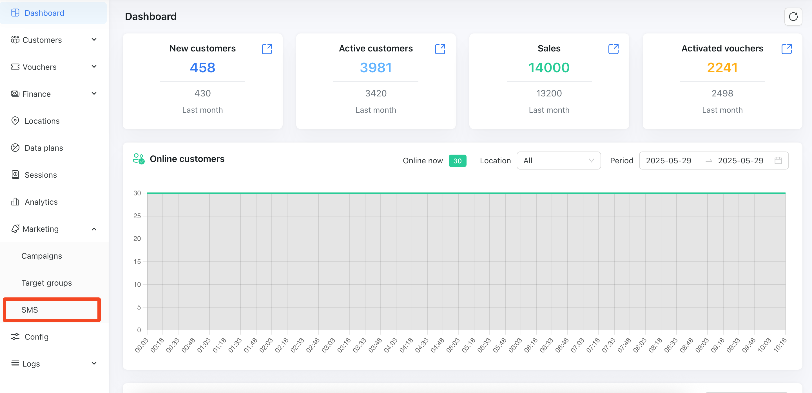
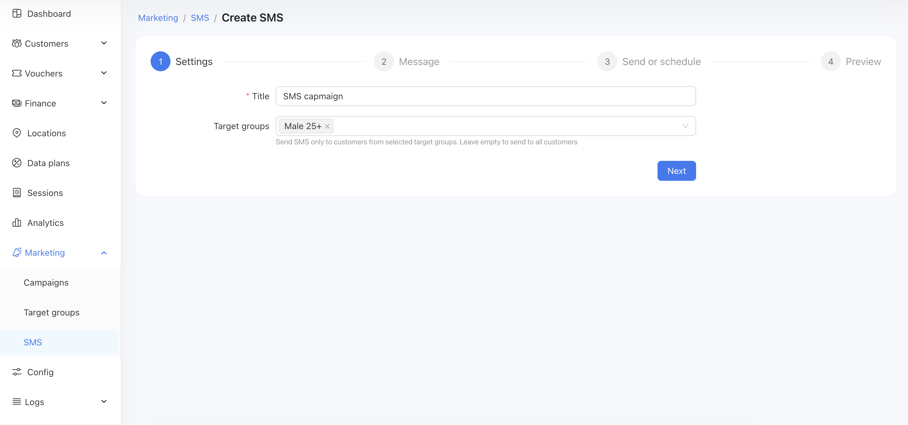
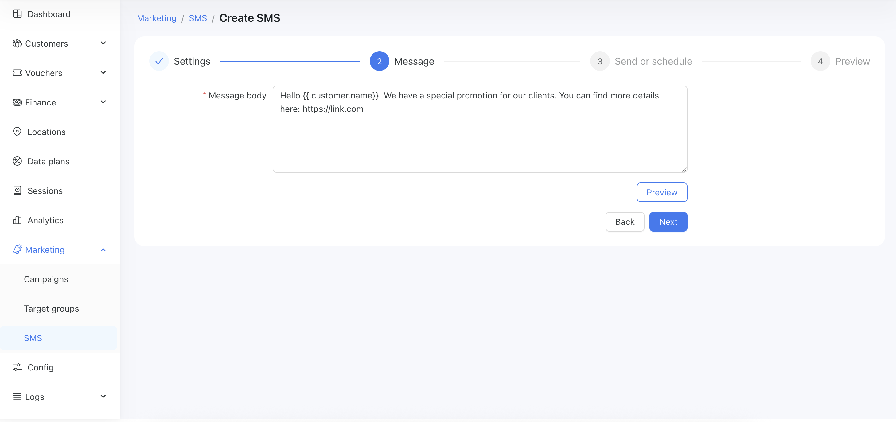
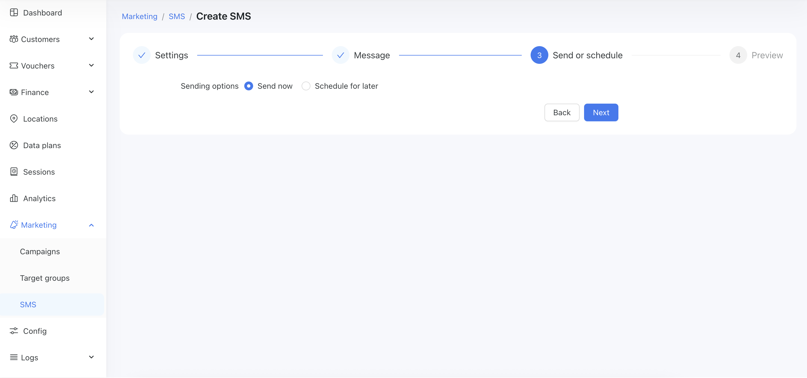
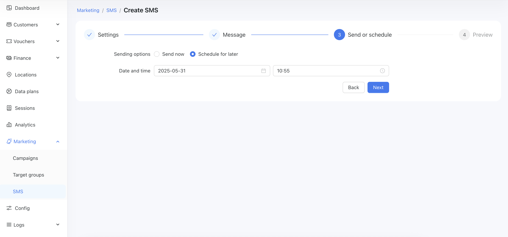
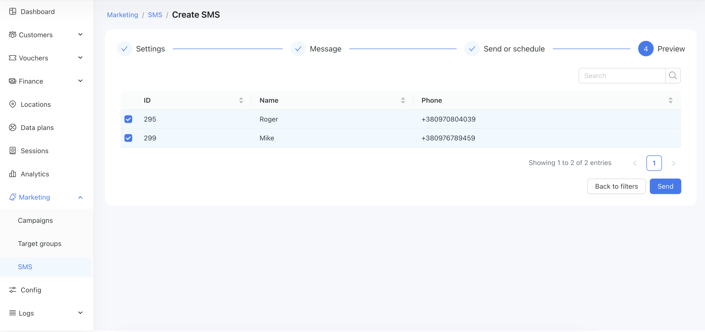
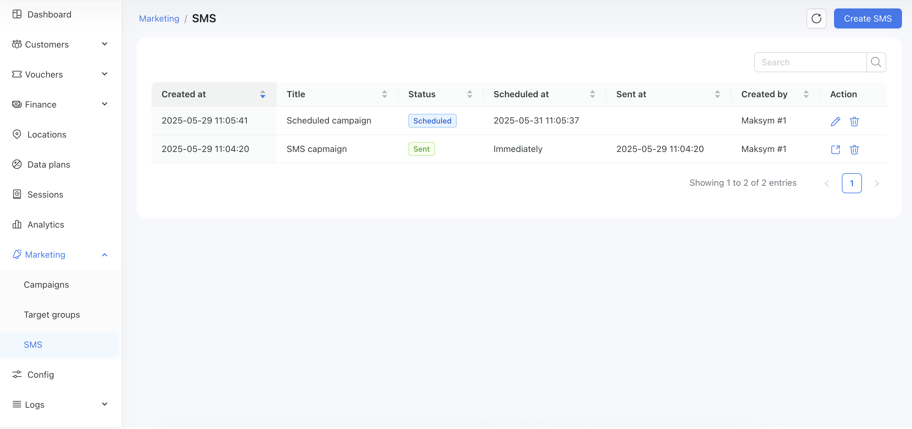
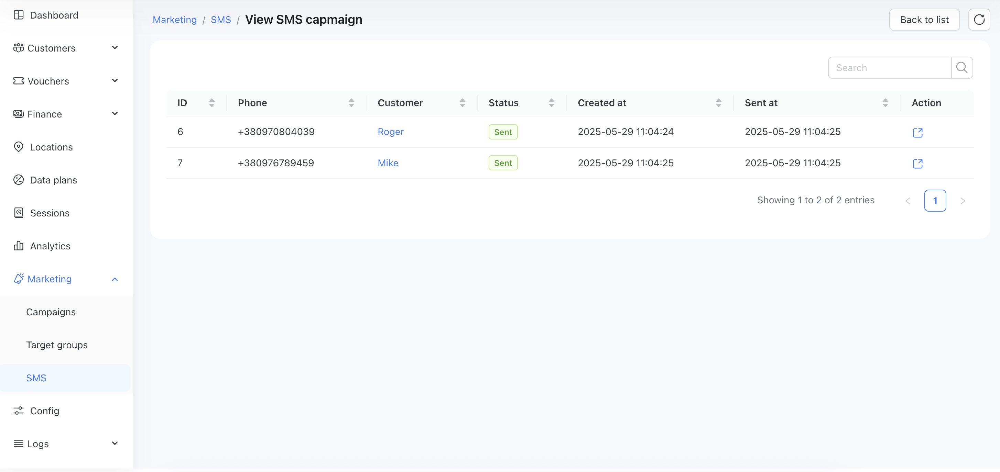

# Mass SMS

The Mass SMS Sending feature in Powerlynx enables you to send targeted text messages to groups of users in just a few clicks. By combining this with the Target Groups feature, you can ensure your message reaches exactly the right audience based on demographics, behavior, or any custom data you’ve collected.

## What Is Mass SMS Sending?
Mass SMS Sending allows you to broadcast messages to multiple users simultaneously. Instead of messaging your entire user base, you can focus on a specific segment—improving engagement and reducing costs.

### This feature is ideal for:

1. Promotions and discounts

2. Announcements (e.g., new products or services)

3. Loyalty campaigns

4. Event reminders

5. Feedback requests

## How It Works
* Create a Target Group using this guide.

* Navigate to `Marketing/SMS` menu on the dashboard:

{data-zoomable}

* Create a New Campaign by clicking `Create SMS` button

* Create title for SMS capmaign and select target group:

{data-zoomable}

* Write the SMS content you want to send. 

{data-zoomable}

Click the "Preview" button to see message text that will be send (first customer from the target group will be used).

**Keep in mind:**

SMS messages should be short and clear (typically 160 characters or less).

* Send now or schedule

You can send SMS right now by selecting the "Send now" option:

{data-zoomable}

or schedule

{data-zoomable}

* Preview the list of recipients

{data-zoomable}

Preview the list of recipients, deselect any customers you want to exclude from the campaign, and click "Send".

You can view your list of campaigns under the `Marketing/SMS` menu:

{data-zoomable}

You can edit campaigns with the status set to "Scheduled" if you need to change any parameters. If the status is "Sent", you can only view the list of recipients and the delivery status of the SMS messages from that campaign:

{data-zoomable}

{data-zoomable}

## Requirements

1. At least one [functioning SMS gateway must be connected to Powerlynx](https://docs.powerlynx.app/system/sms.html).

2. Phone Numbers: Make sure your user profiles include valid mobile numbers.

3. Opt-in Compliance: Ensure you have user consent to send marketing messages via SMS in compliance with your local regulations (e.g., GDPR, TCPA).