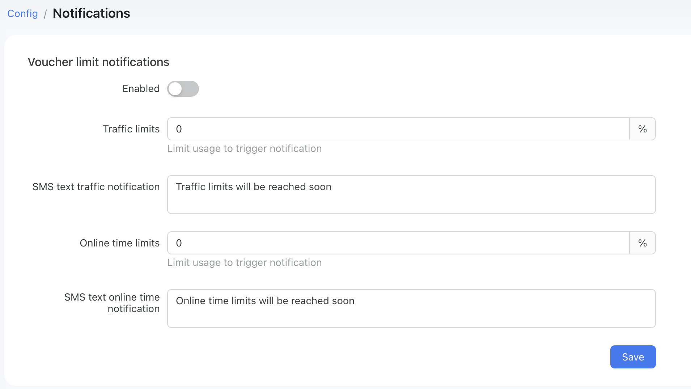
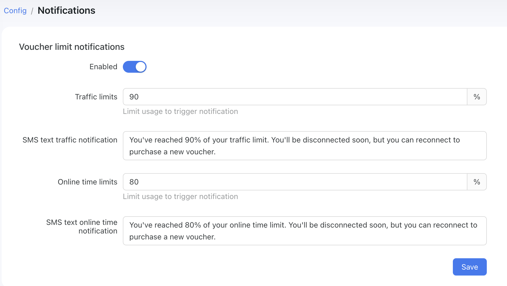
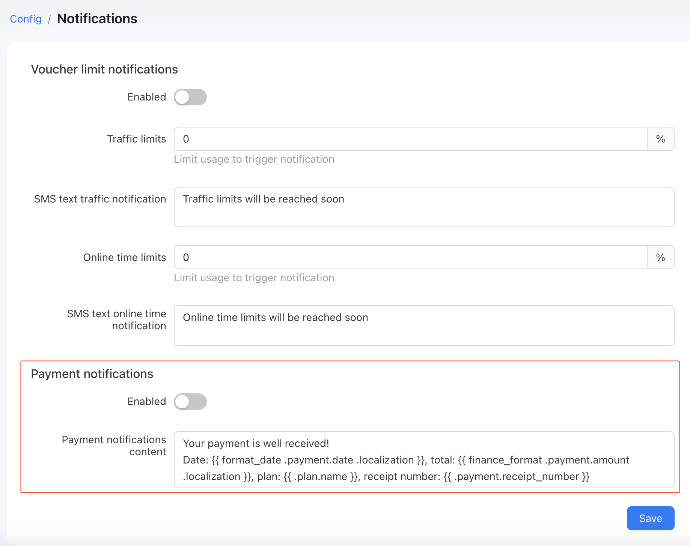

# Notifications

It is quite important to notify your customers about significant activities in their Powerlynx profile. That's why we are introducing the notifications module, and we will extend it to cover all important notifications to customers.

To configure it, navigate to `Config -> System -> Notifications`.

ℹ️ Make sure you've configured the SMS gateway in your system to send SMS notifications - https://docs.powerlynx.app/system/sms.html

# Voucher limit notifications

This type of notification allows you to notify customers via SMS about voucher limits. For example, you can notify them when 90% of available traffic is used or when 80% of available online time is used. Here, we work strictly with usage percentages and SMS notifications.

To enable it, simply toggle it on and configure the notifications. If the percentage value is set to 0, it means this type of notification won't be used. The value should be at least 1%.

{data-zoomable}

For example, you can use it as follows:

{data-zoomable}

In this example, the customer will receive an SMS when they have used 90% of their traffic limit and/or 80% of their online time limit. This depends on the traffic limits configured for the [data plan](https://docs.powerlynx.app/system/data-plans.html).

# Payment notifications

This type of notification allows you to inform your customers via SMS that their payment has been received. In some countries, it is required to notify your customers about their payment online. To enable this feature, simply toggle the payment notifications on and edit the message you will send to your customers.

{data-zoomable}

There are a few variables that you can use in your template:

```
{{ format_date .payment.date .localization }} - the date of payment
{{ finance_format .payment.amount .localization }} - payment amount
{{ .plan.name }} -  name of the purchased tariff plan
{{ .payment.receipt_number }} - unique identifier of a payment in Powerlynx
```