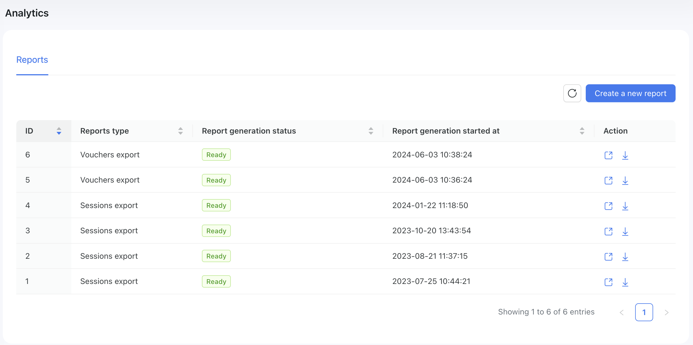
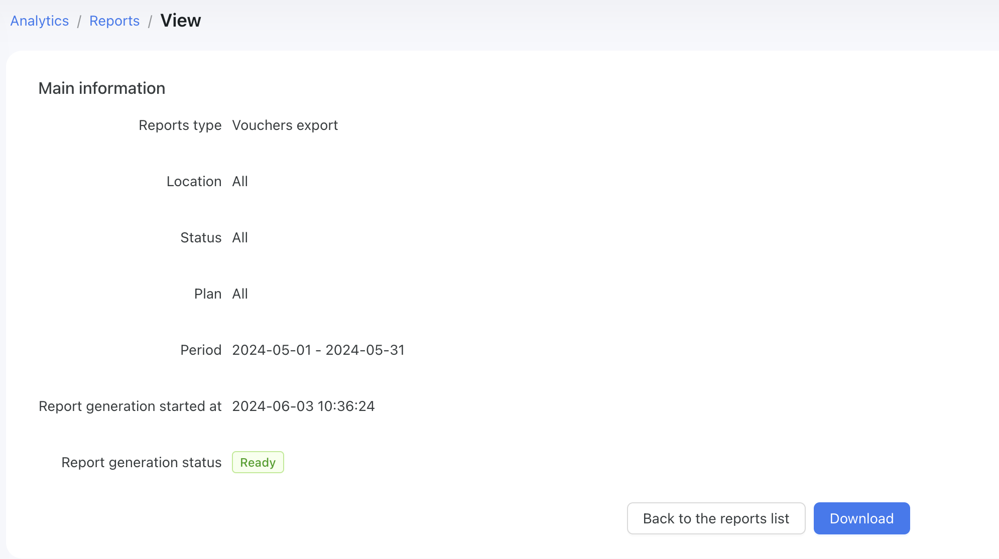

# Reports

It is important to export data and generate reports to analyze different metrics of your business. In Powerlynx, we offer a data export feature that you can use to export sessions and vouchers, helping you better understand usage, popular plans, etc.

To use this feature, navigate to `Analytics -> Reports` and select the report you need:

{data-zoomable}

To generate a report, simply click on the "Create a new report" button, select the type of report, and use filters to export more precise data:

{data-zoomable}

Wait on this page until the "Download" button appears:

{data-zoomable}

Or safely navigate away and come back later to the list of reports. You will see the "Download" button under the generated report.

The output file is a CSV containing all the required and filtered data.

# Available reports

## Sessions export

Allows you to export customer sessions to see the usage. The exported data includes: MAC, IP, customer ID, phone number, start date and time, end date and time, traffic usage, data plan, NAS identifier, and more.

## Vouchers export

Export vouchers with different statuses, locations, and data plans. This data can be useful to see how many vouchers were generated from a specific data plan, and more.

The exported data includes: voucher ID, customer name, serie, full code, status, price, location, activation time, creation time, valid until, data limit, online time limit, data usage, online time usage and more.