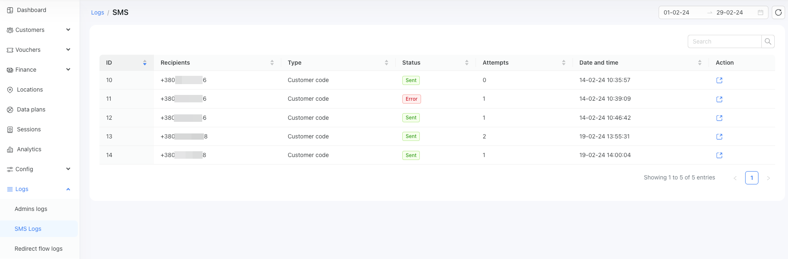

# OTP verification in Powerlynx via SMS

It is important to verify the phone number of the person who connects to your Wi-Fi. This is typically done by sending an SMS with an OTP code to ensure the number belongs to a real person. In Powerlynx, you can choose to skip this process, in which case the system will only verify the format of the phone number to ensure it is valid. However, if you decide to send OTP verification codes to your customers, you will need to set up SMS sending from Powerlynx. By default, Powerlynx does not support methods to send SMS directly from the product without integrating with third-party SMS gateways.

# Configuration of a custom SMS gateway

By "Custom SMS Gateway," we refer to any SMS gateway that is not supported by default in Powerlynx. Currently, we only support Twilio by default, but you can use any other SMS gateway in Powerlynx. However, be aware that configuring a non-default gateway might be less straightforward and could involve more complex setup processes.

To create a configure your SMS sending service navigate to `Config/System/SMS` and click on the "Add" button. You will see this form:

{data-zoomable}

* **Name** - The name of your SMS gateway.

* **Type** - This depends on the selected type, which will present a different set of fields. Two types are available: Custom and Twilio.

* **URL** - Specify the URL of the SMS gateway (as mentioned in the gateway's documentation).

* **Method** - Select the method to call the gateway (POST or GET).

* **Content Type** - How to handle the payload (JSON or x-www-form-urlencoded). JSON can only be used with the POST method.

* **Use Custom Lua Script** - To be used in special cases when it's impossible to configure your SMS gateway without the engineering of some script (requires development skills).

* **Payload** - The request payload for sending SMS. This depends on the content type (JSON or x-www-form-urlencoded) and the syntax provided by the SMS gateway.

* **Verify SSL Certificate** - If this toggle is enabled, the system will verify the SSL certificate of the SMS gateway host with a secure (HTTPS) connection.

* **Success Response** - If the SMS gateway returns a certain successful response, the text to check the response from the gateway must be configured here so that Splynx can identify which SMS was successfully sent. A successful response should contain the string given in this line.

* **Custom Header Name** - The name of the custom header. To be used in cases when you need to send additional headers to the SMS gateway.

* **Custom Header Value** - The value of the custom header.

Example of configuration:

{data-zoomable}

# Configuration of Twilio SMS gateway

We've built integration with Twilio - https://www.twilio.com. They offer various services, including an SMS gateway.

All you need to do is create a Twilio account, obtain the Account SID, Auth Token, and From number values, and then input them into Powerlynx in the designated fields:

{data-zoomable}

::: tip
In Powerlynx, the fields should be populated with values from Twilio as follows:

Account SID = Account SID from Twilio

API key = Account SID from Twilio

API secret = Auth Token from Twilio

From = My Twilio phone number
:::

To locate these values, you should log in to your Twilio console using this link - https://console.twilio.com/, create your first SMS app, and follow the instructions. Afterward, you can find the required details under the "Account Info" settings:

{data-zoomable}

Once it's done, click the "Add" button at the bottom. Next step is to test if it works.

For more secure authentication, create an API key with the type set to 'standard', set up permissions, and use it in the "API key" field in Powerlynx. More information can be found here - https://www.twilio.com/docs/usage/api#authenticate-with-http

# Test SMS sending

Once you've created and configured your SMS sending service, you can run some tests to ensure you can send SMS from Powerlynx. At the bottom of the page, you will find the "Test section":

{data-zoomable}

Simply enter your phone number and click the "Run test" button, then check your phone to confirm that you've received the SMS.

# Check balance

The "Check balance" section enables you to configure functionality to check the balance on your SMS gateway, provided it supports this feature. Simply activate it, set the period, enter your email, enable dashboard notifications, and specify the balance value that should trigger notifications. Powerlynx will then send you an email notification and display a warning on the dashboard about a low balance on your SMS gateway, helping prevent the SMS sending service from stopping due to insufficient funds.

# Enable, disable, and prioritize SMS gateways.

In the list of SMS gateways, you can easily enable, disable, and change the order through drag and drop. You can also enable a specific SMS gateway for a specific location, among other actions. If you have multiple SMS gateways enabled, the system will use the first one as the primary gateway. Any other enabled gateway will serve as a fallback in case the primary SMS gateway fails to send the SMS. Thus, configuring multiple SMS gateways can enhance the reliability of your SMS sending, ensuring that your customers will receive an SMS from one gateway or another.

{data-zoomable}

# Enable the OTP verification for the splash page

Now that you have configured some SMS gateways, you have the option to enable OTP verification for each [splash page](https://docs.powerlynx.app/system/splash-pages.html), although it is not mandatory. Open your splash page settings and choose to enable or disable OTP verification via SMS code. If enabled, customers will be required to confirm their phone numbers using an SMS code. It's important to note that keeping this option enabled for the splash page necessitates a functioning SMS sending service within Powerlynx.

# SMS logs

In Powerlynx, you can track all SMS messages sent from the platform under Logs/SMS logs:

{data-zoomable}

To see the details of each SMS, click on the "Actions" button under each SMS record.