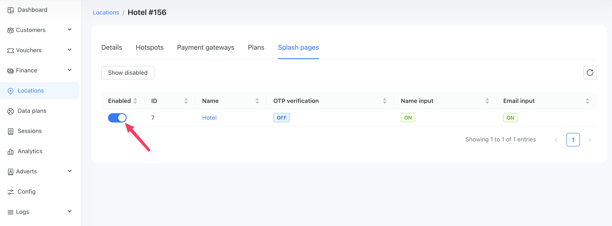

# Splash pages

### What is a WiFi splash page?
Also called a “captive portal” or simply a “login page,” your WiFi splash page is the first website your customers see before they can log into your WiFi network.
Splash pages enable you to customize the appearance (input fields, logo, etc) of the page that appears when a customer connects to the Wi-Fi.

### Configuration
You can find splash pages under `Config / System / Splash pages`.

{data-zoomable}

To create a new splash page, navigate to the page: `Config / System / Splash pages` and click on the `Add` button in the top right corner of the page. You will see the form:

{data-zoomable}

Next, you need to fill out the form. 
Here is a description of each field:
* <b>Name</b> - The name of the new splash page. It can be any name you choose.

* <b>Show terms and conditions</b> - When enabled, a customer will be asked to read and accept the Terms and Conditions on the login page. The customer must check a checkbox before continuing with the authorization.

* <b>Terms and conditions</b> - Enter your Terms and Conditions text here. This text will be displayed to customers in a modal window. This field is visible only when `Show terms and conditions` is enabled.

* <b>Country codes</b> - Choose preferred country codes to display to customers. These country codes will be shown at the top of the selection options.

* <b>SSIDs</b> - Enter the SSIDs of the routers where you wish to use this splash page. One SSID per line. For example, if your Cambium router provides a Wi-Fi network called "Fast internet," then you need to enter "Fast internet" in this field. The system will then use this splash page for that Wi-Fi access point.

* <b>OTP verification</b> - Enable or disable OTP verification by SMS code. If enabled, customers must confirm their phone numbers with an SMS code.

* <b>Name input</b> - Show or hide the Name field. When enabled, the customer should enter their name in the field. Otherwise, the system will use the customer's phone number as a name.

* <b>Email input</b> - Show or hide the Email field. When enabled, the customer should enter their email in the field. Otherwise, the Email input will be disabled.

* <b>Logo</b> - An image that a customer will see on the login page. Please note that this field appears only after the first save of the form.

Here, you can see the filled form:
{data-zoomable}

### How to enable the Splash page

After all configurations have been made, you need to enable your Splash page for a specific location.
Navigate to `Locations / Your location / Splash pages` and then tick the checkbox in the row with your Splash page.

In the screenshot below, you can see that we enabled the `Local shop` Splash page for the `Main #1` location.
This means that for every router in the `Main #1` location, the system will compare the router's SSID with the `Local shop` SSIDs. If there is a match, the system will use the `Local shop` Splash page to customize the login page.

{data-zoomable}

### How the system chooses which Splash page to use
<ol>
<li>A customer connects to the Wi-Fi and is redirected to the login page.</li>
<li>The system looks at the router's SSID and compares it with the SSIDs of every location, choosing the first location that contains the desired SSID.</li>
<li>The system filters only the enabled Splash pages in the selected location.</li>
<li>The system compares the router's SSID with the SSIDs of each filtered Splash page and selects the first Splash page that contains the desired SSID.</li>
<li>The system applies customizations from the selected Splash page to the login page.</li>
</ol>

So, the most important thing is to enter the correct SSIDs into a location and a Splash page, and then enable your Splash page for the desired location.

### Examples of login page customization
Let's look at how a Splash page can change the login page.

#### All fields are enabled
In this example, you can see how it looks when all fields are enabled.

 

#### The custom logo
Below is an example of how the custom logo appears.

::: tip
It's recommended to use pictures with an aspect ratio of 2:1. For example, if the image is 600px wide, then the height should be 300px.
Available formats: png, jpg, jpeg, gif
:::

 

#### Country codes
We selected `Czech Republic +420`, `Germany +49`, and `Spain +34` in the Country codes field.
You can see that the selected codes are placed at the top of the select options, but a customer is free to choose any country code they want.

 

#### Terms and conditions
Here, you can see how the Terms and Conditions modal window looks. This window opens when a customer clicks on the blue Terms and Conditions link.

