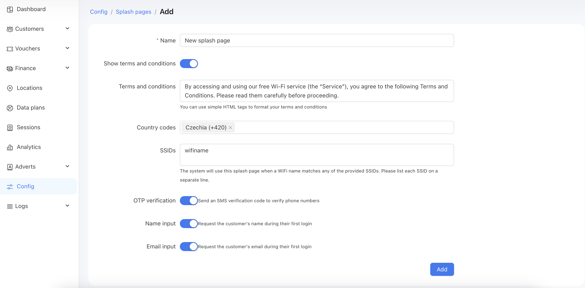

# Splash pages

# What is a splash page and how it works?
A splash page or captive portal is a web page that users are automatically redirected to when they connect to a public or private Wi-Fi network. This page typically requires some action or input from the user before they are granted internet access. Captive portals are commonly used in places like airports, hotels, cafes, offices, and universities.

## **How Splash Pages Work**
1. **User Connects to Wi-Fi:** The user’s device connects to the Wi-Fi network and requests access to a website.

2. **Redirection:** Instead of accessing the internet directly, the user is redirected to the splash page (often hosted on the router or an external server).

3. **User Interaction:** The user interacts with the portal by logging in, accepting terms, entering a voucher code, or completing other required steps.

4. **Access Granted:** Once the requirements are met, the captive portal grants internet access, either temporarily or permanently based on the setup.

## **Key Features of a Splash Page in Powerlynx**

1. **Authentication:** Users may need to log in using their phone number.

2. **Terms and Conditions:** You can enable splash pages require users to agree to terms of service (TOS) or acceptable use policies before accessing the internet.

3. **Branding:** The page includes the business or service provider's branding, such as logos, color schemes, and promotional content.

4. **Payment Gateway:** For paid Wi-Fi, the portal include a payment interface for users to purchase internet access.

5. **Data Collection:** Businesses sometimes use captive portals to collect user data like email addresses or phone numbers for marketing purposes. You can collect data from different users through the splash page.

6. **Usage Tracking:** Captive portals often monitor user activity, such as data usage and time spent online, which can be used for analytics or compliance with regulations.

# Configuration
You can find splash pages under `Config / System / Splash pages`:

{data-zoomable}

{data-zoomable}

To create a new splash page, navigate to the page: `Config / System / Splash pages` and click on the `Add` button in the top right corner of the page. You will see the form:

{data-zoomable}

Next, you need to fill out the form. 
Here is a description of each field:
* <b>Name</b> - The name of the new splash page. It can be any name you choose.

* <b>Show terms and conditions</b> - When enabled, a customer will be asked to read and accept the Terms and Conditions on the login page. The customer must check a checkbox before continuing with the authorization.

* <b>Terms and conditions</b> - Enter your Terms and Conditions text here. This text will be displayed to customers in a modal window. This field is visible only when `Show terms and conditions` is enabled.

* <b>Country codes</b> - Choose preferred country codes to display to customers. These country codes will be shown at the top of the selection options.

* <b>SSIDs</b> - Enter the SSIDs of the routers where you wish to use this splash page. One SSID per line. For example, if your Cambium router provides a Wi-Fi network called "Fast internet," then you need to enter "Fast internet" in this field. The system will then use this splash page for that Wi-Fi access point.

* <b>OTP verification</b> - Enable or disable OTP verification by SMS code. If enabled, customers must confirm their phone numbers with an SMS code. This option requires at least 1 [configured SMS gateway](https://docs.powerlynx.app/system/sms.html).

* <b>Name input</b> - Show or hide the Name field. When enabled, the customer should enter their name in the field. Otherwise, the system will use the customer's phone number as a name.

* <b>Email input</b> - Show or hide the Email field. When enabled, the customer should enter their email in the field. Otherwise, the Email input will be disabled.

* <b>Logo</b> - An image that a customer will see on the login page. Please note that this field appears only after the first save of the form.

## Customize the splash page theme

Once the splash page is created, you can customize it by changing the colors, logos, backgrounds, and more. Switch to the "Theme" tab to customize your splash page:

{data-zoomable}

{data-zoomable}

We recommend exploring each tab - Logo, Container, Body, Button, and Input—and checking the available customization options to create your own design. Make the changes and see how they will appear to the end customer on the same page.

### Customizable status page

The "Status Page" refers to the final page a customer sees before closing the captive portal. It appears at the end of the user journey - after any ads and payment steps have been completed.

To customize it, open your splash page, switch to the `User Journey` tab, and select the "Status Page" option to configure it:

{data-zoomable}

You can add various elements to your Status Page - such as videos, images, text, or buttons with URLs—under the "Content" tab:

{data-zoomable}

Use the "Theme" tab to configure the overall style of the page, including background image or color, button colors, and more:

{data-zoomable}

The "Config" tab allows you to set additional options, such as redirecting the user to a specific website after a delay (in seconds):

{data-zoomable}

::: info
The "Use router's status page" toggle determines which status page will be displayed: the one you've configured in Powerlynx or the one hosted on your hotspot controller (some routers have a built-in, self-hosted status page). If this toggle is enabled, the Powerlynx status page will be bypassed, and users will see the router’s default page instead. We recommend keeping this toggle disabled unless you specifically want to use the router-hosted page. This option was added to support clients who prefer to use their router’s native status page.
:::

That's how it looks at the end of user journey:

{data-zoomable}

### Here are some examples of what you can create:

{data-zoomable}

{data-zoomable}

{data-zoomable}

{data-zoomable}

## How to enable the Splash page

After all configurations have been made, you need to enable your Splash page for a specific location.
Navigate to `Locations / Your location / Splash pages` and then tick the checkbox in the row with your Splash page.

In the screenshot below, you can see that we enabled the `Hotel` Splash page for the `Hotel #156` location.
This means that for every router in the `Hotel #156` location, the system will compare the router's SSID with the `Hotel` SSIDs. If there is a match, the system will use the `Hotel` Splash page to customize the login page.

{data-zoomable}

## How the system chooses which Splash page to use
<ol>
<li>A customer connects to the Wi-Fi and is redirected to the login page.</li>
<li>The system looks at the router's SSID and compares it with the SSIDs of every location, choosing the first location that contains the desired SSID.</li>
<li>The system filters only the enabled Splash pages in the selected location.</li>
<li>The system compares the router's SSID with the SSIDs of each filtered Splash page and selects the first Splash page that contains the desired SSID.</li>
<li>The system applies customizations from the selected Splash page to the login page.</li>
</ol>

So, the most important thing is to enter the correct SSIDs into a location and a Splash page, and then enable your Splash page for the desired location.