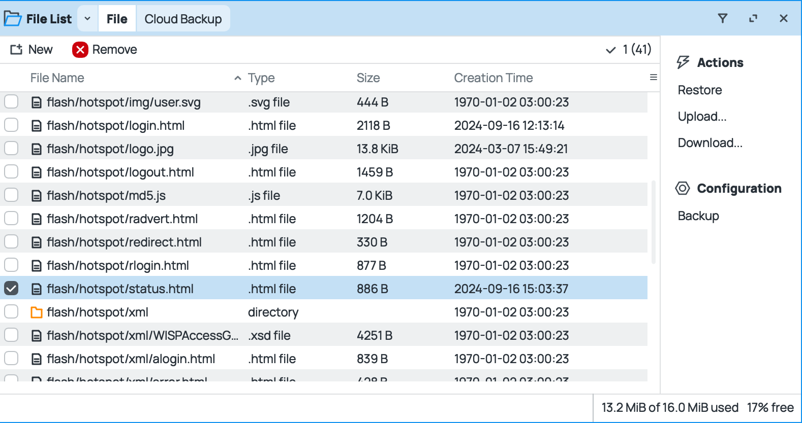
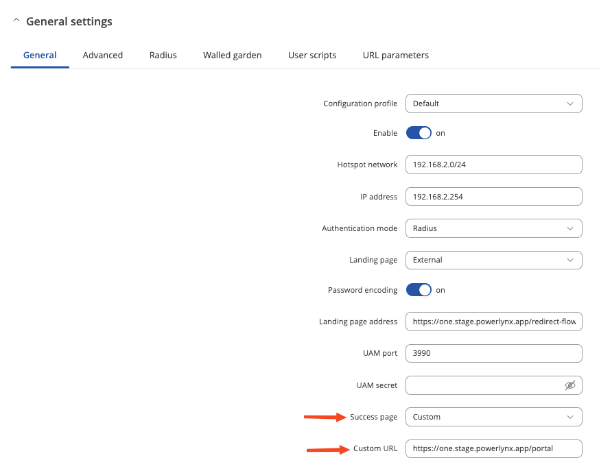
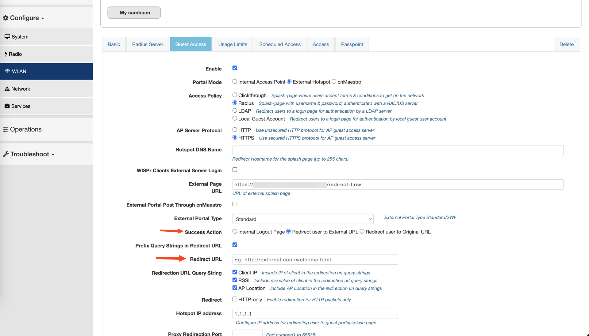

# Public status page

## Overview
The Public Status Page is a feature designed to enhance customer experience by providing them with easy access to their WiFi usage statistics, active vouchers, and historical voucher information. When customers connect to the WiFi network, they will receive an SMS with a link to the status page, where they can authorize themselves and gain access to relevant information about their account and usage.

{data-zoomable}

## Benefits
 - **Enhanced User Experience:** Customers can easily view their WiFi usage statistics, track their data consumption, and manage their vouchers in one convenient place.
- **Real-Time Information:** Users can access up-to-date information on their data usage and voucher status, ensuring transparency and better management of their WiFi plans.
- **Easy Access:** The link to the status page is sent via SMS ot they can be redirected to this page right after login, providing users with a direct and secure method to access their account details from any device.

## How It Works
- WiFi Connection: The customer connects to the WiFi network and purchase a new voucher.

- SMS Notification: An SMS is sent to the customer’s registered mobile number containing a secure link to the public status page.

- Authorization: Upon clicking the link, the customer is directed to the status page, where they need to authorize access.

- Access to Information: Once authorized, the customer can view:
    - Usage Statistics: Current data usage, remaining data, and usage history.
    - Active Vouchers: Details of any active vouchers, including validity period.
    - Historical Vouchers: Information about past vouchers, their usage, and expiry details.

## Configuration

By default, this page is publicly accessible. Each Powerlynx account has its own public status page in the following format: `https://one.powerlynx.app/portal`, where `one.powerlynx.app` is your Powerlynx URL. If your Powerlynx URL is `https://two.powerlynx.app/`, simply add `portal` at the end of the URL, making it `https://two.powerlynx.app/portal`. To access this page, the customer needs to provide their phone number registered with Powerlynx:

{data-zoomable}

This URL can be sent to your customers via SMS, or in some cases, you can redirect your clients to this page right after they log in.

Navigate to `Config/Notifications` and find the **Status page notifications** section:

{data-zoomable}

Enable this feature, select the sending frequency: one-time or every time a new voucher is activated, and edit the text. You can also use this text field to send personalized messages to your customers on your behalf.

You can monitor sent SMS from `Logs/SMS Logs`.

## Mikrotik: Redirect to the status page after logging in

If you're using the [Mikrotik hotspot](https://docs.powerlynx.app/networking/mikrotik.html) in your Powerlynx, you can redirect your customers to the status page without sending them an SMS. All you need to do is replace the `status.html` file on your Mikrotik router with a custom one containing the following code:

```
<!DOCTYPE html>
<html>
<head>
<meta http-equiv="Content-Type" content="text/html; charset=UTF-8">
<meta http-equiv="refresh" content="1; url='https://one.powerlynx.app/portal'">
<meta http-equiv="pragma" content="no-cache">
<meta http-equiv="expires" content="-1">
</head>

<body>
<div style='display: flex; justify-content: center; align-items: center; height: 100vh; width: 100%; flex-direction: column;'>
    <div style="text-align: center; font-size: 70px;">Click this button to open the status page</div>
    <div style="text-align: center; padding-top: 20px;">
        <a href="https://one.powerlynx.app/portal" style="text-decoration: none;">
            <button style="padding: 20px 40px; font-size: 30px; background-color: #4CAF50; color: white; border: none; border-radius: 5px;">
                Click to Connect
            </button>
        </a>
    </div>
</div>
</body>
</html>
```

You can customize this page as you like, but make sure to use your URL for the redirect.

{data-zoomable}

## Teltonika: Redirect to the status page after logging in

If you're using the [Teltonika hotspot](https://docs.powerlynx.app/networking/teltonika.html) in your Powerlynx, you can redirect your customers to the status page without sending them an SMS. All you need to do is to open your Teltonika router, navigate to `Services/Hotspot/General`, edit your hotspot instance and change these settings:

{data-zoomable}

## Cambium: Redirect to the status page after logging in

If you're using the [Cambium hotspot](https://docs.powerlynx.app/networking/cambium.html) in your Powerlynx, you can redirect your customers to the status page without sending them an SMS. All you need to do is to open your Cambium router, navigate to `WLAN/Guest access`, and change these settings:

{data-zoomable}

In the `Redirect URL` field use your status page link (or any other link you want).

## Frequently Asked Questions (FAQs)

### Can I access the status page from any device?
Yes, the status page can be accessed from any device with internet access, such as a smartphone, tablet, or computer.

### What authorization credentials can the customer use to access the status page

For now, the customer only needs to provide their phone number in the exact format it is stored in Powerlynx. We do not send OTP codes when someone accesses the status page, as it doesn't contain any sensitive data like payment credentials, personal information, etc.

### What data can I find on that page

On the status page, you can find all vouchers registered to the customer, including their usage, limits, time frames, and more.

{data-zoomable}

Active and online vouchers are always at the top of the page, while used vouchers appear at the bottom.
