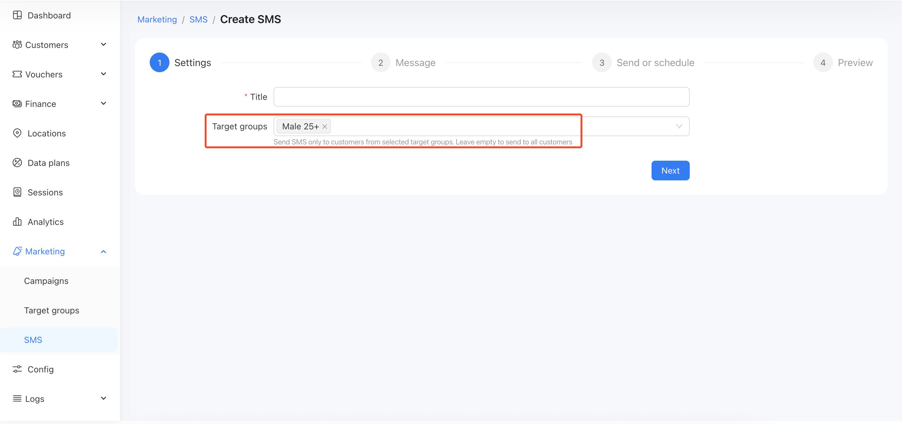

# Target groups

The Target Groups feature in Powerlynx allows you to segment and organize your customers based on specific criteria. This is particularly useful for personalized marketing, such as running targeted ads, sending SMS campaigns, or analyzing audience demographics.

Target Groups are custom-defined customer segments created by filtering users based on selected attributes. These attributes can include default fields and [custom additional fields](https://docs.powerlynx.app/system/additional-fields.html) (like age or gender) that you configure to collect relevant data about your users.

For example, you can create a group that includes all male users aged 25 and above. Once created, this group will automatically include all users in your system who match those criteria.

### Key Benefits
* **Precision Targeting:** Tailor messages or campaigns to specific user demographics.

* **Dynamic Segmentation:** As new users meet the group’s criteria, they are automatically added.

* **Multi-Channel Use:** Use Target Groups across ads, email, SMS, and more.

* **Streamlined Campaigns:** Save time by reusing groups instead of setting filters each time.

## How to Use Target Groups

1. **Define User Attributes**

First, ensure you are collecting the necessary information about your clients. You can create a target group and filter customers using default fields such as email, status, date added, last online, last sale, online/offline status, and more. However, a hotspot is a powerful marketing tool that allows you to collect even more detailed customer data using [Additional Fields](https://docs.powerlynx.app/system/additional-fields.html). Make sure all relevant data is in place to enable effective filtering.

2. **Create a Target Group**

Navigate to `Marketing > Target Groups` in the Powerlynx dashboard and click `Add` button. Choose the filters you'd like to apply:

Example: Age > 25 and Gender = Male and Status = Active:

{data-zoomable}

3. **Save Your Group and preview**

Give your group a descriptive name (e.g., “Males 25+”) and save it. The group will now populate with all customers who meet the selected criteria.

{data-zoomable}

{data-zoomable}

You can export the result in CSV format.

In the list of target groups you can see the "Actions" section with buttons to edit, preview, export in CSV or delete group.

4. **Use that target group**

When setting up an ad or SMS campaign, simply select the Target Group you want to reach. Only users in that group will receive the campaign:

{data-zoomable}

{data-zoomable}