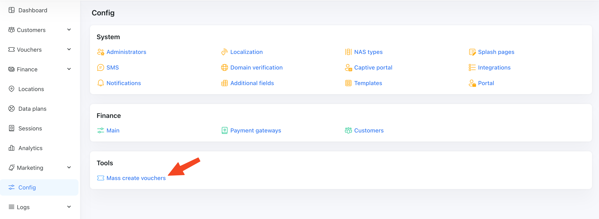
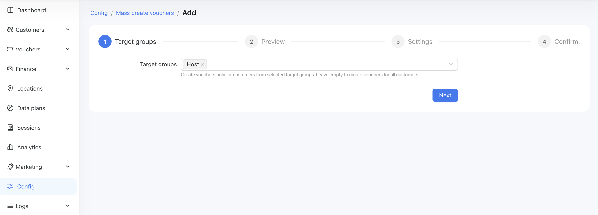
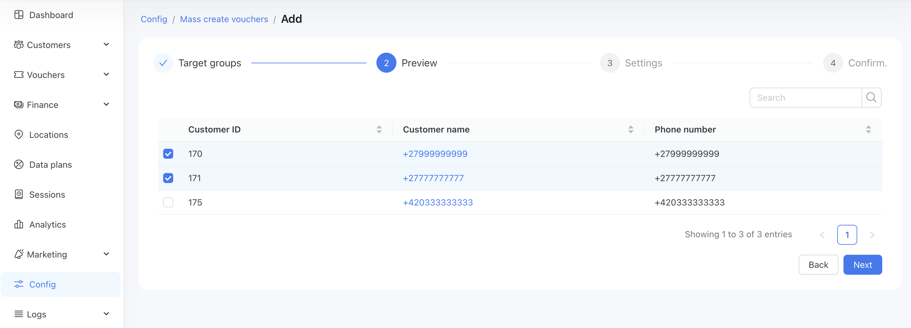
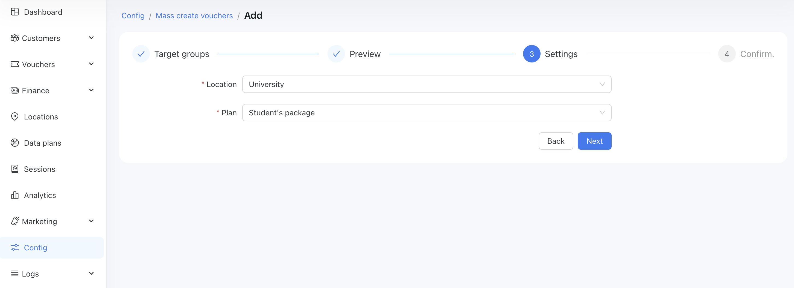
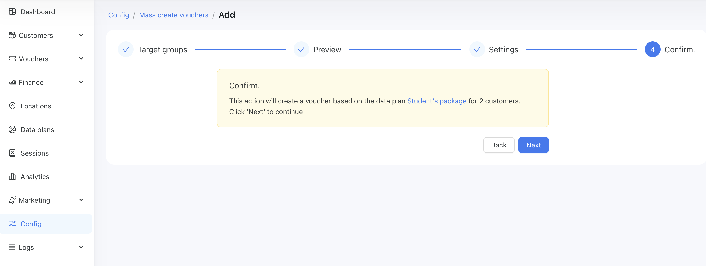
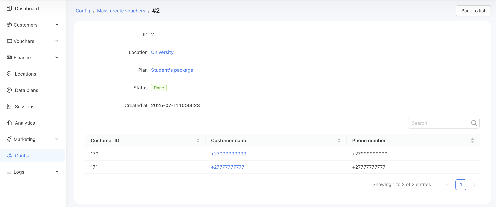
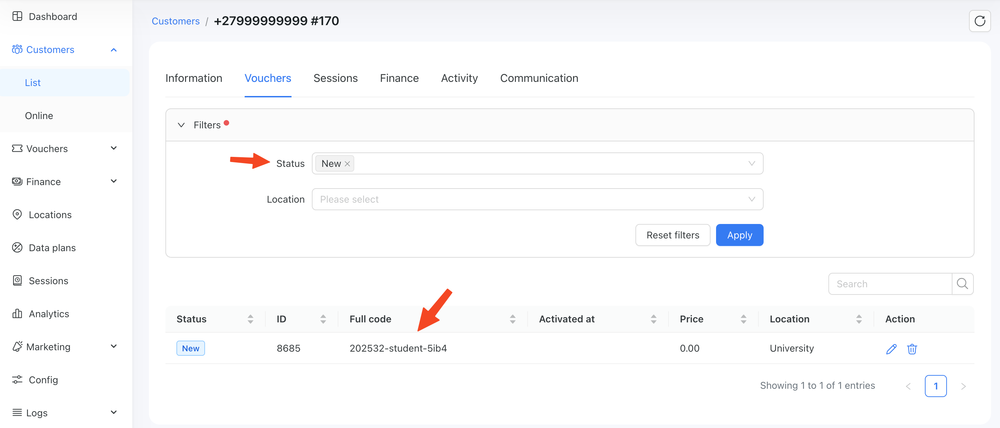

This section describes Powerlynx tools designed to simplify your everyday use of the platform.

# Mass create vouchers tool

This tool is designed to create vouchers for multiple customers in bulk.
For example, if you have 200 customers and want to give them each 1-day internet access—without making the data plan publicly available on the splash page—you can use this tool to:

1. Select the customers
2. Choose the data plan
3. Generate vouchers for them

When the customers connect, they activate their individual voucher and gain internet access.

**How to use:**

1. First, you need to create a target group of customers for whom the vouchers will be generated. Go to **[Marketing → Target Groups](https://docs.powerlynx.app/system/target-groups.html)** and create a new group.

2. Navigate to `Config/Tools/Mass create vouchers` tool:

{data-zoomable}

and click the **Add** button.

3. In Step 1, select your target group containing the filtered customers:

{data-zoomable}

4. In Step 2, review the selected customers and deselect any if necessary:

{data-zoomable}

5. In Step 3, select the location and desired data plan:

{data-zoomable}

::: info
Please note that these vouchers will be linked to the selected location. If a customer connects from a different location, they won’t be able to use the voucher.
:::

6. In Step 4, confirm this action and the process will start:

{data-zoomable}

{data-zoomable}

7. Ensure that the voucher has been created successfully. Navigate to the customer for whom you generated the voucher and open their **Vouchers** tab. Filter vouchers by the status and you should see the voucher listed with a status of **New**:

{data-zoomable}

When the customer connects, the voucher will be automatically activated.

