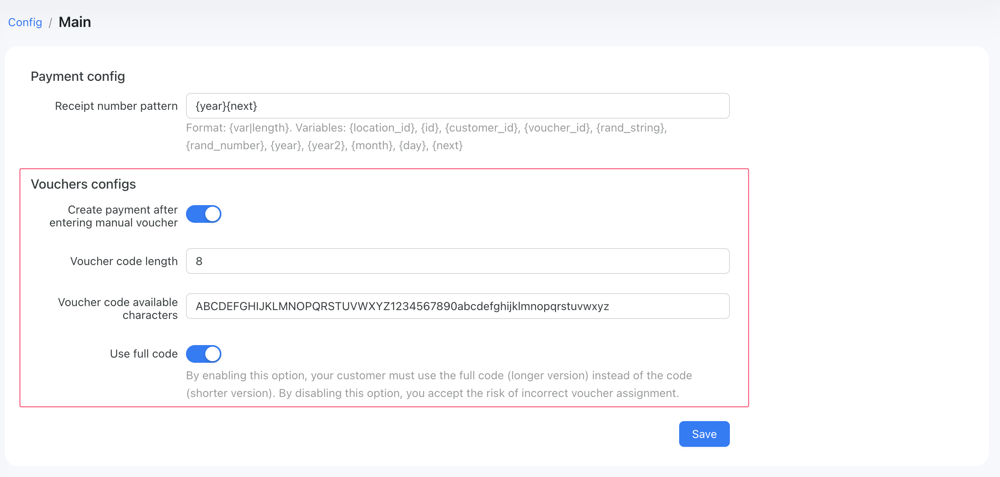

# Vouchers

## What is a voucher in Powerlynx?

In Powerlynx, a voucher functions like an access card, generated by the system to grant users network access under specific conditions. Each voucher contains detailed information about its validity, traffic limits, online time limits, and the maximum number of devices that can connect using it. It inherits the data plan settings (validity, speed limits, traffic limits, time online limits, etc).

## Voucher Creation and Usage Process:

1. **Creating Data Plans:** First, you create a data plan under the Data plans menu with specific limits. For example, you might set a plan with a 10 Mbps upload/download speed, a 1 GB traffic limit, a 1-hour online limit, and a validity of 7 days.

2. **Enabling Data Plans at Locations:** Next, you enable this data plan for a specific location.

3. **Customer Interaction:** When a customer at that location connects to Wi-Fi, they are redirected to a page where they can select a data plan that suits their needs.

4. **Voucher Generation:** Upon selecting a data plan, a new voucher is created with limits as defined in the chosen data plan.

5. **Monitoring and Deactivation:** The system continuously monitors the voucher. If any of the set limits are reached (such as the traffic limit or time online), the system deactivates the voucher and disconnects the customer.

## Example scenario

Consider a café using Powerlynx to manage its Wi-Fi service. The café wants to control Wi-Fi usage to prevent network abuse. They set up several data plans with different limits and enable these plans for their location.

When a customer orders a coffee, they connect to the Wi-Fi and are prompted to choose a data plan. Suppose they choose a plan with a 1-hour online limit, 1GB data, and 10 Mbps speed, valid for 7 days. As soon as they select the plan, a voucher with these specific limits is generated. If the customer reaches the 1GB data limit or exhausts their 1-hour online time within these 7 days, the voucher is automatically deactivated, and the connection is terminated.

This system ensures fair usage of the café's Wi-Fi and offers the flexibility for customers to choose a plan that best suits their needs, while also providing the café with efficient management and monitoring capabilities.

## Explaining the Vouchers menu

You can find the Vouchers menu on the dashboard, located between the Customers and Finance menus:

{data-zoomable}

It includes three sub-menus:

1. **Series** - A list of vouchers grouped by series. Each series can contain thousands of vouchers, and we use them to group vouchers created from the same tariff plan during a specific time period:

{data-zoomable}

All series are created automatically. However, in some cases, you may need to create a series of fresh vouchers that can be printed. This can be done using the "Generate" button, which opens a form where you can set parameters for a new series:

{data-zoomable}

In this example, we generate a series of 5 vouchers from the "Free for Employees" plan, which are designated for use at the "Hotel" location. These vouchers remain valid until the end of their specified validity period. After generation, you will have 5 vouchers that can be utilized in the "Login with Voucher Code" option on a splash page.

::: tip
Pay attention to the **Expiration** section when generating a series. There are two options for setting the expiration method of a voucher:
- **Expiration by 'Valid Until':** This means the generated vouchers are valid until the specified date. They will expire on that date, regardless of whether they have been activated.

- **Expiration by 'Activation Time':** This means the generated vouchers are valid for X days following their activation. For example, if a voucher was generated two months ago but only activated today, the countdown for the "Available time from voucher activation" will begin from the date of activation.
:::

Each serie has 4 actions: 
- Edit - Modify certain parameters of a series;
- View - Display the list of vouchers in this series;
- Export - Export the list of vouchers in this series;
- Delete - Remove the series. 

2. **List** - this page contains the list of all vouchers in the system:

{data-zoomable}

At the top of the list, under the "Filters" tab, we automatically apply a filter by status: Active and Online, to facilitate easier browsing.

{data-zoomable}

3. **Online** - The list includes ONLY online vouchers along with their statistics, IP, MAC, hotspot, and location details.

{data-zoomable}

You can disconnect all sessions of these vouchers using the button in the "Action" column.

## Voucher settings

There are several voucher settings that can be modified. You can find these under `Config/Finance/Main`:

{data-zoomable}

* **Create payment after entering manual voucher** - This option works in conjunction with the "Login using voucher code" feature, which can be enabled for a location under the Payment Gateways tab. If activated, it creates a payment record in the system whenever a customer logs in with a voucher code and the voucher's price is greater than 0. If disabled, the system will not create a payment record for such vouchers but will simply activate them. This option is designed to facilitate better financial monitoring;

* **Voucher code length** - Define the length of a voucher's code;

* **Voucher code available characters** - Choose the set of characters to be used in generating a voucher's code. For example, to make your voucher codes purely numerical, remove all letters and leave only numbers, like `1234567890`.

* **Use full code** - This option allows your customers to log in using a short voucher code (if disabled) instead of a full one. It is enabled by default.

::: tip
Sometimes, our clients need to provide their customers with the ability to log in using a short voucher code instead of the full one.

For example, if a printed voucher has the full code formatted as “202502-SUP-6937”, users would like to use just "6937" to log in quickly.

To achieve this, you need to disable this option, set the "Voucher code length" to 4 and use only digits in the "Voucher code available characters" field:

{data-zoomable}
:::

## Vouchers export

In Powerlynx, you can generate a series, export it, and then print. To do this, go to `Vouchers/Series`, generate a series, and click on the "Export" button under the desired series:

{data-zoomable}

Here, you can select the format (PDF, CSV) and choose the template for the PDF format. After that, click on the "Export" button. This action will initiate a process to create a file. Once the file is ready, you will see a new button appear under the series.

{data-zoomable}

To download a file, please click on the button provided.

There are two themes that you can choose from when saving a file in PDF format.

**Dark theme**

{data-zoomable}

**Light theme**

{data-zoomable}

## Manually add related MAC addresses to vouchers

Some devices, such as Smart TVs or IP cameras, cannot open a captive portal page because they simply don’t support it — but they still need internet access. To handle this, we’ve introduced a feature that allows your clients to add the MAC addresses of such devices during the sign-up process. Additionally, administrators can manually add a MAC address to the corresponding voucher.

How to do it:

1. In the data plan settings, there is an option you need to enable to activate this feature for that specific plan. Please note that this is a per-plan configuration and should only be enabled for the data plans where it's needed:

{data-zoomable}

When enabled, new vouchers under this data plan will include the option to manually add a MAC address:

{data-zoomable}

For the voucher shown in the screenshot, you can add up to 2 MAC addresses (as defined in the data plan settings). Simply click the "Add" button to manually add a new one.

On the captive portal, customers can do this themselves. After completing the payment or ad step, they will see the following screen:

{data-zoomable}

They can skip this step by clicking the "Continue" button, or click "Add" to manually add a MAC address on the next page:

{data-zoomable}

Once added, the device with the specified MAC address will be able to connect to the same WiFi network and will be authorized instantly.
